# QoS Service Models and Switch Implementation

The [QoS overview](01_QOS.md) established why different traffic needs different treatment. This document covers *how* the networking industry standardized that treatment and then dives into the switch-level mechanisms that DiffServ relies on to enforce its rules packet by packet.


## The Baseline: Best-Effort IP and The ToS Field

When the Internet was built, it used a Best-Effort model. Think of this like the standard postal service: the network promises to try its best to deliver your data, but there are no guarantees on speed, delivery, or timing.

To help prioritize traffic, engineers originally included a 1-byte field in the IP header called the **Type of Service** (ToS) field. Applications could use this to ask for things like "low delay" or "high throughput." However, early routers didn't have a unified way to process these requests, so the ToS field was mostly ignored, and Best-Effort remained the standard. As internet traffic evolved to include sensitive data like live voice and video, Best-Effort was no longer good enough.

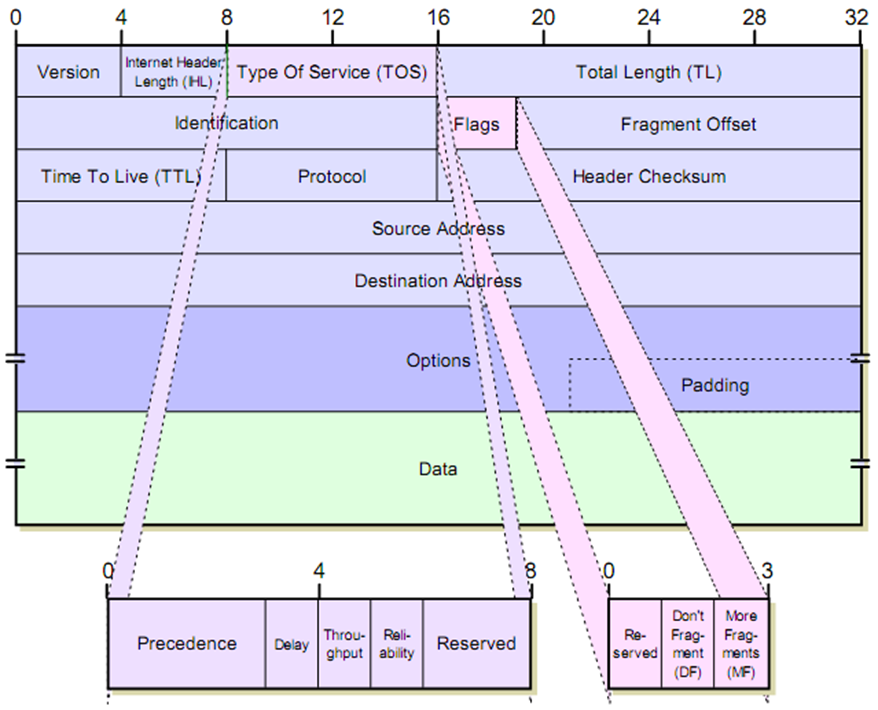


## The First Attempt: Integrated Services Architecture (IntServ)

Defined in RFC 1633, IntServ was the industry's first major attempt to fix the Best-Effort problem. It was designed to mimic the old telephone network, where a dedicated line was kept open for the duration of a call. IntServ uses a stateful signaling protocol called **RSVP** (Resource Reservation Protocol, specified in RFC 2205 alongside RSVP extensions in related RFCs).

- Before sending data, the source application sends a `PATH` message to the destination to map the route.

- The destination sends a `RESV` message back along that exact same path (a process called **route pinning**).

Every router along that path is forced to reserve a specific amount of memory, buffer space, and bandwidth just for that one specific data flow.

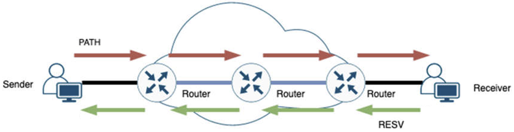

**Why route pinning is necessary:** IP routing is asymmetric; the path from source S to receiver R may differ from the path R uses to reply back to S. Without route pinning, the `RESV` message would follow normal IP routing back to S, potentially traversing completely different routers (e.g., R → S3 → S5 → S4 → S1 → S) and reserving bandwidth on routers that the actual data will never touch. The reservations would be useless. RSVP prevents this by having each router record the previous hop when it processes a `PATH` message. This forces the `RESV` message to retrace the exact forward path in reverse (R → S3 → S2 → S1 → S), ensuring reservations are installed precisely on the routers where data will actually flow.

IntServ provides incredible, mathematically guaranteed performance, but it fails completely in the real world due to a lack of scalability. It forces the Control Plane to track and maintain reservations for every single active flow. While this works for a small office, a core internet router handling millions of concurrent video streams and downloads would instantly collapse under the memory and processing requirements.


## The Winning Standard: Differentiated Services Architecture (DiffServ)

Because IntServ couldn't scale, engineers created DiffServ, which is the undisputed standard used in modern networking today. Instead of tracking millions of individual flows, DiffServ groups traffic into broad categories (classes) and splits the workload between the edges of the network and the core.

- **Edge Routers** (The Bouncers): These sit at the boundary of a network. They run a **Multi-Field (MF) Classifier** that deeply inspects incoming packets (source/destination IP, TCP/UDP port, protocol) to identify unmarked traffic, checks if the traffic violates bandwidth limits, and stamps the packet's header.

- **Core Routers** (The Fast Sorters): These sit inside the network. They run a **Behavior Aggregate (BA) Classifier** that looks at the stamp left by the edge and drops the packet into the appropriate hardware queue. Because they are "dumb" and stateless, they are blindingly fast and can scale indefinitely.

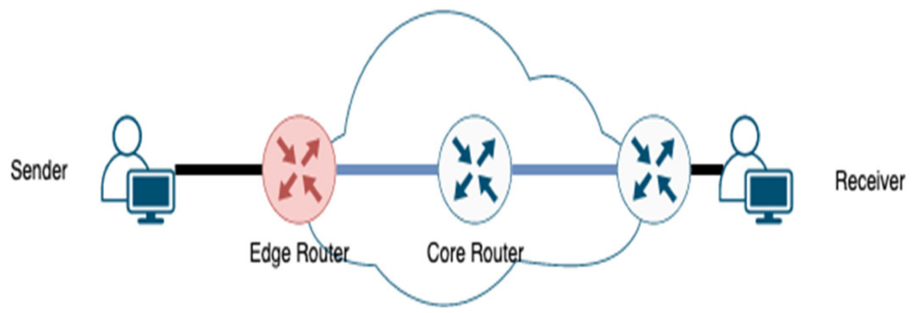

### The DSCP Stamp

DiffServ took the old, ignored ToS byte in the IP header and redefined it as the **Differentiated Services** (DS) field. The first 6 bits of this field are called the **DSCP** (Differentiated Services Code Point). Using 6 bits gives us $2^6 = 64$ possible codepoints (stamps), each telling the core routers exactly how to treat the packet.

```
   0   1   2   3   4   5   6   7
 +---+---+---+---+---+---+---+---+
 |         DSCP          |  ECN  |
 +---+---+---+---+---+---+---+---+
         6 bits           2 bits
```

> The lower 2 bits were originally left as "Currently Unused". They were later defined as the Explicit Congestion Notification (ECN) field by RFC 3168, which is an entirely separate standard from DiffServ. ECN allows switches to signal congestion to endpoints without dropping packets (covered in detail in the RED section below).

### Per-Hop Behaviors

When a core router reads a DSCP stamp, it applies a specific behavior:

**Expedited Forwarding (EF)**

The VIP lane. Used for strict, delay-sensitive traffic like Voice over IP (VoIP). It gets low delay, low jitter, and minimal loss.

**Assured Forwarding (AF)**

The business-class lane defined by RFC 2597. Traffic is grouped into four classes. Each class has three levels of "drop precedence" (Low, Medium, High). If the network gets congested, the router looks at the drop precedence; packets marked "High" are thrown in the trash first to protect the more important data. The naming convention is **AFxy**, where **x** is the class (1–4, higher = higher forwarding priority) and **y** is the drop precedence (1 = Low drop, 2 = Medium, 3 = High). Within a congested class, packets with higher drop precedence are discarded first.

| Drop Precedence | Class 1 (001) | Class 2 (010) | Class 3 (011) | Class 4 (100) |
| --------------- | ------------- | ------------- | ------------- | ------------- |
| Low (1)         | AF11 = 10     | AF21 = 18     | AF31 = 26     | AF41 = 34     |
| Medium (2)      | AF12 = 12     | AF22 = 20     | AF32 = 28     | AF42 = 36     |
| High (3)        | AF13 = 14     | AF23 = 22     | AF33 = 30     | AF43 = 38     |

The DSCP value is computed as: **(Class × 8) + (Drop Precedence × 2)**.

**Class Selectors (CS)**

To maintain backward compatibility with the legacy 3-bit IP Precedence (IPP) field from the original ToS byte, RFC 2474 defined eight Class Selector (CS) codepoints. These set the lower 3 bits of the DSCP to zero, so the upper 3 bits map directly to the old IPP values.

| Category | DSCP Value | Binary     | IP Precedence        |
| -------- | ---------- | ---------- | -------------------- |
| CS0 / DF | 0          | `000 000`  | Routine (Best Effort)|
| CS1      | 8          | `001 000`  | Priority             |
| CS2      | 16         | `010 000`  | Immediate            |
| CS3      | 24         | `011 000`  | Flash                |
| CS4      | 32         | `100 000`  | Flash Override       |
| CS5      | 40         | `101 000`  | Critical             |
| CS6      | 48         | `110 000`  | Internetwork Control |
| CS7      | 56         | `111 000`  | Network Control      |

As a practical reference, Cisco's QoS Baseline maps common application types to specific DSCP codepoints:

| DSCP     | Category           | Typical Application        |
| -------- | ------------------ | -------------------------- |
| CS0 / DF | Best Effort        | General internet traffic   |
| CS1      | Scavenger          | Bulk background downloads  |
| AF11     | Bulk Data          | Backup, FTP                |
| CS2      | Network Management | SNMP, Syslog               |
| AF21     | Transactional Data | ERP, database transactions |
| CS3      | Call Signaling     | SIP, H.323                 |
| AF31     | Mission-Critical   | Critical business apps     |
| CS4      | Streaming Video    | IP/TV, surveillance        |
| AF41     | Interactive Video  | Telepresence, video calls  |
| EF (46)  | Voice              | VoIP bearer audio          |
| CS6      | IP Routing         | OSPF, BGP, routing control |


### DiffServ Domains

DiffServ does not operate as a single, global set of rules across the entire Internet. Instead, it is organized into Domains. A Domain is a distinct region of a network owned and managed by a single administrative entity. Examples include a specific Internet Service Provider (ISP) network, a corporate enterprise Wide Area Network (WAN), or a massive data center fabric. Inside a single Domain, everything is synchronized:

- **The Rulebook**: All routers within the Domain agree exactly on what each DSCP stamp (like Assured Forwarding or Expedited Forwarding) means and how to treat it.

- **The Border Patrol (Edge Routers)**: These sit at the outer boundaries of the Domain. They act as the gatekeepers, enforcing security and traffic policies before letting packets inside.

- **The Inside Workers (Core Routers)**: These sit securely inside the Domain. Because the Edge Routers already did the checking, the Core Routers simply trust the DSCP stamps and forward the traffic at maximum speed.


### Service Level Agreements (SLAs)

Because the Internet is made up of thousands of different interconnected Domains, traffic eventually has to cross borders for example, when a corporate enterprise network connects to an external ISP. When two different Domains connect (peer), they negotiate a **Service Level Agreement (SLA)**.

Think of the SLA as a strict border contract. It specifies exactly how much traffic and what classes of traffic (e.g., 50 Mbps of voice traffic, 500 Mbps of bulk data) the customer domain is legally allowed to inject into the provider domain. If the customer sends more traffic than the SLA allows, the receiving Edge Router will either drop the excess packets or downgrade their priority.


### The Bandwidth Broker (BB)

With Domains established and SLAs negotiated, large networks need a way to manage these agreements dynamically. This is where the **Bandwidth Broker (BB)** comes in. The Bandwidth Broker is a centralized software controller responsible for managing the resources of an entire Domain. BB performs the following duties:

- **Admission Control**: If a customer wants to send more high-priority traffic, the BB looks at the Domain's current capacity and decides whether the network can handle the new request without breaking existing SLAs with other customers.

- **Configuring the Edge**: If the BB approves a new traffic request, it automatically communicates with the Edge Routers to update their "policing profiles," telling them to allow the new traffic through.

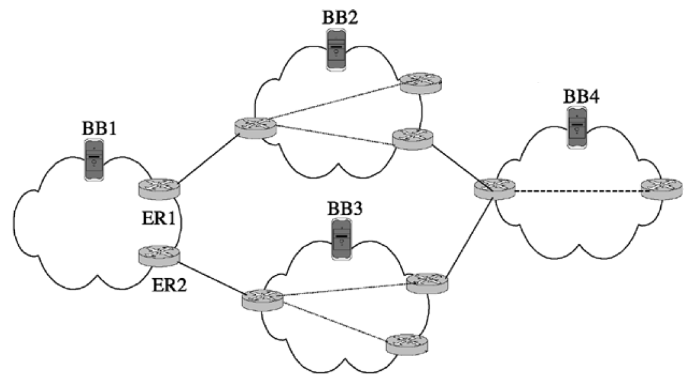

You might wonder: Doesn't a centralized controller sound a lot like the IntServ model that failed? The critical difference is time scale. IntServ failed because it tried to negotiate resources for every single individual connection (per-flow) in real-time. The Bandwidth Broker operates on long-term provisioning. It negotiates aggregate traffic limits for hours, days, or months at a time. By managing broad policies rather than individual packets, the architecture remains highly scalable.


## Switch Architecture

### The Foundation — The Two Planes

Every router or switch has two fundamentally different processing planes:

- **The Control Plane** (The Brain): This is the software-driven part of the router. It handles complex, infrequent tasks like calculating routes (OSPF, BGP), negotiating agreements, and establishing the rules for how traffic should be treated.

- **The Data Plane** (The Muscle): This is the hardware-driven part of the router (using ASICs). It does the actual heavy lifting of forwarding billions of packets per second. It doesn't think; it simply looks at the rules the Control Plane created and acts on them immediately.

### The Transit Path

We must understand how traffic moves through the Data Plane. Every packet makes a three-part physical journey:

- **Ingress** (The Entrance): The physical port where a packet enters the switch. Upon arrival, the switch's forwarding engine immediately parses the packet headers to figure out where it needs to go.

- **Switch Fabric** (The Internal Highway): This is the high-speed silicon backplane that connects all the ports together. Its only job is to transport the packet from the receiving Ingress port to the correct transmitting Egress port as fast as possible.

- **Egress** (The Exit): The physical port where the packet leaves the switch and heads toward its next hop on the network.

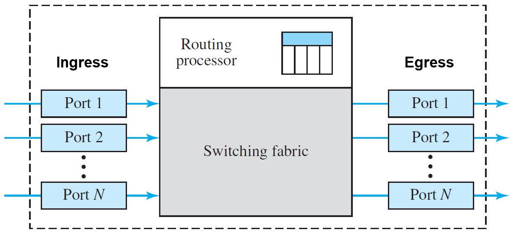

While we describe the transit path as starting at an Ingress port and ending at an Egress port, it is important to note that a single physical interface on a switch operates as both simultaneously. When a port is operating in full-duplex mode, it can receive incoming traffic (acting as Ingress) and transmit outgoing traffic (acting as Egress) at the exact same time, without the two streams interfering with one another. If a port is rated for 100 Gbps, it can technically receive 100 Gbps of data and transmit 100 Gbps of data simultaneously.

### Traffic Types at Ingress

Now that we know the physical path, we have to look at what is entering the Ingress port. There are three distinct types of traffic:

- **Data Traffic**: Standard user traffic (videos, emails, web browsing).

- **Control Traffic**: Traffic from other routers used to map out the network (routing protocol updates like BGP or OSPF).

- **Management Traffic**: Traffic from a network admin logging into the device to configure it (SSH, HTTPS).

The vast majority of Data traffic enters Ingress, crosses the Switch Fabric, and leaves via Egress. It never touches the CPU, allowing it to be forwarded at wire speed. This ASIC-only journey is called the **fast path**. Management and Control packets cannot just be forwarded; they require the CPU to process them. The hardware intercepts these packets in the Data Plane and diverts them up to the Control Plane for software processing. This is referred to as the **slow path**. Slow path is out of the scope of this document.

### The Need for Queues

In a perfect world, a packet flows instantly from Ingress, across the Fabric, and out the Egress port. However, network traffic is rarely perfectly smooth; it is highly bursty. Congestion inevitably occurs—most often due to a "many-to-one" traffic pattern, where several Ingress ports simultaneously blast traffic toward a single Egress port.

Because an Egress cable can only transmit (serialize onto the wire) one packet at a time, the switch cannot immediately forward the excess traffic. Instead of instantly dropping these extra packets, the switch uses Queues. A queue is a logical "waiting line" that temporarily holds packets in strict order until the hardware is ready to transmit them.

To manage traffic effectively, modern switches utilize queues at two distinct stages of the journey:

- **Egress Queues** (The Final Staging Area): These queues sit right before the exit port. Their primary function is QoS scheduling and shaping. If multiple packets arrive at the exit simultaneously, the Egress queue organizes them, ensuring that high-priority traffic gets to skip the line and leave the switch before lower-priority traffic (like a background file download).

- **Ingress Queues** (The Holding Area): These queues sit at the entrance of the switch, before the internal fabric. Their primary function is congestion absorption. If an Egress queue gets completely full, it signals the switch to stop sending it traffic. Packets destined for that overloaded exit must now wait in an Ingress queue until the internal traffic jam clears.

### Head-of-Line (HoL) Blocking

Because Ingress queues are essentially holding areas for traffic waiting to cross the switch, they are vulnerable to a severe performance flaw known as Head-of-Line (HoL) Blocking. This is strictly an Ingress phenomenon. Historically, older switches placed all incoming packets into a single, straightforward queue at the Ingress port.

In a network switch, if the packet at the very front of a basic Ingress queue is destined for a congested Egress port, it stops moving. Consequently, it blocks all the packets behind it in the queue, even if those trailing packets are destined for perfectly idle Egress ports. The entire line stalls because of the head of the line.

The following image demonstrates HOL blocking:

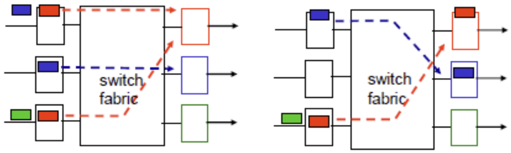

This switch fabric can only transfer one packet per destination port at a time. At time $t$, both the top and bottom input ports have a red-colored packet at the front of their lines, both trying to get to the top output port. The switch allows the top red packet to cross. The bottom red packet loses the contention and is stuck waiting. Because the bottom red packet is stuck at the head of the line, the green packet directly behind it cannot move, even though its destination (the bottom output port) is empty. This is Head-of-Line blocking.

### Virtual Output Queuing (VOQ)

To solve HoL blocking, modern high-performance switches use a sophisticated architecture called Virtual Output Queuing (VOQ). With VOQ, packets are still physically buffered on the Ingress side of the switch, but they are logically organized quite differently. Instead of one giant waiting line, the switch divides the Ingress buffer into multiple, separate logical queues—one dedicated queue for every possible Egress port.

When a packet arrives at Ingress, the switch determines its destination and immediately places it into the specific VOQ for that exit. If Egress Port A becomes congested, only the VOQ for Port A backs up. A packet arriving at the exact same Ingress port, but destined for an uncongested Egress Port B, simply bypasses the traffic jam via its own dedicated VOQ.

By buffering traffic at Ingress but organizing it by Egress destination, VOQ ensures that congestion on one port never degrades the performance of the rest of the switch. This organized, partitioned approach to traffic provides the stable foundation necessary for the measurement and policing algorithms described in the following sections.


## The DiffServ Traffic Management Pipeline

To understand how a switch applies QoS, we must trace a packet through the complete DiffServ pipeline. The logical diagram below maps this pipeline onto the physical switch architecture, illustrating the journey from arrival to departure.

```
            ┌─ INGRESS ─────────────────┐  ┌─ FABRIC ─────┐  ┌─ EGRESS ──────────────────┐
            │                           │  │              │  │                           │
Packet ────►│  Classifier               │  │              │  │  WRED (Drop / ECN Mark)───┼───► Packet Out
  In        │      │                    │  │              │  │       ▲                   │
            │      ▼                    │  │              │  │       │                   │
            │  Meter (Token Bucket)     │  │   Switch     │  │  Shaper (Leaky Bucket)    │
            │      │                    │  │   Fabric     │  │       ▲                   │
            │      ▼                    │  │  (Crossbar)  │  │       │                   │
            │  Marker (G / Y / R)       │  │              │  │  Egress Queue             │
            │      │                    │  │              │  │  (per Traffic Class)      │
            │      ▼                    │  │              │  │       ▲                   │
            │  Policer ── Drop ──► X    │  │              │  └───────┼───────────────────┘
            │      │                    │  │              │          │
            │    Pass                   │  │              │          │
            │      ▼                    │  │              │          │
            │  Ingress VOQ  ────────────┼─►│─ ─ ─ ─ ─ ─ ──┼─ ─ ─ ─ ──┘
            │  (per Egress dest.)       │  │              │
            └───────────────────────────┘  └──────────────┘
```

Edge routers sit at the boundary of the network and do the complex work. They perform Multi-Field (MF) Classification (inspecting IP addresses, TCP/UDP ports, and protocols), meter the traffic, and explicitly mark the DSCP headers. Core routers are designed for pure speed. Because the edge has already marked the packets, the core skips the heavy ingress steps (metering, policing, and MF classification). Instead, it relies entirely on fast Behavior Aggregate (BA) Classification. It simply reads the 6-bit DSCP tag, instantly trusts it, and drops the packet into the corresponding egress queue.

The following sections detail each building block of the pipeline.


## Rate Measurement — Token Bucket and Leaky Bucket

Before a network device can restrict or manage traffic, it needs a mathematical model to measure it. There are two primary algorithms used:

**Token Bucket** (Allows Bursts)

Imagine a bucket that automatically fills with "tokens" at a constant, agreed-upon rate (e.g., 100 tokens per second). When a packet wants to pass, it must take a token out of the bucket. If the network is quiet, tokens save up. When a sudden burst of data arrives, it can consume all the saved tokens at once, allowing the burst to pass at maximum speed. Once the bucket is empty, new traffic is restricted.

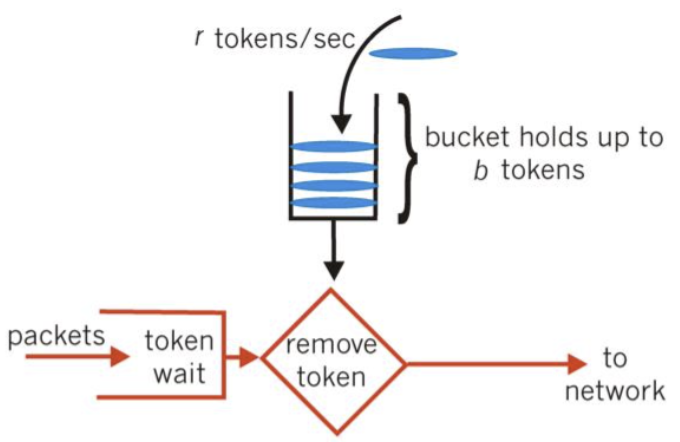

**Leaky Bucket** (Forces Smoothness)

Imagine a bucket with a hole in the bottom. You can pour water (data bursts) into the top as fast and erratically as you want, but it only leaks out the bottom at one steady, unchanging rate. This algorithm completely eliminates bursts, turning chaotic incoming traffic into a perfectly smooth output stream. If you pour data in too fast, the bucket overflows and packets are dropped.

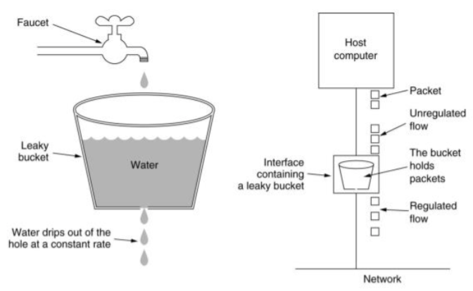


## Ingress Classification

Before a packet can be metered or marked, the switch must first determine *which policy* applies to it. This is the job of the Classifier — the very first step in the ingress pipeline.

The Classifier inspects IP header fields — such as the DSCP value, source/destination IP, protocol number, or TCP/UDP port number — and uses them to look up the corresponding traffic profile. Different traffic types have different bandwidth contracts. For example:

- A packet with DSCP 46 (EF / Voice) might be mapped to a strict voice profile with a low committed rate and tight policing.
- A packet with DSCP 0 (Best Effort) might be mapped to a permissive default profile with a large burst allowance.

The Classifier does not modify the packet or assign a color. Its sole output is a policy selection: which set of Token Bucket parameters (CIR, CBS, PIR, PBS) the Meter should use for this packet. Once the policy is selected, the packet moves to the Meter and Marker.

This is the bridge between the per-class world (traffic classes defined by DSCP tags) and the per-packet world (metering, marking, and policing described in the sections below). Every subsequent step operates on the individual packet using the profile the Classifier chose.


## Ingress Metering and Marking

With the traffic profile selected by the Classifier, the switch evaluates whether the sender is conforming to its bandwidth contract. It does this using a **Three-Color Marker** — a Token Bucket system that meters each packet and paints it one of three colors:

- **Green** (Conforming): The flow is within its guaranteed budget.
- **Yellow** (Exceeding): The flow is over its baseline budget but still within a tolerable excess.
- **Red** (Violating): The flow has entirely exceeded its allowance.

In every Token Bucket system, one token directly represents one byte of data. The configured bandwidth rate acts as continuous income, steadily refilling the bucket with tokens over time, while each incoming packet acts as an immediate expense that consumes tokens exactly equal to its size. Because network hardware cannot easily measure the speed of an instantaneous packet, it instead performs a simple mathematical check: does the bucket currently have enough saved tokens ($T_c$) to "pay" for the packet's size ($B$)? By ensuring the packet size doesn't exceed the available token balance, the switch prevents traffic from draining the bucket faster than the rate can replenish it, effectively enforcing a long-term speed limit through a series of short-term, size-based transactions.

There are two standardized Three-Color Marker algorithms. Both use two token buckets and produce the same three colors, but they differ in what they measure: one polices **burst size** at a single rate, the other polices **two distinct rates**.

> **How the color is stored:** The switch does not modify the packet itself when assigning a color. Instead, the switch ASIC attaches an internal descriptor or metadata tag to the packet as it moves through the pipeline. Think of it as a sticky note the switch puts on the packet for its own internal use. The Policer reads this internal color to decide drop/pass/remark, and WRED reads it to pick which threshold profile to apply. This metadata never leaves the switch; it is discarded when the packet is serialized onto the outgoing wire.


### Single-Rate Three-Color Marker (srTCM)

The srTCM, defined in [RFC 2697](https://datatracker.ietf.org/doc/html/rfc2697), is the simpler of the two markers. It has a single speed limit (one rate) and uses two buckets to distinguish between a normal burst and an excessive burst at that rate.

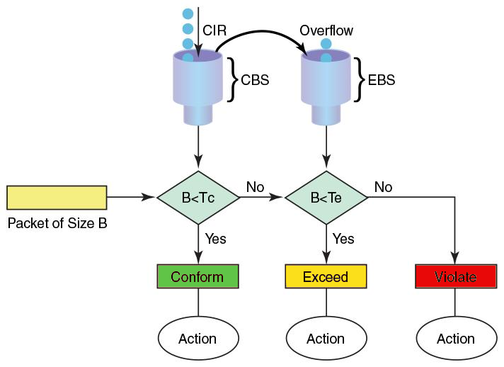

| Parameter | Meaning                               | Role                            |
|-----------|---------------------------------------|---------------------------------|
| **CIR**   | Token generation rate (the only rate) | The guaranteed average speed    |
| **CBS**   | Max size of the Committed bucket      | Max conforming burst            |
| **EBS**   | Max size of the Excess bucket         | Max tolerable excess burst      |

- **Bucket C** (Committed Burst): Holds tokens up to CBS.
- **Bucket E** (Excess Burst): Holds tokens up to EBS.

Both buckets share the single rate CIR, but they are not refilled independently. Tokens generated at CIR flow into Bucket C first. Only when Bucket C is completely full do the surplus tokens overflow into Bucket E. If both buckets are full, new tokens are simply discarded. This overflow design means Bucket E only accumulates tokens during quiet periods when the flow is not consuming its full committed allowance.

**Marking algorithm:** When a packet of size $B$ arrives:

1. If $B \le T_c$ (Bucket C has enough tokens): spend $B$ tokens from Bucket C → **Green**.
2. Else if $B \le T_e$ (Bucket C is short, but Bucket E has enough): spend $B$ tokens from Bucket E → **Yellow**.
3. Else (neither bucket can cover the packet): no tokens are spent → **Red**.

The srTCM answers one question: *how bursty is this flow at its contracted rate?* A flow sending at or below CIR stays Green. A flow that sends a burst exceeding CBS but still within the saved-up excess allowance (EBS) turns Yellow. A flow that exhausts both buckets turns Red. Because there is only one rate, the srTCM cannot distinguish between a flow sending at 80 Mbps versus 800 Mbps — it only cares whether the accumulated burst size fits within the bucket depths.


### Two-Rate Three-Color Marker (trTCM)

The trTCM, defined in [RFC 2698](https://datatracker.ietf.org/doc/html/rfc2698), adds a second speed limit. Instead of measuring burst tolerance at one rate, it measures traffic against two independent rates: a baseline rate (Committed) and an absolute ceiling rate (Peak).

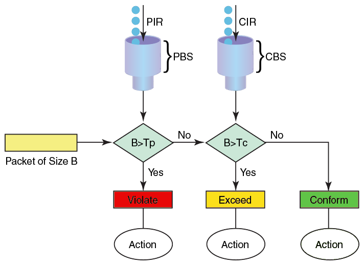

| Parameter | Meaning                           | Role                              |
|-----------|-----------------------------------|-----------------------------------|
| **CIR**   | Refill rate of Committed bucket   | Guaranteed average rate           |
| **CBS**   | Max size of Committed bucket      | Max conforming burst              |
| **PIR**   | Refill rate of Peak bucket        | Upper bound rate (PIR ≥ CIR)      |
| **PBS**   | Max size of Peak bucket           | Max admissible burst at peak rate |

- **Bucket C** (Committed): Refills at CIR up to CBS.
- **Bucket P** (Peak): Refills at PIR up to PBS.

Unlike the srTCM, each bucket refills independently at its own rate. There is no overflow relationship between them — they operate in parallel.

**Marking algorithm:** When a packet of size $B$ arrives:

1. If $B > T_p$ (Bucket P cannot cover the packet): no tokens are spent from either bucket → **Red**.
2. Else if $B > T_c$ (Bucket P can, but Bucket C cannot): spend $B$ tokens from Bucket P only → **Yellow**.
3. Else (both buckets can cover the packet): spend $B$ tokens from both Bucket C and Bucket P → **Green**.

Notice the evaluation order is reversed compared to the srTCM: the trTCM checks the Peak bucket first. This is because the Peak rate is the absolute ceiling — if the flow exceeds PIR, nothing else matters and the packet is immediately Red.

The trTCM answers a different question: *how fast is this flow relative to two rate tiers?* A flow sending at or below CIR stays Green. A flow sending faster than CIR but slower than PIR turns Yellow — it is exceeding its baseline but staying under the peak ceiling. A flow exceeding PIR turns Red. Because the two buckets refill at different rates, the trTCM directly measures the flow's actual throughput against two speed thresholds, not just its burst behavior.

### Why Two Systems

| Dimension                | srTCM (RFC 2697)                                     | trTCM (RFC 2698)                                |
|--------------------------|------------------------------------------------------|-------------------------------------------------|
| **Rates configured**     | One (CIR)                                            | Two (CIR and PIR)                               |
| **What it measures**     | Burst size at a single rate                          | Throughput against two rate thresholds          |
| **Bucket relationship**  | Overflow — E only fills when C is full               | Independent — each refills at its own rate      |
| **Yellow means**         | "Burst exceeded CBS but within EBS at the same rate" | "Sending faster than CIR but slower than PIR"   |

**When to use the srTCM:** The flow has a single contracted rate and you want to tolerate occasional bursts up to a defined size. This is common for access-layer policing where the SLA specifies "100 Mbps with up to 64 KB burst" — the CIR is 100 Mbps, CBS defines the normal burst allowance, and EBS defines a larger grace burst. The srTCM is the natural choice when the question is: *did this customer send a burst that is too large?*

**When to use the trTCM:** The flow has two distinct rate tiers — a guaranteed baseline and an allowed peak — and you need to police throughput at both levels simultaneously. This is common for tiered ISP services where a customer pays for "50 Mbps guaranteed, burstable to 200 Mbps." CIR is 50 Mbps, PIR is 200 Mbps. Traffic within 50 Mbps is fully protected (Green), traffic between 50–200 Mbps is best-effort (Yellow, dropped first during congestion), and traffic above 200 Mbps is dropped immediately (Red). The trTCM is the natural choice when the question is: *how fast is this customer sending relative to two rate limits?*


## Ingress Enforcement (Policer)

Once the traffic is measured and colored, the switch must enforce the bandwidth rules immediately before letting the traffic into its internal network. It uses a Policer for this. The Policer is the network's strict border guard. It is commonly applied on ingress to protect internal network resources, prevent DoS attacks or burst overloads, and strictly enforce Service Level Agreements (SLAs). Importantly, it has no memory and no buffer to hold delayed packets.

The Policer looks at the colors assigned by the Marker and takes one of three possible actions. Because it makes an instantaneous decision with no buffering, it adds zero latency to the flow.

| Action     | What happens                                                             |
| ---------- | ------------------------------------------------------------------------ |
| **Pass**   | Forward the packet as-is, no modification.                               |
| **Drop**   | Discard the packet immediately. It never enters the switch fabric.       |
| **Remark** | Rewrite the packet's DSCP bits to a lower priority, then forward.        |

Remarking is distinct from the Marker's internal color (which is switch-local metadata that never leaves the switch). A remark modifies the real packet header. Every downstream switch will see the degraded label, and WRED will drop or mark it first during congestion.

Which colors trigger which action depends on the enforcement policy. **Hard Drop** is the strict approach: Green and Yellow packets are passed, Red packets are dropped. This protects internal bandwidth but can introduce sudden packet loss and TCP reordering if the sender doesn't properly shape its bursts. **Soft Drop** is the lenient approach: Green packets are passed, Yellow and Red packets are remarked. Nothing is destroyed at the policer, but over-budget traffic is demoted so the network treats it as expendable downstream.


## Egress Shaping (Shaper)

The surviving Green and Yellow packets are routed across the switch's internal fabric and arrive at the exit port (Egress). Here, the switch uses a Shaper to ensure the traffic leaving doesn't overwhelm the downstream device. The Shaper is the network's diplomat. It uses the **Leaky Bucket** algorithm, which means it relies on memory buffers (queues).

If a burst of traffic arrives at the exit port faster than the outgoing cable can handle, the Shaper does not drop the packets. Instead, it holds them in its buffer and releases them gradually at the precise, configured speed limit. It prevents packet loss but introduces a slight delay (latency) while packets wait in line.


## Active Queue Management

The egress Shaper works perfectly until too much traffic arrives for too long. If that happens, its memory buffer (the egress queue) will eventually fill up. If a buffer becomes completely full, it triggers a catastrophic event called **Tail Drop**, where all new arriving packets are indiscriminately dropped regardless of flow or priority.

To prevent this, the switch uses an early warning system that takes proactive action *before* the queue overflows.


### RED — The Base Algorithm

When a switch's egress queue starts filling up, it uses a mechanism called **Random Early Detection (RED)**. Instead of waiting for the queue to become 100% full (which causes massive, simultaneous packet loss), RED starts intentionally dropping a few random packets early. Because TCP protocols monitor for lost packets, these early drops act as a "warning shot". When the sender realizes a packet was dropped, it assumes the network is congested and slows down its transmission rate. RED monitors the average depth of the egress queue and operates with a single set of three parameters:

- $K_{min}$: The queue depth where the switch starts worrying.
- $K_{max}$: The queue depth where the switch enters panic mode.
- $P_{max}$: The maximum probability (percentage) of taking action between $K_{min}$ and $K_{max}$.

RED treats every packet identically — it has no awareness of a packet's color or priority. It operates in three zones:

- **Below $K_{min}$**: The egress queue is healthy. All packets pass through normally.

- **Between $K_{min}$ and $K_{max}$**: The switch begins randomly **dropping** passing packets. The drop probability increases linearly from 0% (at $K_{min}$) to $P_{max}$ (at $K_{max}$). This gradual ramp is crucial — it gives TCP senders time to detect loss and reduce their transmission rate smoothly, rather than hitting a sudden cliff where every packet is lost at once.

- **Above $K_{max}$**: The queue is critically full. **All** arriving packets are dropped (100% drop rate), equivalent to tail drop. This is the last resort to prevent total buffer exhaustion.

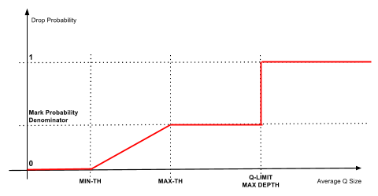


### RED With ECN (Mark Instead of Drop)

While RED prevents the queue from overflowing, you still destroyed perfectly good data, which has to be retransmitted, causing delays. To solve the problem of destroying data just to send a warning, engineers looked back at the 8-bit Differentiated Services (DS) field we discussed earlier. The first 6 bits are the DSCP stamp (for priority), and the remaining 2 bits are the **Explicit Congestion Notification (ECN)** bits.

ECN (defined in RFC 3168) allows the router to warn endpoints about congestion without dropping the packet. The two bits act as a communication channel between the sender, the router, and the receiver, using four possible states:

| ECN Bits | Name    | Short Description                                                             |
| -------- | ------- | ----------------------------------------------------------------------------- |
| 00       | Non-ECT | ECN not supported. Packets are dropped under congestion.                      |
| 10       | ECT(0)  | ECN-capable. Sender allows marking instead of dropping during congestion.     |
| 01       | ECT(1)  | ECN-capable. Same behavior as ECT(0), with potential use in advanced schemes. |
| 11       | CE      | Congestion Experienced. Packet is marked by the network to signal congestion. |

For ECN to work, both the sending computer and receiving computer must support it. Here is the exact flow of how they prevent a traffic jam:

- The Sender creates a packet and sets the ECN bits to 10 ("I am ECN capable").

- The packet hits a core switch. The switch is starting to experience congestion.

- Instead of dropping the packet, the switch flips the bits to 11 (CE - Congestion Experienced) and forwards it.

- The Receiver gets the packet, sees the 11, and realizes the network is struggling.

- The Receiver reflects this congestion signal back to the Sender by setting the **ECE** (ECN-Echo) flag in its next TCP ACK. This flag means: "I received a CE-marked packet — the path is congested."

- The Sender sees the ECE flag, reduces its congestion window (slowing its transmission rate), and sets the **CWR** (Congestion Window Reduced) flag in its next packet to tell the Receiver: "I got your signal and already slowed down, you can stop echoing."

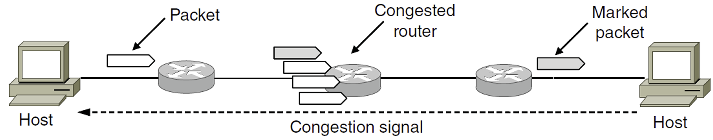

When you configure a switch to use ECN-aware RED, the standard RED logic remains exactly the same, but the "action" changes from Drop to Mark. The switch monitors the average queue depth and operates in three distinct zones:

- **Below $K_{min}$**: No action.

- **Between $K_{min}$ and $K_{max}$**: The switch randomly **marks** (sets ECN CE) passing packets with probability increasing linearly from 0% to $P_{max}$.

- **Above $K_{max}$**: All arriving packets are **marked** with CE.

If the sender ignores the warnings (or doesn't slow down fast enough) and the queue continues to grow until the physical memory buffer is 100% full, the switch has no more physical space. At this point, it must drop the packets, regardless of ECN capabilities.


### WRED — Adding Priority Awareness

Plain RED has a limitation: it treats a Green (conforming) packet and a Red (violating) packet exactly the same. **Weighted RED (WRED)** solves this by running multiple independent RED profiles on the same queue: one for each packet color. Each color gets its own $K_{min}$, $K_{max}$, and $P_{max}$ thresholds, configured to be progressively more aggressive for lower-priority traffic:

- **Red** packets have the lowest $K_{min}$ — they start getting dropped/marked earliest.
- **Yellow** packets have a moderate $K_{min}$.
- **Green** packets have the highest $K_{min}$ — they are protected for as long as possible.

This is where the "Weighted" name comes from. The algorithm weights its response based on the packet's color. As the queue fills, WRED punishes "bad" (over-budget) traffic first, protecting "good" (conforming) traffic until congestion becomes severe. A single queue can therefore offer differentiated treatment without needing separate physical buffers per priority.
