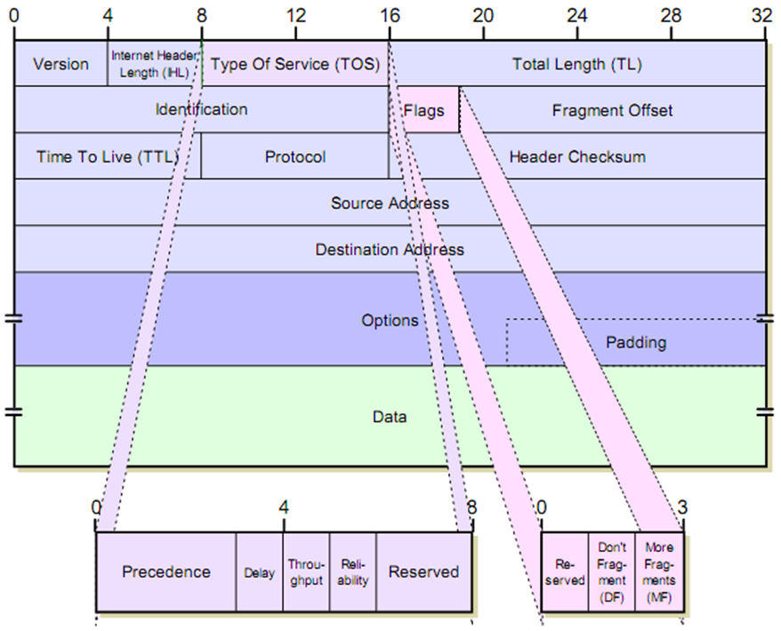
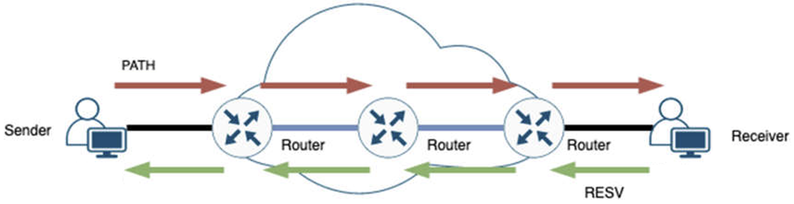
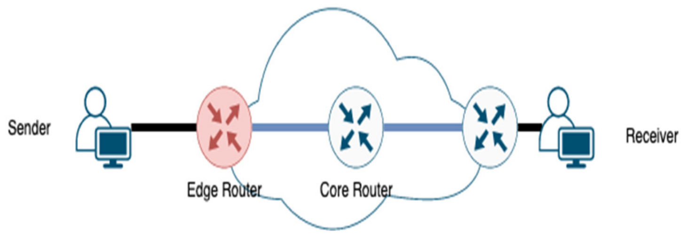
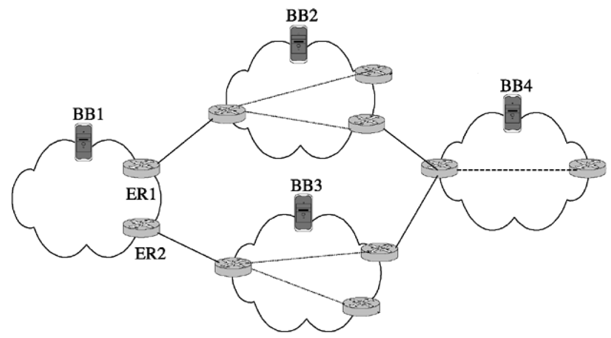
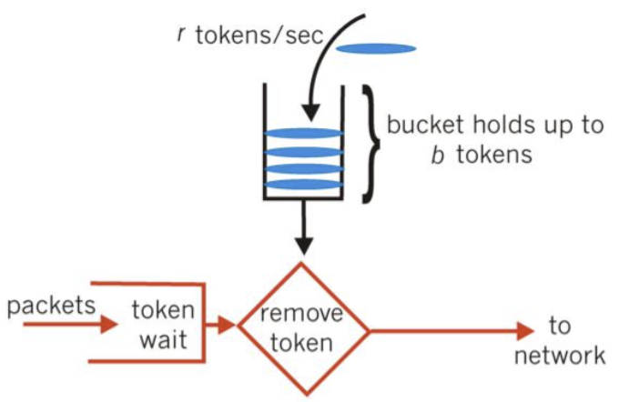
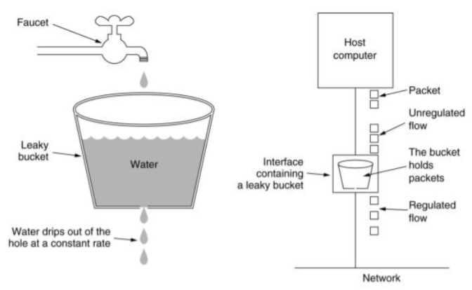
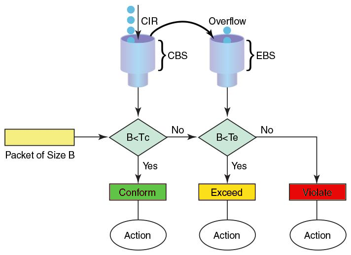
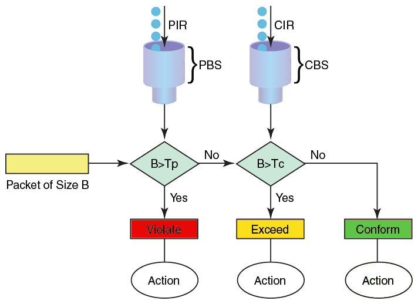

# QoS Service Models and Switch Implementation

The [QoS overview](01_QOS.md) established why different traffic needs different treatment. This document covers *how* the networking industry standardized that treatment and then dives into the switch-level mechanisms that DiffServ relies on to enforce its rules packet by packet.


## The Baseline: Best-Effort IP and The ToS Field

When the Internet was built, it used a Best-Effort model. Think of this like the standard postal service: the network promises to try its best to deliver your data, but there are no guarantees on speed, delivery, or timing.

To help prioritize traffic, engineers originally included a 1-byte field in the IP header called the **Type of Service** (ToS) field. Applications could use this to ask for things like "low delay" or "high throughput." However, early routers didn't have a unified way to process these requests, so the ToS field was mostly ignored, and Best-Effort remained the standard. As internet traffic evolved to include sensitive data like live voice and video, Best-Effort was no longer good enough.




## The First Attempt: Integrated Services Architecture (IntServ)

Defined in RFC 1633, IntServ was the industry's first major attempt to fix the Best-Effort problem. It was designed to mimic the old telephone network, where a dedicated line was kept open for the duration of a call. IntServ uses a stateful signaling protocol called **RSVP** (Resource Reservation Protocol, specified in RFC 2205 alongside RSVP extensions in related RFCs).

- Before sending data, the source application sends a `PATH` message to the destination to map the route.

- The destination sends a `RESV` message back along that exact same path (a process called **route pinning**).

Every router along that path is forced to reserve a specific amount of memory, buffer space, and bandwidth just for that one specific data flow.



**Why route pinning is necessary:** IP routing is asymmetric; the path from source S to receiver R may differ from the path R uses to reply back to S. Without route pinning, the `RESV` message would follow normal IP routing back to S, potentially traversing completely different routers (e.g., R → S3 → S5 → S4 → S1 → S) and reserving bandwidth on routers that the actual data will never touch. The reservations would be useless. RSVP prevents this by having each router record the previous hop when it processes a `PATH` message. This forces the `RESV` message to retrace the exact forward path in reverse (R → S3 → S2 → S1 → S), ensuring reservations are installed precisely on the routers where data will actually flow.

IntServ provides mathematically guaranteed performance but cannot scale. It forces the Control Plane to track and maintain reservations for every active flow. While this is feasible for a small office, a core internet router handling millions of concurrent video streams and downloads would be overwhelmed by the memory and processing requirements.


## The Winning Standard: Differentiated Services Architecture (DiffServ)

Because IntServ couldn't scale, engineers created DiffServ, which is the undisputed standard used in modern networking today. Instead of tracking millions of individual flows, DiffServ groups traffic into broad categories (classes) and splits the workload between the edges of the network and the core.

- **Edge Routers**: These sit at the boundary of a network. They run a **Multi-Field (MF) Classifier** that deeply inspects incoming packets (source/destination IP, TCP/UDP port, protocol) to identify unmarked traffic, checks if the traffic violates bandwidth limits, and stamps the packet's header.

- **Core Routers**: These sit inside the network. They run a **Behavior Aggregate (BA) Classifier** that reads the stamp left by the edge and places the packet into the appropriate hardware queue. Because they are stateless, they can forward at line rate and scale indefinitely.



### The DSCP Stamp

DiffServ took the old, ignored ToS byte in the IP header and redefined it as the **Differentiated Services** (DS) field. The first 6 bits of this field are called the **DSCP** (Differentiated Services Code Point). Using 6 bits gives us $2^6 = 64$ possible codepoints (stamps), each telling the core routers exactly how to treat the packet.

```
   0   1   2   3   4   5   6   7
 +---+---+---+---+---+---+---+---+
 |         DSCP          |  ECN  |
 +---+---+---+---+---+---+---+---+
         6 bits           2 bits
```

> The lower 2 bits were originally left as "Currently Unused". They were later defined as the Explicit Congestion Notification (ECN) field by RFC 3168, which is an entirely separate standard from DiffServ. ECN allows switches to signal congestion to endpoints without dropping packets (covered in detail in [Active Queue Management](02a_AQM.md#red-with-ecn-mark-instead-of-drop)).

### Per-Hop Behaviors

When a core router reads a DSCP stamp, it applies a specific behavior:

**Expedited Forwarding (EF)**

Defined in RFC 3246, EF provides the highest forwarding priority. It guarantees low latency, low jitter, and minimal packet loss, making it the standard choice for real-time traffic such as Voice over IP (VoIP).

**Assured Forwarding (AF)**

Defined by RFC 2597, AF provides differentiated forwarding with controllable drop behavior. Traffic is grouped into four independently managed classes (RFC 2597 assigns no inherent ordering between them; the actual forwarding priority of each class is determined by the operator's scheduling configuration). Each class has three levels of drop precedence (Low, Medium, High). During congestion within a class, the router discards packets with higher drop precedence first, protecting the more conformant traffic. The naming convention is **AFxy**, where **x** is the class number (1–4) and **y** is the drop precedence (1 = Low, 2 = Medium, 3 = High).

| Drop Precedence | Class 1 (001) | Class 2 (010) | Class 3 (011) | Class 4 (100) |
| --------------- | ------------- | ------------- | ------------- | ------------- |
| Low (1)         | AF11 = 10     | AF21 = 18     | AF31 = 26     | AF41 = 34     |
| Medium (2)      | AF12 = 12     | AF22 = 20     | AF32 = 28     | AF42 = 36     |
| High (3)        | AF13 = 14     | AF23 = 22     | AF33 = 30     | AF43 = 38     |

The DSCP value is computed as: **(Class × 8) + (Drop Precedence × 2)**.

**Class Selectors (CS)**

To maintain backward compatibility with the legacy 3-bit IP Precedence (IPP) field from the original ToS byte, RFC 2474 defined eight Class Selector (CS) codepoints. These set the lower 3 bits of the DSCP to zero, so the upper 3 bits map directly to the old IPP values.

| Category | DSCP Value | Binary     | IP Precedence        |
| -------- | ---------- | ---------- | -------------------- |
| CS0 / DF | 0          | `000 000`  | Routine (Best Effort)|
| CS1      | 8          | `001 000`  | Priority             |
| CS2      | 16         | `010 000`  | Immediate            |
| CS3      | 24         | `011 000`  | Flash                |
| CS4      | 32         | `100 000`  | Flash Override       |
| CS5      | 40         | `101 000`  | Critical             |
| CS6      | 48         | `110 000`  | Internetwork Control |
| CS7      | 56         | `111 000`  | Network Control      |

As a practical reference, Cisco's QoS Baseline maps common application types to specific DSCP codepoints:

| DSCP     | Category           | Typical Application        |
| -------- | ------------------ | -------------------------- |
| CS0 / DF | Best Effort        | General internet traffic   |
| CS1      | Scavenger          | Bulk background downloads  |
| AF11     | Bulk Data          | Backup, FTP                |
| CS2      | Network Management | SNMP, Syslog               |
| AF21     | Transactional Data | ERP, database transactions |
| CS3      | Call Signaling     | SIP, H.323                 |
| AF31     | Mission-Critical   | Critical business apps     |
| CS4      | Streaming Video    | IP/TV, surveillance        |
| AF41     | Interactive Video  | Telepresence, video calls  |
| EF (46)  | Voice              | VoIP bearer audio          |
| CS6      | IP Routing         | OSPF, BGP, routing control |

### DiffServ Domains

DiffServ does not operate as a single, global set of rules across the entire Internet. Instead, it is organized into **Domains**. A Domain is a contiguous network region under a single administrative authority — such as an ISP backbone, a corporate WAN, or a data center fabric. Within a Domain, two properties hold:

- **Consistent DSCP semantics**: Every router in the Domain interprets each DSCP codepoint identically, applying the same Per-Hop Behavior for a given stamp.

- **Trust boundary at the edge**: The Edge Routers (described above) enforce classification and policing at the Domain boundary. Core Routers inside the Domain trust the DSCP stamps applied at the edge and forward without re-inspection.

### Service Level Agreements (SLAs)

Because the Internet is made up of thousands of different interconnected Domains, traffic eventually has to cross borders — for example, when a corporate enterprise network connects to an external ISP. When two different Domains connect (peer), they negotiate a **Service Level Agreement (SLA)**.

Think of the SLA as a strict border contract. It specifies exactly how much traffic and what classes of traffic (e.g., 50 Mbps of voice traffic, 500 Mbps of bulk data) the customer domain is legally allowed to inject into the provider domain. If the customer sends more traffic than the SLA allows, the receiving Edge Router will either drop the excess packets or downgrade their priority.

### The Bandwidth Broker (BB)

With Domains established and SLAs negotiated, large networks need a way to manage these agreements dynamically. The **Bandwidth Broker (BB)** is a centralized software controller that manages the resources of an entire Domain. It performs two primary functions:

- **Admission Control**: If a customer wants to send more high-priority traffic, the BB looks at the Domain's current capacity and decides whether the network can handle the new request without breaking existing SLAs with other customers.

- **Configuring the Edge**: If the BB approves a new traffic request, it automatically communicates with the Edge Routers to update their "policing profiles," telling them to allow the new traffic through.



A centralized controller may appear similar to IntServ's per-flow approach, but the critical difference is time scale. IntServ failed because it tried to negotiate resources for every single individual connection (per-flow) in real-time. The Bandwidth Broker operates on long-term provisioning. It negotiates aggregate traffic limits for hours, days, or months at a time. By managing broad policies rather than individual packets, the architecture remains highly scalable.


## The DiffServ Traffic Management Pipeline

To understand how a switch applies QoS, we must trace a packet through the complete DiffServ pipeline. The logical diagram below maps this pipeline onto the physical switch architecture, illustrating the journey from arrival to departure.

> For a treatment of the underlying switch silicon architecture, see [Switch Architecture](https://github.com/ManiAm/net-lab-switch-serdes/blob/master/docs/01_switch_architecture.md).

```
            ┌─ INGRESS ─────────────────┐  ┌─ FABRIC ─────┐  ┌─ EGRESS ──────────────────┐
            │                           │  │              │  │                           │
Packet ────►│  Classifier               │  │              │  │  WRED (Drop / ECN Mark)───┼───► Packet Out
  In        │      │                    │  │              │  │       ▲                   │
            │      ▼                    │  │              │  │       │                   │
            │  Meter (Token Bucket)     │  │   Switch     │  │  Shaper (Leaky Bucket)    │
            │      │                    │  │   Fabric     │  │       ▲                   │
            │      ▼                    │  │  (Crossbar)  │  │       │                   │
            │  Marker (G / Y / R)       │  │              │  │  Egress Queue             │
            │      │                    │  │              │  │  (per Traffic Class)      │
            │      ▼                    │  │              │  │       ▲                   │
            │  Policer ── Drop ──► X    │  │              │  └───────┼───────────────────┘
            │      │                    │  │              │          │
            │    Pass                   │  │              │          │
            │      ▼                    │  │              │          │
            │  Ingress VOQ  ────────────┼─►│─ ─ ─ ─ ─ ─ ──┼─ ─ ─ ─ ──┘
            │  (per Egress dest.)       │  │              │
            └───────────────────────────┘  └──────────────┘
```

On an edge router, the full pipeline executes from classification through policing. On a core router, these ingress steps are bypassed — the existing DSCP stamp determines the egress queue directly.

The following sections detail each building block of the pipeline.


## Rate Measurement — Token Bucket and Leaky Bucket

Before a network device can restrict or manage traffic, it needs a mathematical model to measure it. There are two primary algorithms used:

**Token Bucket** (Allows Bursts)

Imagine a bucket that automatically fills with "tokens" at a constant, agreed-upon rate (e.g., 100 tokens per second). When a packet wants to pass, it must take a token out of the bucket. If the network is quiet, tokens save up. When a sudden burst of data arrives, it can consume all the saved tokens at once, allowing the burst to pass at maximum speed. Once the bucket is empty, new traffic is restricted.



**Leaky Bucket** (Forces Smoothness)

Imagine a bucket with a hole in the bottom. You can pour water (data bursts) into the top as fast and erratically as you want, but it only leaks out the bottom at one steady, unchanging rate. This algorithm completely eliminates bursts, turning chaotic incoming traffic into a perfectly smooth output stream. If you pour data in too fast, the bucket overflows and packets are dropped.




## Ingress Classification

Before a packet can be metered or marked, the switch must first determine *which policy* applies to it. This is the job of the Classifier — the very first step in the ingress pipeline.

The Classifier inspects IP header fields — such as the DSCP value, source/destination IP, protocol number, or TCP/UDP port number — and uses them to look up the corresponding traffic profile. Different traffic types have different bandwidth contracts. For example:

- A packet with DSCP 46 (EF / Voice) might be mapped to a strict voice profile with a low committed rate and tight policing.
- A packet with DSCP 0 (Best Effort) might be mapped to a permissive default profile with a large burst allowance.

The Classifier does not modify the packet or assign a color. Its sole output is a policy selection: which set of Token Bucket parameters (CIR, CBS, PIR, PBS) the Meter should use for this packet. Each traffic class maintains its own independent token bucket — voice traffic is metered against the voice budget, best-effort traffic against the best-effort budget, and so on. They do not share a bucket. Once the policy is selected, the packet moves to the Meter and Marker.

This is the bridge between the per-class world (traffic classes defined by DSCP tags) and the per-packet world (metering, marking, and policing described in the sections below). Every subsequent step operates on the individual packet using the profile the Classifier chose.


## Ingress Metering and Marking

With the traffic profile selected by the Classifier, the switch evaluates whether the sender is conforming to its bandwidth contract. It does this using a **Three-Color Marker** — a Token Bucket system that meters each packet and paints it one of three colors:

- **Green** (Conforming): The flow is within its guaranteed budget.
- **Yellow** (Exceeding): The flow is over its baseline budget but still within a tolerable excess.
- **Red** (Violating): The flow has entirely exceeded its allowance.

In every Token Bucket system, one token directly represents one byte of data. The configured bandwidth rate acts as continuous income, steadily refilling the bucket with tokens over time, while each incoming packet acts as an immediate expense that consumes tokens exactly equal to its size. Because network hardware cannot easily measure the speed of an instantaneous packet, it instead performs a simple mathematical check: does the bucket currently have enough saved tokens ($T_c$) to "pay" for the packet's size ($B$)? By ensuring the packet size doesn't exceed the available token balance, the switch prevents traffic from draining the bucket faster than the rate can replenish it, effectively enforcing a long-term speed limit through a series of short-term, size-based transactions.

There are two standardized Three-Color Marker algorithms. Both use two token buckets and produce the same three colors, but they differ in what they measure: one polices **burst size** at a single rate, the other polices **two distinct rates**.

> **How the color is stored:** The switch does not modify the packet itself when assigning a color. Instead, the switch ASIC attaches an internal descriptor or metadata tag to the packet as it moves through the pipeline. Think of it as a sticky note the switch puts on the packet for its own internal use. The Policer reads this internal color to decide drop/pass/remark, and WRED reads it to pick which threshold profile to apply. This metadata never leaves the switch; it is discarded when the packet is serialized onto the outgoing wire.


### Single-Rate Three-Color Marker (srTCM)

The srTCM, defined in [RFC 2697](https://datatracker.ietf.org/doc/html/rfc2697), is the simpler of the two markers. It has a single speed limit (one rate) and uses two buckets to distinguish between a normal burst and an excessive burst at that rate.



| Parameter | Meaning                               | Role                            |
|-----------|---------------------------------------|---------------------------------|
| **CIR**   | Token generation rate (the only rate) | The guaranteed average speed    |
| **CBS**   | Max size of the Committed bucket      | Max conforming burst            |
| **EBS**   | Max size of the Excess bucket         | Max tolerable excess burst      |

- **Bucket C** (Committed Burst): Holds tokens up to CBS.
- **Bucket E** (Excess Burst): Holds tokens up to EBS.

Both buckets share the single rate CIR, but they are not refilled independently. Tokens generated at CIR flow into Bucket C first. Only when Bucket C is completely full do the surplus tokens overflow into Bucket E. If both buckets are full, new tokens are simply discarded. This overflow design means Bucket E only accumulates tokens during quiet periods when the flow is not consuming its full committed allowance.

**Marking algorithm:** When a packet of size $B$ arrives:

1. If $B \le T_c$ (Bucket C has enough tokens): spend $B$ tokens from Bucket C → **Green**.
2. Else if $B \le T_e$ (Bucket C is short, but Bucket E has enough): spend $B$ tokens from Bucket E → **Yellow**.
3. Else (neither bucket can cover the packet): no tokens are spent → **Red**.

The srTCM answers one question: *how bursty is this flow at its contracted rate?* A flow sending at or below CIR stays Green. A flow that sends a burst exceeding CBS but still within the saved-up excess allowance (EBS) turns Yellow. A flow that exhausts both buckets turns Red. Because there is only one rate, all traffic exceeding CIR is differentiated solely by remaining burst allowance. The srTCM cannot classify over-budget traffic into distinct rate tiers — whether a flow exceeds CIR by 10% or by 700%, the marking outcome depends only on how many tokens remain in the buckets, not on the flow's throughput relative to multiple rate thresholds.


### Two-Rate Three-Color Marker (trTCM)

The trTCM, defined in [RFC 2698](https://datatracker.ietf.org/doc/html/rfc2698), adds a second speed limit. Instead of measuring burst tolerance at one rate, it measures traffic against two independent rates: a baseline rate (Committed) and an absolute ceiling rate (Peak).



| Parameter | Meaning                           | Role                              |
|-----------|-----------------------------------|-----------------------------------|
| **CIR**   | Refill rate of Committed bucket   | Guaranteed average rate           |
| **CBS**   | Max size of Committed bucket      | Max conforming burst              |
| **PIR**   | Refill rate of Peak bucket        | Upper bound rate (PIR ≥ CIR)      |
| **PBS**   | Max size of Peak bucket           | Max admissible burst at peak rate |

- **Bucket C** (Committed): Refills at CIR up to CBS.
- **Bucket P** (Peak): Refills at PIR up to PBS.

Unlike the srTCM, each bucket refills independently at its own rate. There is no overflow relationship between them — they operate in parallel.

**Marking algorithm:** When a packet of size $B$ arrives:

1. If $B > T_p$ (Bucket P cannot cover the packet): no tokens are spent from either bucket → **Red**.
2. Else if $B > T_c$ (Bucket P can, but Bucket C cannot): spend $B$ tokens from Bucket P only → **Yellow**.
3. Else (both buckets can cover the packet): spend $B$ tokens from both Bucket C and Bucket P → **Green**.

Notice the evaluation order is reversed compared to the srTCM: the trTCM checks the Peak bucket first. This is because the Peak rate is the absolute ceiling — if the flow exceeds PIR, nothing else matters and the packet is immediately Red.

The trTCM answers a different question: *how fast is this flow relative to two rate tiers?* A flow sending at or below CIR stays Green. A flow sending faster than CIR but slower than PIR turns Yellow — it is exceeding its baseline but staying under the peak ceiling. A flow exceeding PIR turns Red. Because the two buckets refill at different rates, the trTCM directly measures the flow's actual throughput against two speed thresholds, not just its burst behavior.

### Why Two Systems

| Dimension                | srTCM (RFC 2697)                                     | trTCM (RFC 2698)                                |
|--------------------------|------------------------------------------------------|-------------------------------------------------|
| **Rates configured**     | One (CIR)                                            | Two (CIR and PIR)                               |
| **What it measures**     | Burst size at a single rate                          | Throughput against two rate thresholds          |
| **Bucket relationship**  | Overflow — E only fills when C is full               | Independent — each refills at its own rate      |
| **Yellow means**         | "Burst exceeded CBS but within EBS at the same rate" | "Sending faster than CIR but slower than PIR"   |

**When to use the srTCM:** The flow has a single contracted rate and you want to tolerate occasional bursts up to a defined size. This is common for access-layer policing where the SLA specifies "100 Mbps with up to 64 KB burst" — the CIR is 100 Mbps, CBS defines the normal burst allowance, and EBS defines a larger grace burst. The srTCM is the natural choice when the question is: *did this customer send a burst that is too large?*

**When to use the trTCM:** The flow has two distinct rate tiers — a guaranteed baseline and an allowed peak — and you need to police throughput at both levels simultaneously. This is common for tiered ISP services where a customer pays for "50 Mbps guaranteed, burstable to 200 Mbps." CIR is 50 Mbps, PIR is 200 Mbps. Traffic within 50 Mbps is fully protected (Green), traffic between 50–200 Mbps is best-effort (Yellow, dropped first during congestion), and traffic above 200 Mbps is dropped immediately (Red). The trTCM is the natural choice when the question is: *how fast is this customer sending relative to two rate limits?*


## Ingress Enforcement (Policer)

Once the traffic is measured and colored, the switch must enforce the bandwidth rules immediately before letting the traffic into its internal network. It uses a Policer for this. The Policer is the network's strict border guard. It is commonly applied on ingress to protect internal network resources, prevent DoS attacks or burst overloads, and strictly enforce Service Level Agreements (SLAs). Importantly, it has no memory and no buffer to hold delayed packets.

The Policer looks at the colors assigned by the Marker and takes one of three possible actions. Because it makes an instantaneous decision with no buffering, it adds zero latency to the flow.

| Action     | What happens                                                             |
| ---------- | ------------------------------------------------------------------------ |
| **Pass**   | Forward the packet as-is, no modification.                               |
| **Drop**   | Discard the packet immediately. It never enters the switch fabric.       |
| **Remark** | Rewrite the packet's DSCP bits to a lower priority, then forward.        |

Remarking is distinct from the Marker's internal color (which is switch-local metadata that never leaves the switch). A remark modifies the real packet header. Every downstream switch will see the degraded label, and WRED will drop or mark it first during congestion.

Which colors trigger which action depends on the enforcement policy. **Hard Drop** is the strict approach: Green and Yellow packets are passed, Red packets are dropped. This protects internal bandwidth but can introduce sudden packet loss and TCP reordering if the sender doesn't properly shape its bursts. **Soft Drop** is the lenient approach: Green packets are passed, Yellow and Red packets are remarked. No packets are discarded at the policer, but over-budget traffic is demoted so the network treats it as expendable downstream.


## Egress Queue Structure

After surviving ingress processing, packets cross the switch fabric (crossbar) and arrive at the destination egress port. Each egress port does not contain a single monolithic buffer; it is divided into multiple independent queues — up to eight, numbered TC 0 through TC 7, as defined by the IEEE 802.1Q standard. How many queues are active and how the scheduler divides link bandwidth among them is configured through **Enhanced Transmission Selection (ETS)**, covered in the next document.

When a packet arrives at the egress port, the switch consults an operator-configured **DSCP-to-TC mapping table** to determine which queue the packet enters. For example, a packet marked DSCP 26 (AF31) might map to TC 3, while a packet marked DSCP 0 (Best Effort) maps to TC 0. This mapping is the bridge between DiffServ's Layer 3 classification (the DSCP stamp) and the Layer 2 queuing hardware (the physical queue index).

Because each TC is an independent queue, the switch can attach per-queue traffic management policies. Each queue can have its own **Shaper** (controlling the maximum drain rate) and its own **WRED profile** (controlling when to drop or ECN-mark packets as the queue fills). The Shaper is described below; WRED and the other congestion actions are covered in [Active Queue Management](02a_AQM.md).


## Egress Shaping (Shaper)

Each egress queue has a Shaper to ensure traffic leaving does not overwhelm the downstream device. The Shaper uses the **Leaky Bucket** algorithm, which means it relies on the queue's memory buffer to absorb bursts.

If a burst of traffic arrives at the exit port faster than the outgoing cable can handle, the Shaper does not drop the packets. Instead, it holds them in its buffer and releases them gradually at the precise, configured speed limit. It prevents packet loss but introduces a slight delay (latency) while packets wait in line.


The next document, [Active Queue Management](02a_AQM.md), covers what happens when the Shaper's buffer starts to fill — the proactive congestion mechanisms (RED, ECN, WRED, and Packet Trimming) that prevent tail drop.
