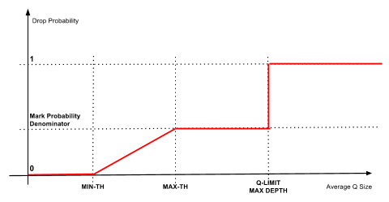
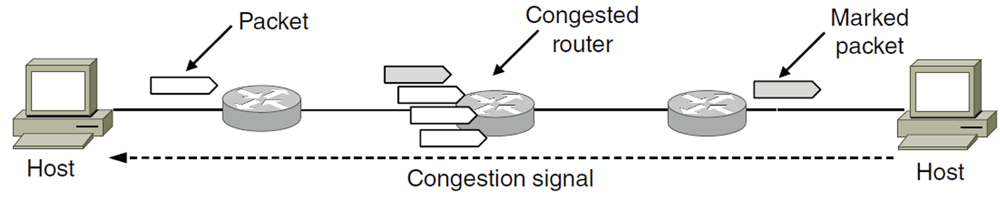
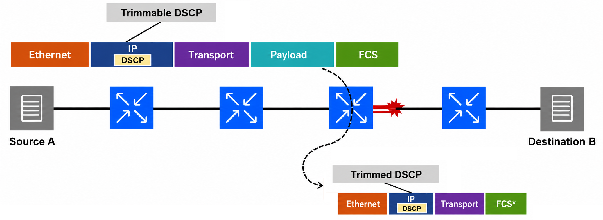
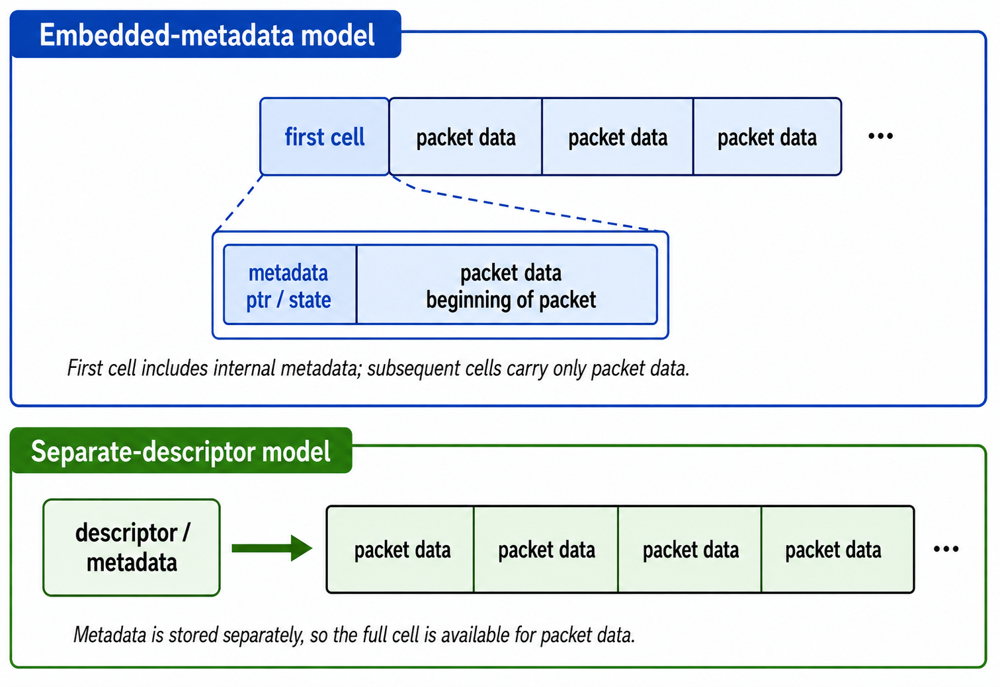

# Active Queue Management

The [egress shaper](02_SERVICE_MODELS.md#egress-shaping-shaper) works perfectly until too much traffic arrives for too long. If that happens, its memory buffer (the egress queue) will eventually fill up. If a buffer becomes completely full, it triggers a catastrophic event called **Tail Drop**, where all new arriving packets are indiscriminately dropped regardless of flow or priority.

To prevent this, the switch uses an early warning system that takes proactive action *before* the queue overflows.

## RED — The Base Algorithm

When a switch's egress queue starts filling up, it uses a mechanism called **Random Early Detection (RED)**. Instead of waiting for the queue to become 100% full (which causes massive, simultaneous packet loss), RED starts intentionally dropping a few random packets early. Because TCP protocols monitor for lost packets, these early drops act as a "warning shot". When the sender realizes a packet was dropped, it assumes the network is congested and slows down its transmission rate. RED monitors the average depth of the egress queue and operates with a single set of three parameters:

- $K_{min}$: The minimum threshold — the queue depth at which probabilistic action begins.
- $K_{max}$: The maximum threshold — the queue depth at which all arriving packets are acted upon.
- $P_{max}$: The maximum probability (percentage) of taking action between $K_{min}$ and $K_{max}$.

RED treats every packet identically — it has no awareness of a packet's color or priority. It operates in three zones:

- **Below $K_{min}$**: The egress queue is healthy. All packets pass through normally.

- **Between $K_{min}$ and $K_{max}$**: The switch begins randomly **dropping** passing packets. The drop probability increases linearly from 0% (at $K_{min}$) to $P_{max}$ (at $K_{max}$). This gradual ramp is crucial — it gives TCP senders time to detect loss and reduce their transmission rate smoothly, rather than hitting a sudden cliff where every packet is lost at once.

- **Above $K_{max}$**: The queue is critically full. **All** arriving packets are dropped (100% drop rate), equivalent to tail drop. This is the last resort to prevent total buffer exhaustion.

## RED With ECN (Mark Instead of Drop)

While RED prevents the queue from overflowing, it still discards packets that must be retransmitted, adding latency. To signal congestion without destroying data, engineers repurposed the two lowest bits of the DS field — the bits left unused when DSCP was defined — as the **Explicit Congestion Notification (ECN)** field.

ECN (defined in RFC 3168) allows the router to warn endpoints about congestion without dropping the packet. The two bits act as a communication channel between the sender, the router, and the receiver, using four possible states:

| ECN Bits | Name    | Short Description                                                             |
| -------- | ------- | ----------------------------------------------------------------------------- |
| 00       | Non-ECT | ECN not supported. Packets are dropped under congestion.                      |
| 10       | ECT(0)  | ECN-capable. Sender allows marking instead of dropping during congestion.     |
| 01       | ECT(1)  | ECN-capable. Same behavior as ECT(0), with potential use in advanced schemes. |
| 11       | CE      | Congestion Experienced. Packet is marked by the network to signal congestion. |

For ECN to work, both the sending computer and receiving computer must support it. Here is the exact flow of how they prevent a traffic jam:

- The Sender creates a packet and sets the ECN bits to 10 ("I am ECN capable").

- The packet hits a core switch. The switch is starting to experience congestion.

- Instead of dropping the packet, the switch flips the bits to 11 (CE - Congestion Experienced) and forwards it.

- The Receiver gets the packet, sees the 11, and realizes the network is struggling.

- The Receiver reflects this congestion signal back to the Sender by setting the **ECE** (ECN-Echo) flag in its next TCP ACK. This flag means: "I received a CE-marked packet — the path is congested."

- The Sender sees the ECE flag, reduces its congestion window (slowing its transmission rate), and sets the **CWR** (Congestion Window Reduced) flag in its next packet to tell the Receiver: "I got your signal and already slowed down, you can stop echoing."

When you configure a switch to use ECN-aware RED, the standard RED logic remains exactly the same, but the "action" changes from Drop to Mark. The switch monitors the average queue depth and operates in three distinct zones:

- **Below $K_{min}$**: No action.

- **Between $K_{min}$ and $K_{max}$**: The switch randomly **marks** (sets ECN CE) passing packets with probability increasing linearly from 0% to $P_{max}$.

- **Above $K_{max}$**: All arriving packets are **marked** with CE.

If the sender ignores the warnings (or doesn't slow down fast enough) and the queue continues to grow until the physical memory buffer is 100% full, the switch has no more physical space. At this point, it must drop the packets, regardless of ECN capabilities.

## WRED — Adding Priority Awareness

Plain RED has a limitation: it treats a Green (conforming) packet and a Red (violating) packet exactly the same. **Weighted RED (WRED)** solves this by running multiple independent RED profiles on the same queue: one for each packet color. Each color gets its own $K_{min}$, $K_{max}$, and $P_{max}$ thresholds, configured to be progressively more aggressive for lower-priority traffic:

- **Red** packets have the lowest $K_{min}$ — they start getting dropped/marked earliest.
- **Yellow** packets have a moderate $K_{min}$.
- **Green** packets have the highest $K_{min}$ — they are protected for as long as possible.

This is where the "Weighted" name comes from. The algorithm weights its response based on the packet's color. As the queue fills, WRED punishes "bad" (over-budget) traffic first, protecting "good" (conforming) traffic until congestion becomes severe. A single queue can therefore offer differentiated treatment without needing separate physical buffers per priority.

## Hardware Implementation: The Unified WRED/ECN Profile

The sections above present RED, ECN, and WRED as distinct concepts. In practice, switch ASICs implement them as a single, unified configuration object — commonly called a **WRED profile** — that is attached to a specific egress queue. RED and ECN are not independent, parallel mechanisms; ECN is a **mode** layered on top of the WRED threshold engine.

A WRED profile contains two categories of parameters:

- **Threshold parameters**: The per-color $K_{min}$, $K_{max}$, and $P_{max}$ values that define when and how aggressively the algorithm responds to congestion.

- **ECN mode**: A toggle that determines what **action** the algorithm takes when those thresholds are crossed.

When a WRED profile is attached to a queue, the ECN mode controls the behavior:

| ECN Mode | ECN-Capable Packets (ECT)  | Non-ECN-Capable Packets (Non-ECT) |
| -------- | -------------------------  | --------------------------------- |
| Disabled | Dropped probabilistically  | Dropped probabilistically |
| Enabled  | Marked with CE (preserved) | Dropped (via WRED thresholds or tail drop, depending on ASIC) |

With ECN disabled, the profile operates as a pure WRED drop engine — the traditional RED behavior described above. With ECN enabled, the same thresholds drive CE marking instead of drops for ECN-capable traffic. Non-ECN-capable packets sharing the same queue are still subject to probabilistic drops, because marking their headers would be meaningless — the endpoints do not understand the signal.

This design means that configuring "RED" versus "RED with ECN" on a switch is not a matter of choosing between two different algorithms. The operator defines a single set of WRED thresholds, attaches them to a queue, and then enables or disables ECN marking on that same profile. The threshold math is identical in both cases; only the resulting action differs.

> **Platform variance:** The exact behavior for non-ECT packets on ECN-enabled queues is ASIC-dependent. Some silicon (e.g., Broadcom Trident II) applies the same WRED thresholds to drop non-ECT traffic. Others (e.g., Juniper QFX10000 series) fall back to tail drop for non-ECT packets on ECN-enabled queues, ignoring the WRED thresholds entirely. Vendor documentation should always be consulted for the specific platform.

## Packet Trimming — The Third Congestion Action

The previous sections introduced two actions a switch can take at the egress queue when congestion builds: dropping (RED/WRED) and marking (ECN). Packet Trimming is a third action, designed for scenarios where neither dropping nor marking is sufficient:

| Congestion action   | What the switch does | What the sender learns | Limitation |
|---------------------|---------------------|----------------------|------------|
| **Drop** (RED/WRED) | Destroy the packet entirely | Nothing — must wait for a retransmission timeout or SACK gap | Slow recovery; the sender has no immediate signal |
| **Mark** (ECN)      | Preserve the packet, flip ECN bits to CE | "Slow down" — a proactive early warning | No help once the queue is full and packets must be discarded |
| **Trim**            | Strip the payload, forward only the headers on a high-priority queue | "This specific packet was lost to congestion, but the path is alive" | Requires transport support (e.g., NACK-based selective retransmission) |

Dropping completely destroys the packet. The receiver has no immediate knowledge of the loss, forcing the transport layer to rely on a retransmission timeout (RTO). This delay — typically tens to hundreds of milliseconds — is catastrophic for tightly synchronized workloads. ECN marking preserves the packet but acts only as a proactive, early-warning signal to slow the sender down. It offers no recovery mechanism once a queue is entirely overwhelmed and packets must be discarded.

Packet Trimming fills the gap between these two extremes. Instead of silently discarding a packet when a buffer fills, the switch truncates it. The payload is stripped, but the transport headers are preserved and forwarded. This allows the receiver to instantly identify the missing data and issue a selective retransmission request (NACK), recovering the payload in a single round-trip without waiting for an RTO.

### Trim Eligibility

Not all traffic should be trimmed. For example, control-plane packets, such as ARP or BGP, must never be truncated. The switch must determine which packets are eligible for trimming before applying the truncation logic. This eligibility decision varies by implementation:

- **Queue-based eligibility**: The switch trims any packet that would otherwise be dropped from a trim-enabled egress queue. Eligibility is determined entirely by which queue the packet lands in. This is the model used in current SAI APIs and SONiC implementations.

- **DSCP-based eligibility**: The source NIC marks outgoing data packets with a specific DSCP codepoint (referred to as **DSCP-TRIMMABLE** in the Ultra Ethernet specification), signaling to every switch in the fabric that this packet may be truncated under congestion. The UE specification recommends combining DSCP-based eligibility with queue congestion state — both conditions must be true for trimming to occur. This approach gives endpoints explicit control over which flows opt in to trimming.

In either model, trimming is only triggered when an eligible packet encounters actual congestion at the egress queue. A packet that is eligible but arrives at an uncongested queue is forwarded normally.

### DSCP Rewrite and Priority Promotion

Regardless of how eligibility is determined, the switch must signal to the receiver that a packet has been trimmed. It does this by rewriting the DSCP field in the IP header to a pre-configured value known as **DSCP-TRIMMED**. This rewrite informs the destination host that the payload was intentionally removed and enables **priority promotion**: because every switch in the fabric maps the TRIMMED DSCP to a higher-priority traffic class, the trimmed packet bypasses the very congestion that caused it to be trimmed. Since the trimmed packet consists only of headers (typically 128–256 bytes), promoting it does not meaningfully contribute to congestion in the high-priority queue. Instead, it ensures the loss notification reaches the destination with minimal delay.

### End-to-End Workflow

Source A sends a full-size frame (Ethernet | IP | Transport | Payload | FCS) across the fabric. The **Trimmable DSCP** label in the diagram indicates that the IP header's DSCP field carries a codepoint marking this packet as eligible for trimming. The frame traverses two switches without issue. At the third switch, the egress queue is congested — shown by the red burst.

Instead of dropping the packet, the congested switch performs five operations:

1. **Truncate** the packet to a configured size (typically 128–256 bytes), keeping the Ethernet, IP, and transport headers but stripping the payload.

2. **Update the IP total length** and recalculate the IP header checksum to reflect the smaller packet.

3. **Rewrite the DSCP** field to the configured **Trimmed** codepoint, so every downstream device knows this packet was intentionally truncated.

4. **Recalculate the FCS.** The original FCS was computed over the full frame — headers and payload combined — so it is now invalid. The switch computes a new checksum over the trimmed frame. This is why the diagram labels it **FCS\***: the trimmed packet is a valid Ethernet frame with a fresh checksum, not a corrupt fragment. It passes Layer 2 integrity checks at every downstream hop.

5. **Forward the trimmed copy** through a high-priority egress queue (the "trim queue") that is not congested, bypassing the bottleneck. The original full-size packet is dropped and counted in the queue's standard drop statistics.

Destination B receives the trimmed packet, sees the Trimmed DSCP, and knows exactly which flow lost data — all the transport headers (including sequence numbers) are intact. The receiver immediately sends a selective retransmission request (NACK) back to Source A, which retransmits only the missing payload. The entire recovery completes in a single round-trip, without waiting for a retransmission timeout.

### Switch Configuration Parameters

To implement packet trimming on modern data center switch ASICs, four core parameters must be defined:

- **Trim Size**: The maximum byte length of the trimmed packet. The value must be large enough to preserve the headers the receiver needs to identify the original flow and request retransmission:

  | Header   | Size (bytes) |
  |----------|--------------|
  | Ethernet | 14           |
  | IPv4     | 20           |
  | IPv6     | 40           |
  | TCP      | 20           |
  | UDP      | 8            |
  | RoCE BTH | 12           |
  | **Minimum for flow ID (IPv4 + BTH)** | **~46** |
  | **Typical configured size** | **128–256** |

  The configured size is set well above the minimum to accommodate optional headers (VLAN tags, GRE/VXLAN encapsulation) and transport metadata such as sequence numbers. Networks using tunneling or encapsulation require a larger trim size to preserve the inner headers. The trim size is a network-wide parameter — all switches in the fabric must use the same value to ensure consistent behavior.

- **DSCP Mapping**: The DSCP value written into the trimmed packet's IP header (the TRIMMED codepoint). In implementations that use DSCP-based eligibility, administrators can also configure which incoming DSCP values are eligible for trimming.

- **Traffic Class (TC)**: The high-priority traffic class into which the switch reclassifies the trimmed packets to facilitate priority promotion.

- **Queue**: The specific egress queue assigned for forwarding the trimmed traffic. Depending on the platform, this is either an explicit index or dynamically derived from the Traffic Class.

Packet Trimming is a foundational element of the Ultra Ethernet Transport (UET) specification by the Ultra Ethernet Consortium (UEC). It is actively supported by modern switch architectures — including NVIDIA Spectrum-4, Broadcom Tomahawk 5, and Marvell Teralynx — making it a critical mechanism for zero-drop, low-tail-latency AI environments.

### Trim Size and ASIC Cell Size

Switch ASICs do not store packets as contiguous byte streams. The Memory Management Unit (MMU) slices each incoming packet into fixed-size units called **cells** — the smallest unit of buffer allocation. A 1500-byte packet, for example, occupies multiple cells, linked together by an internal pointer chain. Cell size is a hardware constant that varies by platform:

| Platform family                          | Cell size |
|------------------------------------------|-----------|
| NVIDIA Spectrum-1                        | 96 bytes (48 × 2)  |
| NVIDIA Spectrum-2 / Spectrum-3           | 144 bytes (48 × 3) |
| NVIDIA Spectrum-4 / Spectrum-5           | 192 bytes (48 × 4) |
| Broadcom Trident II (Memory Model-based) | 208 bytes |
| Broadcom Tomahawk 3/4                    | 254 bytes |
| Nokia 7220 IXR-H5                        | 206 bytes |
| Nokia 7220 IXR-H6                        | 392 bytes |

How the ASIC organizes data within each cell depends on the architecture. Two models are common:

1. **Embedded-metadata model (Broadcom, Nokia).** The first cell of a packet is split between internal metadata (40–64 bytes of per-packet state — pointers, scheduling context, QoS tags) and the beginning of the packet data. Subsequent cells carry only packet data. Because metadata occupies part of the first cell, the usable space for packet bytes in that cell is `cell_size − metadata_overhead`.

2. **Separate-descriptor model (NVIDIA Spectrum).** Metadata is stored in a dedicated descriptor buffer, entirely outside the cell array. Every cell — including the first — holds only packet data.

This cell structure directly constrains the trim size. On platforms that use the embedded-metadata model, a trimmed packet should ideally fit within a single cell. The effective maximum is approximately `cell_size − metadata_overhead`, which is why the actual trimmed packet size may differ from the configured value by a few bytes — the ASIC rounds to cell boundaries. On Nokia IXR-H5/H6, the trim size is non-configurable and fixed to exactly one cell minus metadata. On Spectrum-4, where metadata is stored separately, the configurable range is 256–1024 bytes (must be a multiple of 4).

The buffer benefit is direct: a 1500-byte packet occupies 6–8 cells depending on the ASIC. After trimming, it occupies one cell. The remaining cells are immediately freed back to the shared buffer pool, relieving the very congestion that triggered the trim.

### Cell Types: SOP, MOP, and EOP

Cells within a packet are classified by position. In Broadcom architectures the first cell is called the **SOP cell** (Start of Packet), the last is the **EOP cell** (End of Packet), and any cells in between are **MOP cells** (Middle of Packet).

The SOP cell is the most significant of the three. Because packets are stored in arrival order, the SOP cell always contains the packet headers — Ethernet, IP, and transport — which are the fields the ASIC needs to make a forwarding decision. This has two important consequences:

1. **Cut-through pipelining.** The ingress pipeline begins parsing the SOP cell and performing forwarding lookups *before* the MOP and EOP cells have even arrived. The forwarding decision overlaps with packet reception, reducing latency.

2. **Admission control at SOP.** Buffer availability and memory threshold checks are evaluated when the SOP cell arrives. If resources are insufficient — for example, the ingress FIFO level exceeds the priority threshold — the packet is dropped immediately, before subsequent cells consume buffer. This prevents a partially admitted packet from wasting memory that could serve other flows.
