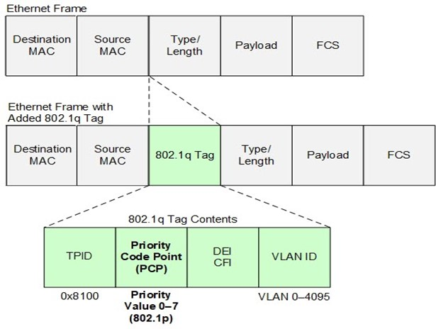
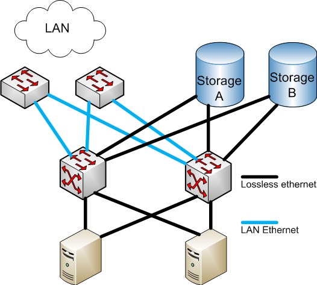

# Traffic Classification and Scheduling

## Marking the Traffic (Tagging)

Before a switch can apply any specialized rules, the packets must carry an identification tag. This happens at two different layers of the network model:

- **Layer 3 Tagging** (DiffServ / DSCP): When a server or edge router generates an IP packet, it marks the 6-bit **Differentiated Services Code Point** (DSCP) field in the IP header. Because this tag lives at Layer 3, it survives routing across different subnets. It provides up to 64 possible classifications (e.g., EF for VoIP, AF41 for Video). DiffServ was covered in the [Service Models document](02_SERVICE_MODELS.md).

- **Layer 2 Tagging** (IEEE 802.1Q / PCP): When that packet is encapsulated into an Ethernet frame, a 3-bit **Priority Code Point** (PCP) is added to the VLAN tag. This provides 8 priority levels (0–7). Because it is a Layer 2 tag, it is visible to the switch hardware immediately, but it is stripped off if the packet is routed without a VLAN tag.




## Data Center Bridging (DCB) — Why it exists

### The "Wild West" of QoS (1998–2011)

Standards like 802.1Q and DiffServ defined the tags (PCP and DSCP) but failed to specify exactly how switch silicon should handle those tags. Because there was no standard for how queues should be scheduled or how losslessness should be guaranteed, switch vendors bolted on these behaviors in proprietary, incompatible ways. For over a decade, building a multi-vendor fabric with consistent QoS was nearly impossible.

### The Catalyst for Convergence (FCoE)

In the late 2000s, data centers typically maintained two completely separate physical networks:

- **The LAN** (Local Area Network): Standard Ethernet for user and application traffic. It was expected to be "lossy" and relied on upper-layer protocols like TCP to retransmit dropped packets.

- **The SAN** (Storage Area Network): Fibre Channel (FC) networks dedicated entirely to storage. FC protocols assumed a physically flawless, lossless medium; storage arrays would severely degrade or crash if packets were dropped.

To reduce cabling and hardware costs, the industry pushed to converge these two networks running both regular data and storage traffic over the exact same Ethernet switches. The flagship technology for this was **Fibre Channel over Ethernet** (FCoE). However, to make Ethernet acceptable for SAN traffic, engineers needed a standardized way to guarantee that specific storage priorities would never drop packets, while traditional TCP traffic remained lossy.



### The Standardization of DCB (2011)

To solve the FCoE convergence problem and end the era of proprietary vendor lock-in, the IEEE crystallized a family of standards around 2011 under the umbrella of **Data Center Bridging (DCB)**. This suite provided the missing standardized behavioral specifications for Ethernet silicon. For the first time, operators could confidently run a lossless storage class alongside a lossy best-effort class on a single, standardized physical wire.

### The Modern Rebirth (RoCEv2 and AI Fabrics)

Ultimately, FCoE proved overwhelmingly complex to deploy and largely faded from mainstream adoption. For a brief period, it seemed the DCB standards suite might become obsolete alongside it. However, the explosive growth of High-Performance Computing (HPC) and AI clusters brought a nearly identical problem back to the surface: InfiniBand.

Just like Fibre Channel, InfiniBand relies on a natively lossless architecture. When the industry developed RoCEv2 (RDMA over Converged Ethernet) to run InfiniBand operations over standard Ethernet, they inherited the exact same requirement: they needed to prevent packet drops at all costs. Network engineers revived the DCB protocols. The exact same building blocks originally invented to protect legacy storage arrays were perfectly suited to protect modern, high-speed AI workloads. Today, DCB remains the foundational QoS architecture for RDMA-based data centers.

> For an in-depth treatment of RDMA, InfiniBand, and RoCE, refer to the [RDMA Primer](https://github.com/ManiAm/RDMA-Primer).


### DCB Building Blocks

The DCB suite comprises four standards. Each is detailed in the sections that follow.

| Feature | IEEE Standard | Purpose |
| ------- | ------------- | ------- |
| Enhanced Transmission Selection (ETS) | IEEE 802.1Qaz | Defines how egress queues share port bandwidth, preventing any single traffic class from monopolizing the link. |
| Priority Flow Control (PFC) | IEEE 802.1Qbb | Enables per-priority flow control, allowing specific traffic classes to operate losslessly while others remain lossy on the same physical link. |
| Data Center Bridging Exchange (DCBX) | IEEE 802.1Qaz (extends 802.1AB LLDP) | Auto-negotiates DCB parameters between directly connected devices, preventing silent misconfigurations. |
| Quantized Congestion Notification (QCN) | IEEE 802.1Qau | Provides Layer 2 congestion feedback. Obsolete in modern routed fabrics; replaced by ECN and DCQCN at Layer 3. |


## Classification and the Internal Priority Pivot

When a packet arrives, the switch must determine its priority. However, different types of traffic use different header fields. The IEEE 802.1Q standard uses a 3-bit Priority Code Point (PCP) for Layer 2 fabrics, while the IETF DiffServ standard uses a 6-bit Differentiated Services Code Point (DSCP) for routed IP fabrics.

Because switch pipelines require a unified value to make decisions, the first step is converting the external header into a single **Internal Priority** (a 3-bit value, from 0 to 7). The switch uses a configurable **Trust Mode** on the ingress port to determine which header to read:

- **Trust DSCP**: Reads the 6-bit DSCP field and maps its 64 possible values down to the 8 internal priorities. Multiple DSCP values often map to a single internal priority (e.g., standard policies map DSCP 46 to internal priority 5).

- **Trust PCP**: Reads the 3-bit PCP field, which typically maps 1:1 to the internal priority.

- **Trust Both**: Dynamically reads DSCP for IP traffic and PCP for non-IP traffic (such as ARP or LLDP).

Once this Internal Priority is established, it acts as the central pivot point for two parallel processes: The Ingress Path (memory allocation) and The Egress Path (scheduling).

```text
                                       ┌─► Traffic Class (TC) ──► Egress Queue & ETS Scheduling
                                       │   (IEEE 802.1Qaz)        (Determines WHEN it leaves)
                                       │
Incoming Packet ──► Internal Priority ─┤
(DSCP or PCP)                          │
                                       │
                                       └─► Priority Group (PG) ──► Ingress Buffer & PFC State
                                           (IEEE 802.1Qbb)         (Determines IF it pauses)
```


## The Ingress Path: Memory and Loss Prevention (IEEE 802.1Qbb)

Before a packet can be scheduled for egress, it must be successfully buffered into the switch's memory as it arrives. The Internal Priority dictates how this memory is allocated and managed.

### Priority Groups (PG)

The Internal Priority maps the packet to an ingress buffer known as a **Priority Group** (PG). The PG dictates:

- **Buffer Allocation**: The specific amount of memory space reserved for this traffic type.

- **Lossless Behavior**: Whether flow control is enabled for this buffer. Priorities in a "lossy" PG are dropped if the buffer overflows.

### Priority-based Flow Control (PFC)

Before PFC, the only flow control mechanism available was IEEE 802.3x PAUSE, which halted the entire physical link indiscriminately. In a converged network carrying multiple traffic classes, this is unacceptable — pausing a bulk data transfer would simultaneously halt latency-sensitive traffic like VoIP.

IEEE 802.1Qbb introduced Priority-based Flow Control (PFC). If a Priority Group is configured as "lossless," an impending buffer overflow will trigger a PFC PAUSE frame aimed exclusively at that specific priority. This prevents packet loss for high-volume traffic (like RDMA) while allowing best-effort traffic on the same physical cable to continue flowing.

> PFC is covered in much more detail in **[Priority-based Flow Control (PFC)](04_PFC.md)**.


## The Egress Path: Classification and Queuing (IEEE 802.1Qaz)

Once safely buffered in a Priority Group, the switch must determine how the packet will leave the device. This process is governed by IEEE 802.1Qaz, commonly known as Enhanced Transmission Selection (ETS).

### Traffic Class (TC) Assignment

ETS introduces the logical concept of a **Traffic Class** (TC0–TC7). While the Priority Group dictates ingress memory, the Traffic Class dictates the egress grouping. The switch uses a configurable Priority-to-TC table to map the Internal Priority to one of these logical classes.

No IEEE or IETF standard mandates which traffic belongs in which TC number. "IEEE 802.1Q Annex I" recommends traffic *types* per priority level (shown below), but the actual TC assignment is a local policy decision. Operators must ensure consistency across all switches in their fabric — the specific TC number does not matter, only that it is uniform.

| Priority    | Traffic Type (802.1Q Annex I) |
| ----------- | ----------------------------- |
| 1 (lowest)  | Background |
| 0 (default) | Best Effort |
| 2           | Excellent Effort |
| 3           | Critical Applications |
| 4           | Video, < 100 ms latency |
| 5           | Voice, < 10 ms latency |
| 6           | Internetwork Control |
| 7 (highest) | Network Control |

Note the non-linear ordering — priority 1 is lower than priority 0 (default). This table maps priority values to recommended traffic types, but does not assign TC numbers.

In practice, vendors and industry groups publish their own templates (not mandates):

- **SONiC AZURE profile** — Microsoft's data center convention (TC 3/4 = lossless for RoCEv2)
- **IBTA RoCEv2 Annex** — recommends DSCP 26 (AF31) for RoCEv2 data traffic
- **Cisco / Arista defaults** — their own TC groupings for campus/DC use cases

These are conventions, not requirements. Two operators can use completely different TC assignments as long as the mapping is consistent across all switches in the fabric.

### Physical Silicon Queuing

While ETS defines up to 8 logical Traffic Classes, it does not dictate the hardware architecture. The switch ASIC determines the number and size of physical queues. However, the standard requires queue isolation: packets mapped to the same TC are placed into a dedicated physical egress queue, ensuring that distinct traffic classes are physically separated from one another.

### Egress Scheduling (Emptying the Queues)

With multiple physical queues holding different Traffic Classes, an ETS scheduler must determine the precise order in which queues transmit data onto the wire when the port is free. Network operators typically configure a hybrid of two scheduling algorithms to balance absolute latency requirements with bandwidth fairness:

- **Strict Priority (SP)**: The scheduler drains this queue completely before allowing any other queue to transmit. It guarantees the absolute lowest latency for highly critical traffic (like VoIP or Congestion Notification Packets). The drawback is the risk of starvation; if the SP queue is constantly saturated, lower-priority queues cannot transmit.

- **Deficit Weighted Round Robin (DWRR)**: Queues take turns transmitting based on a configured bandwidth percentage (weight). DWRR uses a deficit counter to track variable packet sizes, ensuring true *byte-level* fairness rather than simple *packet-count* fairness. This prevents starvation while respecting bandwidth tiers.

Multiple queues can be configured as Strict Priority simultaneously; when they are, the scheduler services them in descending priority order — TC7 is fully drained before TC6, TC6 before TC5, and so on. This creates a cascading starvation hierarchy where a higher SP queue can starve a lower SP queue, and all SP queues collectively starve the DWRR queues beneath them. For this reason, SP is reserved exclusively for traffic that is both latency-critical **and** inherently low-volume.

```
Egress Port
    ▲
    │
Scheduler
    ▲
    ├── TC7: VoIP / CNPs          ◄── Strict Priority (always first)
    ├── TC6: Routing Control      ◄── Strict Priority
    ├── TC5: Interactive Video    ◄── DWRR (weight: 30%)
    ├── TC3: Transactional Data   ◄── DWRR (weight: 25%)
    ├── TC1: Scavenger            ◄── DWRR (weight: 10%)
    └── TC0: Best Effort          ◄── DWRR (weight: 35%)
```

By strictly separating ingress buffering (PGs) from egress scheduling (TCs)—both branching from the centralized Internal Priority—modern architectures seamlessly run highly sensitive, lossless flows alongside standard, lossy data on the exact same physical infrastructure. Their behaviors remain entirely isolated through distinct configurations.

> For a detailed treatment of how DWRR evolved from simpler scheduling algorithms (Round Robin and Weighted Round Robin), including how the DWRR Quantum is calculated, see [Appendix A](#appendix-a-the-evolution-of-egress-scheduling-algorithms).


## The DCB Toolbox: Tailoring the Pipeline to Application Needs

While the dual-mapping architecture described above makes converged networks possible, it also leads to a common misconception. Because DCB is frequently marketed under the umbrella of "Lossless Ethernet," it is easy to assume it is an all-or-nothing feature that latency-sensitive traffic (like VoIP) completely bypasses. In reality, DCB is a modular toolbox. A converged network succeeds by allowing each application class to consume only the specific DCB components that serve its needs, while ignoring the rest.

Here is how different traffic profiles navigate the exact same DCB pipeline:

- **The Need for Speed (Latency-Sensitive)**: Applications like real-time Voice over IP (VoIP) or routing control protocols (BGP) are not configured with PFC. For these applications, the buffering latency introduced by flow control would degrade real-time audio or delay routing convergence. Therefore, they map to standard lossy Priority Groups on the ingress side. If the buffer fills, the switch drops excess packets — an acceptable trade-off, since brief loss is preferable to added latency. However, because they share the egress port with high-volume data flows, they rely on the scheduling mechanism, ETS (802.1Qaz). They are placed in a Strict Priority (SP) queue, ensuring they are transmitted before bulk data.

- **The Need for Perfection (Loss-Sensitive)**: Applications like RoCEv2 or iSCSI-based storage cannot tolerate dropped packets. They enable PFC on the ingress port to prevent packet loss, creating a lossless Priority Group. On the egress port, rather than using Strict Priority scheduling — which would starve other traffic classes due to their sustained high volume — they rely on ETS configured with DWRR weights. This allows them to share the remaining bandwidth proportionally with other traffic classes.

The table below is a unified reference showing how each traffic type uses the full DCB pipeline. The values below represent widely adopted industry conventions, not mandated standards. The specific assignment is an operator decision — what matters is that the same mapping is applied consistently from the NIC through every switch in the fabric.

| Traffic Type           | Example Protocol           | DSCP                  | TC | PFC?                       | Scheduling           | Rationale |
| ---------------------- | -------------------------- | --------------------- | -- | -------------------------- | -------------------- | --------- |
| Standard Data          | HTTP, general TCP          | 0 (CS0 / DF)          | 1  | NO                         | DWRR                 | Default class; TCP retransmits handle loss |
| Background             | Bulk transfers, backups    | 8 (CS1)               | 0  | NO                         | DWRR (lowest weight) | Scavenger class; served last under contention |
| Traditional Storage    | iSCSI                      | 18 (AF21) or 32 (CS4) | 4  | Optional (YES if lossless) | DWRR                 | No single global DSCP standard; do not use 34 (AF41), which many vendors assign to video |
| RDMA / AI Data         | RoCEv2, NVMe-oF            | 26 (AF31)             | 3  | YES                        | DWRR                 | Industry-standard TC and DSCP (NVIDIA, AMD, Broadcom, SONiC); high-volume so DWRR prevents starvation of other classes |
| Real-Time Voice        | VoIP, SIP                  | 46 (EF)               | 5  | NO                         | Strict Priority      | Drop preferable to delay; universally accepted codepoint for voice |
| Network Control + CNPs | BGP, OSPF, BFD, RoCEv2 CNP | 48 (CS6)              | 6  | NO                         | Strict Priority      | Low-volume, latency-critical; CNPs share this TC when both use DSCP 48 |

> **Separating CNPs from Network Control (optional):** If the operator needs distinct treatment for CNPs and routing control packets (e.g., different drop policies), CNPs can be marked with a DSCP other than CS6 — such as EF (46) — and mapped to their own TC.

> **Critical pitfall:** Never mark massive bulk RDMA flows with CS6 (DSCP 48). Doing so places multi-gigabit AI transfers in the exact same Strict Priority queue as routing keep-alives. A single sustained RDMA burst starves BGP and OSPF, collapsing the entire network topology.


## Data Center Bridging Exchange (DCBX) — IEEE 802.1Qaz

Configuring DCB parameters such as PFC priorities, ETS weights, and application mappings manually across thousands of switch ports and server Network Interface Cards (NICs) is highly error-prone. The Data Center Bridging Exchange Protocol (DCBX) automates this process by allowing directly connected devices to dynamically discover and negotiate their QoS settings before actual data flows.

Without an automated handshake, converged networks are highly vulnerable to **silent misconfigurations**. For example, if a switch is configured to expect lossless RoCEv2 traffic on Priority 3, but a server NIC is misconfigured to send it on Priority 0, the data will still flow. However, it will land in a standard, lossy queue. Under heavy load, the switch will drop those packets, causing catastrophic performance degradation without triggering any obvious configuration alarms. DCBX significantly reduces the risk of such misconfigurations by establishing a declared common configuration on the link. However, it does not eliminate them entirely — both endpoints must implement DCBX, the policy must be configured correctly on the authoritative switch, and operators should still validate with test traffic and monitoring.

### Phase 1: The Communication Channel (LLDP)

DCBX is not a standalone protocol. It is packaged as an extension layered on top of the Link Layer Discovery Protocol (LLDP, IEEE 802.1AB). When a server NIC connects to a switch, LLDP immediately opens a continuous, low-level dialogue between the two devices. DCBX uses this existing channel to transmit its parameters as specific Type-Length-Value (TLV) fields within the LLDP frames.

### Phase 2: The Parameter Exchange

Over this LLDP channel, DCBX exchanges the three core pillars of the QoS architecture discussed in the previous sections:

- **Application Mapping**: Which application protocols (e.g., RoCEv2 tagged with DSCP 26) must be mapped to which internal Traffic Classes.

- **PFC Configuration (802.1Qbb)**: Which specific priority groups have Priority-based Flow Control enabled (making them lossless) versus disabled (lossy).

- **ETS Bandwidth Allocation (802.1Qaz)**: Which Traffic Classes are granted Strict Priority, and what specific DWRR percentage weights are assigned to the remaining queues.

### Phase 3: Enforcement and "Willing Mode"

If the negotiation flags a mismatch (e.g., the NIC and Switch disagree on which priority is lossless), the system can halt transmission for that specific traffic class until the error is resolved. However, in modern, large-scale data centers, it is highly inefficient to independently manage configurations on both the switches and the servers. To solve this, DCBX relies on a deployment model known as "Willing Mode":

- **The Switch (Authoritative)**: The network administrator configures the "master" QoS policy exclusively on the switch.

- **The Server NIC (Willing)**: The NIC is configured to operate in "willing mode." This means the NIC passively listens to the DCBX advertisements from the switch and automatically overrides its own local settings to match the switch's configuration.

```text
Switch (Authoritative)                        Server NIC (Willing Mode)
┌──────────────────┐                          ┌──────────────────┐
│ QoS Policy Maker │─── LLDP / DCBX Packets ─►│ QoS Policy Taker │
│                  │                          │                  │
│ [x] PFC: Pri 3   │◄── 1. Switch Advertises ─│ (Awaits Config)  │
│ [x] ETS: 50%     │                          │                  │
│ [x] App: DSCP 26 │─── 2. NIC Applies ──────►│ [x] PFC: Pri 3   │
└──────────────────┘                          │ [x] ETS: 50%     │
         ▲                                    │ [x] App: DSCP 26 │
         │                                    └──────────────────┘
         │          3. Safe Data Transmission          ▼
         └─────────────────────────────────────────────┘
```

### DCBX on the ConnectX-4

On a ConnectX-4, we can query the firmware-level DCBX settings to see how the NIC is configured to participate in this negotiation:

```bash
sudo mlxconfig -d /dev/mst/mt4115_pciconf0 q | grep -iE "dcbx"

        LLDP_NB_DCBX_P1                             False(0)
        DCBX_IEEE_P1                                True(1)
        DCBX_CEE_P1                                 True(1)
        DCBX_WILLING_P1                             True(1)
```

- **`LLDP_NB_DCBX_P1 = False`**: LLDP operates in its default blocking mode, meaning the NIC firmware consumes DCBX-carrying LLDP frames directly and negotiates with the switch. If this were `True`, LLDP frames would instead be forwarded to the host OS, bypassing the firmware and disabling automatic DCBX negotiation.

- **`DCBX_IEEE_P1 = True`**: The NIC supports the modern IEEE 802.1Qaz DCBX standard. This is the version used in current RoCEv2 deployments and is the protocol that carries the PFC, ETS, and application mapping TLVs.

- **`DCBX_CEE_P1 = True`**: The NIC also supports the older Converged Enhanced Ethernet (CEE) version of DCBX, originally developed by Cisco and Intel before the IEEE standard was ratified. Having both enabled allows the NIC to negotiate with legacy switches that only speak CEE.

- **`DCBX_WILLING_P1 = True`**: The NIC is in "willing" mode, meaning it will accept the switch's DCB parameters rather than insisting on its own. In a typical deployment, the switch is the authoritative source of truth for PFC priorities, ETS bandwidth weights, and application mappings. A willing NIC defers to whatever the switch advertises.


## The Legacy Standard: Layer 2 Congestion Control (IEEE 802.1Qau / QCN)

Quantized Congestion Notification (QCN) was part of the original Data Center Bridging (DCB) suite. It was designed to provide direct, rate-limiting congestion control for early networks (such as initial FCoE or RoCEv1 deployments). However, due to fundamental shifts in how modern data centers are built, QCN is now largely obsolete.

To understand why QCN failed, one must understand network boundaries. In a flat Layer 2 network, devices communicate using MAC addresses, and frames can flow freely. However, modern data centers are built with Layer 3 routers separating the switch tiers. Native Layer 2 frames cannot pass through a Layer 3 router; they are strictly trapped within their local broadcast domain.

In early, flat Layer 2 data centers, QCN acted as a simple, direct feedback loop between the congested switch and the sender:

- **Congestion Detection**: A switch detects that its buffers are filling up.

- **The CNM Frame**: The switch generates a Congestion Notification Message (CNM).

- **Direct Feedback**: The switch sends this CNM as a native Layer 2 frame directly backward to the MAC address of the offending server, instructing the server's NIC to throttle its transmission rate.

As data centers scaled to massive sizes, they abandoned flat Layer 2 designs in favor of Layer 3 IP routing between every switch tier. This architectural shift immediately broke QCN. Because CNMs are strictly Layer 2 frames, they lack IP headers. If a server in Rack A sends traffic to a server in Rack B, and an intermediate switch experiences congestion, that switch attempts to send a L2 CNM back to Rack A. However, because the CNM hits a Layer 3 routing boundary, it is immediately dropped. The congestion signal never reaches the sender, rendering the protocol useless.

Because congestion signals must now traverse routed IP fabrics, modern RoCEv2 networks replace QCN entirely with a Layer 3-aware solution: Explicit Congestion Notification (ECN) coupled with the Data Center Quantized Congestion Notification (DCQCN) algorithm. Instead of the switch generating a L2 message and sending it backward, the switch simply marks the IP header of the forward-flowing packet (ECN). When the destination server sees this mark, it generates a fully routable Layer 3 packet (a Congestion Notification Packet, or CNP) and sends it back to the source. This ensures the congestion signal can successfully navigate the routers and reach the sender.

> DCQCN is covered in much more detail in **[Data Center Quantized Congestion Notification](05_DCQCN.md)**.


---

## Appendix A: The Evolution of Egress Scheduling Algorithms

The [Egress Scheduling](#egress-scheduling-emptying-the-queues) section above describes the two scheduling modes available to ETS: Strict Priority and Deficit Weighted Round Robin (DWRR). DWRR did not emerge in isolation. It is the product of a multi-generational evolution, where each algorithm was designed to solve a specific flaw in its predecessor. This appendix traces that lineage.


### A.1 Round Robin (RR)

The simplest scheduling algorithm visits every egress queue in a continuous, sequential loop. If a queue has traffic, the scheduler pulls exactly one packet from it, transmits that packet onto the wire, and immediately advances to the next queue.

**Motivation:** If a switch relies solely on strict priority scheduling, the lowest-priority queues can suffer indefinite **starvation** — they never transmit because higher-priority queues are constantly occupied. Round Robin eliminates starvation by guaranteeing that every queue eventually receives a transmission opportunity.

**Strengths:**

- **Zero Starvation**: Every active queue is mathematically guaranteed transmission time, regardless of how busy other queues are.

- **Hardware Simplicity**: The algorithm requires minimal memory and no complex state tracking, making it trivial to implement in basic switch ASICs.

**Weaknesses:**

- **No QoS Differentiation**: All queues are treated identically. Critical control-plane traffic receives the exact same service rate as background storage backups, making it impossible to enforce bandwidth tiers.

- **Packet Size Blindness**: RR schedules packets, not bytes. If Queue A sends 64-byte TCP ACKs and Queue B sends 1500-byte data payloads, each queue transmits one packet per round — but Queue B silently consumes approximately 23 times more bandwidth on the wire. True fairness is destroyed.

To introduce QoS differentiation — allowing the scheduler to treat some queues preferentially over others — engineers extended the algorithm with configurable weights.


### A.2 Weighted Round Robin (WRR)

Weighted Round Robin retains the cyclic structure of RR but assigns each queue a configurable **weight**. Instead of pulling one packet per queue per round, the scheduler transmits *N* packets from each queue, where *N* is proportional to the queue's configured weight.

**Motivation:** WRR introduces bandwidth tiers. A network operator can assign a weight of 3 to a video queue and 1 to a background data queue. For every 1 background packet transmitted, 3 video packets are transmitted.

**Strengths:**

- **Bandwidth Allocation**: Allows administrators to define proportional service tiers (e.g., allocating 75% of port capacity to high-priority data and 25% to low-priority traffic).

- **Starvation Prevention**: Lower-priority queues still receive guaranteed, albeit smaller, portions of the transmission cycle.

**Weaknesses:**

- **Packet Size Blindness**: WRR still counts packets, not bytes. If the high-priority queue (weight 3) sends 64-byte frames, it transmits 3 × 64 = 192 bytes per round. If the low-priority queue (weight 1) sends 1500-byte frames, it transmits 1500 bytes per round. Despite holding a lower weight, the low-priority queue consumes approximately 88% of the actual bandwidth. Variable Maximum Transmission Units (MTUs) — ranging from tiny control frames to 9000-byte storage payloads — render WRR's bandwidth allocations unreliable.

To achieve accurate bandwidth distribution in the presence of variable packet sizes, the scheduler must track the actual byte size of every packet it transmits.


### A.3 Deficit Weighted Round Robin (DWRR)

DWRR replaces the packet-counting model with a **byte-credit** system. Each queue is assigned a weight, which the switch ASIC translates into a **Quantum** — a specific number of bytes representing that queue's per-round credit allocation. Every queue also maintains a **Deficit Counter**, a running credit balance that persists across scheduling rounds.

The scheduling cycle proceeds as follows:

1. **Credit Allocation**: When the scheduler visits a queue, it adds the configured Quantum to that queue's Deficit Counter.

2. **Transmission Decision**: The scheduler examines the exact byte size of the packet at the head of the queue.

3. **Sufficient Credit**: If the Deficit Counter is greater than or equal to the packet size, the packet is transmitted. The Deficit Counter is decremented by the exact byte size of the transmitted packet. The scheduler repeats this step — transmitting additional packets from the same queue — until the queue is empty or the counter drops below the size of the next waiting packet.

4. **Insufficient Credit**: If the Deficit Counter is less than the packet size, the packet remains in the queue. The remaining credit (the **deficit**) is preserved in the counter and rolls over to the next round, ensuring that no allocated bandwidth is silently lost.

```text
Queue X (Quantum = 3000 bytes)
──────────────────────────────────────────────────────
Round 1:
  Deficit Counter: 0 + 3000 = 3000
  Packet 1 (1500 B): 3000 ≥ 1500 → Transmit.  Counter: 3000 - 1500 = 1500
  Packet 2 (1500 B): 1500 ≥ 1500 → Transmit.  Counter: 1500 - 1500 = 0
  Packet 3 (1500 B): 0 < 1500   → Wait. Deficit of 0 saved.

Round 2:
  Deficit Counter: 0 + 3000 = 3000
  Packet 3 (1500 B): 3000 ≥ 1500 → Transmit.  Counter: 3000 - 1500 = 1500
  Packet 4 (800 B):  1500 ≥ 800  → Transmit.  Counter: 1500 - 800  = 700
  Packet 5 (1500 B): 700 < 1500  → Wait. Deficit of 700 saved.

Round 3:
  Deficit Counter: 700 + 3000 = 3700
  Packet 5 (1500 B): 3700 ≥ 1500 → Transmit.  Counter: 3700 - 1500 = 2200
  ...
```

**Motivation:** By tracking the exact byte size of every transmission and preserving unused credits across rounds, DWRR ensures that bandwidth distribution precisely matches the configured weights over time, completely irrespective of packet sizes.

**Strengths:**

- **True Byte-Level Fairness**: Delivers exact bandwidth percentages. A queue sending 1500-byte packets and a queue sending 64-byte packets will ultimately receive their exact configured bandwidth ratios.

- **No Wasted Bandwidth**: If a queue is empty, the scheduler immediately skips it. Its allocated bandwidth is natively redistributed among the other active queues.

**Weaknesses:**

- **ASIC Complexity**: The switch silicon must maintain persistent state (Deficit Counters) and perform per-packet arithmetic (subtracting variable byte lengths) for every queue at line rate. This is computationally more expensive than the simple counter logic of RR or WRR.


### A.4 Calculating the DWRR Quantum

The Quantum assigned to each queue is derived from two inputs: the queue's configured weight (expressed as a percentage of the port's total bandwidth) and the port's **Maximum Transmission Unit (MTU)**. The standard formula is:

```
Quantum = Weight (%) × MTU
```

The MTU serves as the natural scaling factor because the Quantum must be large enough to guarantee that at least one maximum-sized packet can always be transmitted per round. If the Quantum were smaller than the MTU, a queue could accumulate a deficit indefinitely without ever being able to transmit, effectively starving it.

**Example:** Consider a 100 Gbps port with a 9000-byte jumbo MTU and three DWRR queues:

| Queue | Application | Weight | Quantum Calculation | Quantum (Bytes) |
| ----- | ----------- | ------ | ------------------- | --------------- |
| TC3   | RDMA        | 50%    | 0.50 × 9000        | 4500            |
| TC1   | Bulk Data   | 30%    | 0.30 × 9000        | 2700            |
| TC0   | Best Effort | 20%    | 0.20 × 9000        | 1800            |

Over many scheduling rounds, the cumulative bytes transmitted from each queue will converge on the 50:30:20 ratio, regardless of the individual packet sizes within each queue.

> **Implementation note:** Some switch ASICs internally normalize weights or apply minimum Quantum floors to prevent edge cases where very small weights produce Quanta below common packet sizes. Vendor documentation should be consulted for platform-specific behavior.
