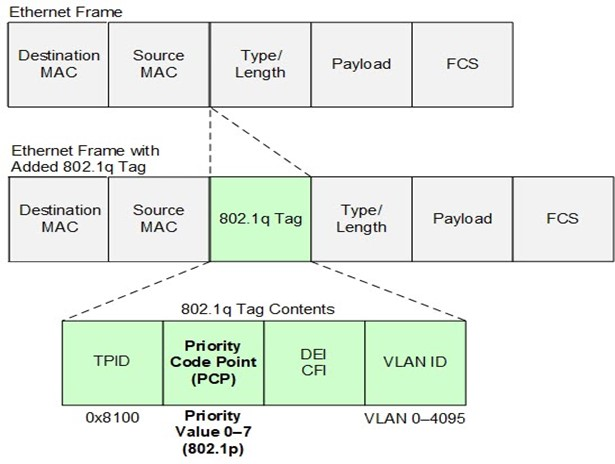
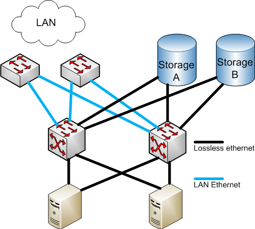
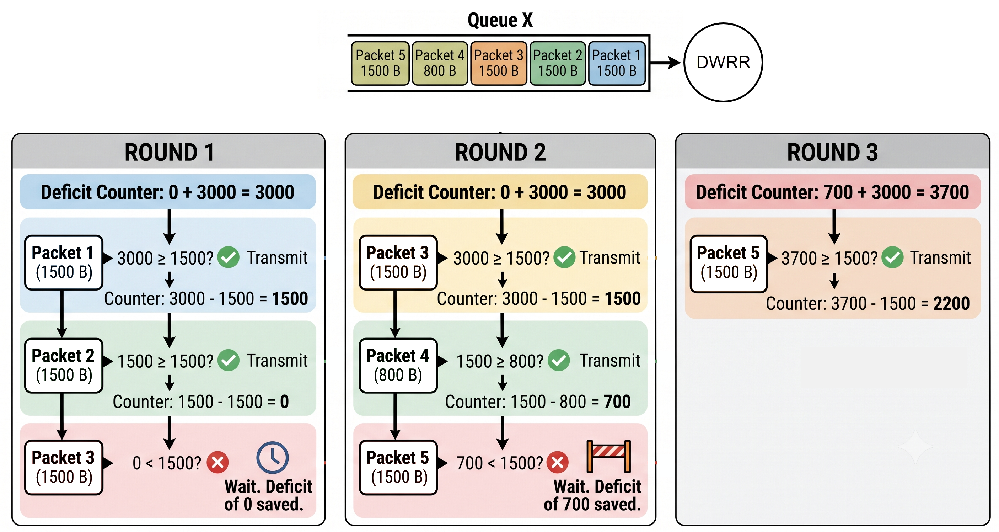

# Traffic Classification and Scheduling

## Marking the Traffic (Tagging)

Before a switch can apply any specialized rules, the packets must carry an identification tag. This happens at two different layers of the network model:

- **Layer 3 Tagging** (DiffServ / DSCP): When a server or edge router generates an IP packet, it marks the 6-bit **Differentiated Services Code Point** (DSCP) field in the IP header. Because this tag lives at Layer 3, it survives routing across different subnets. It provides up to 64 possible classifications (e.g., EF for VoIP, AF41 for Video). DiffServ was covered in the [Service Models document](02_SERVICE_MODELS.md).

- **Layer 2 Tagging** (IEEE 802.1Q / PCP): When that packet is encapsulated into an Ethernet frame, a 3-bit **Priority Code Point** (PCP) is added to the VLAN tag. This provides 8 priority levels (0–7). Because it is a Layer 2 tag, it is visible to the switch hardware immediately, but it is stripped off if the packet is routed without a VLAN tag.




## Data Center Bridging (DCB) — Why it exists

### The "Wild West" of QoS (1998–2011)

Standards like 802.1Q and DiffServ defined the tags (PCP and DSCP) but deliberately left unspecified how switch silicon should act on those tags. Neither standard dictated queue scheduling algorithms, buffer thresholds, or losslessness guarantees. Without these behavioral specifications, switch vendors implemented their own proprietary, mutually incompatible mechanisms. For over a decade, building a multi-vendor fabric with consistent QoS behavior was nearly impossible.

### The Catalyst for Convergence (FCoE)

In the late 2000s, data centers typically maintained two completely separate physical networks:

- **The LAN** (Local Area Network): Standard Ethernet for user and application traffic. It was expected to be "lossy" and relied on upper-layer protocols like TCP to retransmit dropped packets.

- **The SAN** (Storage Area Network): Fibre Channel (FC) networks dedicated entirely to storage. FC protocols assumed a physically flawless, lossless medium; storage arrays would severely degrade or crash if packets were dropped.

To reduce cabling and hardware costs, the industry pushed to converge these two networks — running both regular data and storage traffic over the same Ethernet switches. The flagship convergence technology was **Fibre Channel over Ethernet** (FCoE). However, standard Ethernet provides no delivery guarantees; making it acceptable for SAN traffic required a standardized mechanism to guarantee that specific storage priorities would never drop packets, while traditional TCP traffic continued operating in its normal, lossy mode.



### The Standardization of DCB (2011)

To solve the FCoE convergence problem and end the era of proprietary vendor lock-in, the IEEE crystallized a family of standards around 2011 under the umbrella of **Data Center Bridging (DCB)**. This suite provided the missing standardized behavioral specifications for Ethernet silicon. For the first time, operators could confidently run a lossless storage class alongside a lossy best-effort class on a single, standardized physical wire.

### The Modern Rebirth (RoCEv2 and AI Fabrics)

Ultimately, FCoE proved operationally complex to deploy — requiring end-to-end lossless configuration, specialized Converged Network Adapters, and tight coordination between storage and network teams — and largely faded from mainstream adoption. For a brief period, the DCB standards suite appeared destined for obsolescence alongside it. However, the explosive growth of High-Performance Computing (HPC) and AI clusters brought a nearly identical problem back to the surface: InfiniBand.

Just like Fibre Channel, InfiniBand relies on a natively lossless link layer (credit-based flow control prevents any packet from being transmitted unless the receiver has available buffer space). When the industry developed RoCEv2 (RDMA over Converged Ethernet) to carry InfiniBand transport over standard Ethernet, it inherited the exact same requirement: the RDMA transport protocol does not retransmit dropped packets at the link layer, so the network must prevent packet loss. Network engineers revived the DCB protocols. The same building blocks originally invented to protect legacy storage arrays were directly applicable to modern, high-speed AI workloads. Today, DCB remains the foundational QoS architecture for RDMA-based data centers.

> For an in-depth treatment of RDMA, InfiniBand, and RoCE, refer to the [RDMA Primer](https://github.com/ManiAm/RDMA-Primer).


### DCB Building Blocks

The DCB suite comprises four standards. Each is detailed in the sections that follow.

| Feature | IEEE Standard | Purpose |
| ------- | ------------- | ------- |
| Enhanced Transmission Selection (ETS) | IEEE 802.1Qaz | Defines how egress queues share port bandwidth, preventing any single traffic class from monopolizing the link. |
| Priority Flow Control (PFC) | IEEE 802.1Qbb | Enables per-priority flow control, allowing specific traffic classes to operate losslessly while others remain lossy on the same physical link. |
| Data Center Bridging Exchange (DCBX) | IEEE 802.1Qaz (extends 802.1AB LLDP) | Auto-negotiates DCB parameters between directly connected devices, preventing silent misconfigurations. |
| Quantized Congestion Notification (QCN) | IEEE 802.1Qau | Provides Layer 2 congestion feedback. Obsolete in modern routed fabrics; replaced by ECN and DCQCN at Layer 3. |


## Classification and the Traffic Class Pivot

When a packet arrives, the switch must resolve its external marking into a single unified value for internal processing. Although the ASIC parser can read both DSCP and PCP headers, all downstream pipeline stages — buffer management, flow control, queue selection — reference a single normalized index: the 3-bit **Traffic Class** (TC 0–7). The switch uses a configurable **Trust Mode** on the ingress port to determine which incoming header to read when deriving this value:

- **Trust DSCP**: Reads the 6-bit DSCP field and maps its 64 possible values down to 8 Traffic Classes via a `DSCP-to-TC` map. Multiple DSCP values often map to a single TC (e.g., standard policies map DSCP 46 to TC 5).

- **Trust PCP**: Reads the 3-bit PCP field and maps it to a TC via a `DOT1P-to-TC` map.

- **Trust Both**: Dynamically reads DSCP for IP traffic and PCP for non-IP traffic (such as ARP or LLDP).

No IEEE or IETF standard mandates which traffic belongs in which TC number. TC assignment is a local policy decision; the specific number is irrelevant as long as the mapping is uniform across the fabric. In practice, vendors and industry groups publish recommended templates, such as the one in the [DCB Toolbox](#the-dcb-toolbox-tailoring-the-pipeline-to-application-needs) table below.

Once the Traffic Class is established, it serves as the central pivot for two independent subsystems: the Ingress Path (memory allocation) and the Egress Path (scheduling).

```text
                                          ┌──► Egress Queue ──► ETS Scheduling
                                          │   (IEEE 802.1Qaz)   (Determines WHEN it leaves)
                                          │
Incoming Packet ──► Traffic Class (TC) ───┤
(DSCP or PCP)                             │
                                          │
                                          └──► Priority Group (PG) ──► Ingress Buffer & PFC State
                                              (IEEE 802.1Qbb)          (Determines IF it pauses)
```


## The Ingress Path: Memory and Loss Prevention (IEEE 802.1Qbb)

Before a packet can be scheduled for egress, it must be successfully buffered into the switch's memory as it arrives. The Traffic Class dictates how this memory is allocated and managed.

### Priority Groups (PG)

The Traffic Class maps the packet to an ingress buffer partition known as a **Priority Group** (PG). A configurable `TC-to-PG` map determines this assignment. The PG dictates two properties:

- **Buffer Allocation**: The amount of dedicated memory reserved for this traffic class.

- **Lossless vs. Lossy Behavior**: Whether PFC is enabled for this PG. If PFC is enabled, the PG is lossless — an impending buffer overflow triggers a PAUSE frame to the upstream sender rather than dropping packets. If PFC is disabled, the PG is lossy — excess packets are tail-dropped when the buffer fills.

### Priority-based Flow Control (PFC)

Before PFC, the only flow control mechanism available was IEEE 802.3x PAUSE, which halted the entire physical link indiscriminately. In a converged network carrying multiple traffic classes, this is unacceptable — pausing a bulk data transfer would simultaneously halt latency-sensitive traffic like VoIP.

IEEE 802.1Qbb introduced Priority-based Flow Control (PFC). If a Priority Group is configured as "lossless," an impending buffer overflow will trigger a PFC PAUSE frame aimed exclusively at that specific priority. This prevents packet loss for high-volume traffic (like RDMA) while allowing best-effort traffic on the same physical cable to continue flowing.

> PFC is covered in much more detail in **[Priority-based Flow Control (PFC)](04_PFC.md)**.


## The Egress Path: Queuing and Scheduling (IEEE 802.1Qaz)

Once safely buffered in a Priority Group, the switch must determine how the packet will leave the device. This process is governed by IEEE 802.1Qaz, commonly known as Enhanced Transmission Selection (ETS).

### TC-to-Queue Assignment

Each Traffic Class maps to a dedicated physical egress queue via a configurable `TC-to-Queue` map.

### Physical Silicon Queuing

While ETS defines up to 8 logical Traffic Classes, it does not dictate the hardware architecture. The switch ASIC determines the number and size of physical queues available per port. However, the standard mandates that each Traffic Class maps to its own dedicated egress queue — packets assigned to TC3 never share a queue with packets assigned to TC1. This physical separation ensures that scheduling decisions (bandwidth allocation, priority ordering) apply independently to each class without cross-contamination.

### Egress Scheduling (Emptying the Queues)

With multiple physical queues holding different Traffic Classes, an ETS scheduler must determine the precise order in which queues transmit data onto the wire when the port is free. Network operators typically configure a hybrid of two scheduling algorithms to balance absolute latency requirements with bandwidth fairness:

- **Strict Priority (SP)**: The scheduler drains this queue completely before allowing any other queue to transmit. It guarantees the lowest latency for critical traffic (like VoIP or Congestion Notification Packets). The drawback is the risk of starvation; if the SP queue is constantly saturated, lower-priority queues cannot transmit.

- **Deficit Weighted Round Robin (DWRR)**: Queues take turns transmitting based on a configured bandwidth percentage (weight). DWRR uses a deficit counter to track variable packet sizes, ensuring true *byte-level* fairness rather than simple *packet-count* fairness. This prevents starvation while respecting bandwidth tiers.

> For a detailed treatment of how DWRR evolved from simpler scheduling algorithms (Round Robin and Weighted Round Robin), including how the DWRR Quantum is calculated, see [Appendix A](#appendix-a-the-evolution-of-egress-scheduling-algorithms).

Multiple queues can be configured as Strict Priority simultaneously; when they are, the scheduler services them in descending priority order — TC7 is fully drained before TC6, TC6 before TC5, and so on. This creates a cascading starvation hierarchy where a higher SP queue can starve a lower SP queue, and all SP queues collectively starve the DWRR queues beneath them. For this reason, SP is reserved exclusively for traffic that is both latency-critical **and** inherently low-volume.

```
Egress Port
    ▲
    │
Scheduler
    ▲
    ├── TC7: Switch CPU (LLDP, LACP)   ◄── Strict Priority (always first)
    ├── TC6: Network Control / CNPs    ◄── Strict Priority
    ├── TC5: Real-Time Voice (VoIP)    ◄── Strict Priority
    ├── TC4: Traditional Storage       ◄── DWRR (weight: 15%)
    ├── TC3: RDMA / AI Data            ◄── DWRR (weight: 40%)
    ├── TC1: Standard Data             ◄── DWRR (weight: 30%)
    └── TC0: Background                ◄── DWRR (weight: 15%)
```


## The DCB Toolbox: Tailoring the Pipeline to Application Needs

DCB is often called "Lossless Ethernet," which leads to a common misconception: that it is an all-or-nothing switch — either the entire link is lossless or DCB is irrelevant. In reality, losslessness (PFC) is just one component. DCB is a modular toolbox, and each application class uses only the pieces it needs.

Two examples show how different applications use the same physical link but rely on completely different DCB components:

- **Latency-sensitive traffic** (VoIP, BGP): These applications care about delay, not about occasional packet loss. A dropped voice sample causes a brief glitch; a delayed one is useless. PFC would actually hurt here — pausing the sender adds buffering latency. So these map to a **lossy** PG (no PFC). If the buffer fills, the switch drops excess packets rather than pausing. On the egress side, they are placed in a **Strict Priority** queue so the scheduler always transmits them before bulk data.

- **Loss-sensitive traffic** (RoCEv2, iSCSI): These applications cannot tolerate any packet loss — a single drop triggers expensive transport-layer recovery. They map to a **lossless** PG with PFC enabled, so the switch pauses the sender before the buffer overflows. On the egress side, they use **DWRR** (weighted round-robin) scheduling instead of Strict Priority. Why? Because they push sustained high volume. If they were in a Strict Priority queue, they would starve every other traffic class on the port.

The table below is a unified reference showing how each traffic type uses the full DCB pipeline. The TC assignments and DSCP-to-TC mappings are widely adopted industry conventions, not mandated standards. The specific assignment is an operator decision — what matters is that the same mapping is applied consistently from the NIC through every switch in the fabric.

| Traffic Type           | Example Protocol           | DSCP                  | TC | Lossless?    | Scheduling           | Rationale |
| ---------------------- | -------------------------- | --------------------- | -- | ------------ | -------------------- | --------- |
| Background             | Bulk transfers, backups    | 8 (CS1)               | 0  | No           | DWRR (lowest weight) | Scavenger class; served last under contention |
| Standard Data          | HTTP, general TCP, ICMP    | 0 (CS0 / DF)          | 1  | No           | DWRR                 | Default class; loss is tolerable (TCP retransmits, ICMP is best-effort) |
| RDMA / AI Data         | RoCEv2, NVMe-oF            | 26 (AF31)             | 3  | Yes          | DWRR                 | Industry-standard TC and DSCP (NVIDIA, AMD, Broadcom, SONiC); high-volume so DWRR prevents starvation of other classes |
| Traditional Storage    | iSCSI                      | 18 (AF21) or 32 (CS4) | 4  | Optional     | DWRR                 | No single global DSCP standard; do not use 34 (AF41), which many vendors assign to video |
| Real-Time Voice        | VoIP, SIP                  | 46 (EF)               | 5  | No           | Strict Priority      | Drop preferable to delay; universally accepted codepoint for voice |
| Network Control + CNPs | BGP, OSPF, BFD, RoCEv2 CNP | 48 (CS6)              | 6  | No           | Strict Priority      | Low-volume, latency-critical; CNPs share this TC when both use DSCP 48 |
| Switch CPU (Internal)  | LLDP, LACP, STP BPDUs      | N/A                   | 7  | No           | Strict Priority      | L2 control frames with no IP header bypass DSCP classification; ASIC places them in TC 7 on egress; not operator-assignable |

> **Reading the DSCP column:** The DSCP codepoints themselves are IETF-standardized, not arbitrary numbers. **Class Selectors (CS)** are backward-compatible with the legacy 3-bit IP Precedence field (CSn = n × 8). **Assured Forwarding (AF)** encodes a class and a drop precedence into a single value (AFxy = x × 8 + y × 2). **Expedited Forwarding (EF = 46)** is the dedicated codepoint for low-latency real-time traffic. For a full explanation of these families and their history, see [Per-Hop Behaviors](02_SERVICE_MODELS.md#per-hop-behaviors).

> **Separating CNPs from Network Control (optional):** If the operator needs distinct treatment for CNPs and routing control packets (e.g., different drop policies), CNPs can be marked with a DSCP other than CS6 — such as EF (46) — and mapped to their own TC.

> **Critical pitfall:** Never mark massive bulk RDMA flows with CS6 (DSCP 48). Doing so places multi-gigabit AI transfers in the exact same Strict Priority queue as routing keep-alives. A single sustained RDMA burst starves BGP and OSPF, collapsing the entire network topology.


## Data Center Bridging Exchange (DCBX) — IEEE 802.1Qaz

Configuring DCB parameters such as PFC priorities, ETS weights, and application mappings manually across thousands of switch ports and server Network Interface Cards (NICs) is highly error-prone. The Data Center Bridging Exchange Protocol (DCBX) automates this process by allowing directly connected devices to dynamically discover and negotiate their QoS settings before actual data flows.

Without an automated handshake, converged networks are vulnerable to **silent misconfigurations**. Consider this scenario: a switch is configured to apply PFC (lossless treatment) to Priority 3 for RoCEv2 traffic, but a server NIC is misconfigured to mark RoCEv2 packets with Priority 0. The data still flows — there is no immediate error — but it lands in a standard lossy queue that lacks PFC protection. Under heavy load, the switch tail-drops those packets, causing severe RDMA performance degradation without triggering any configuration alarms. DCBX significantly reduces this risk by establishing a declared common configuration before data flows. However, it does not eliminate misconfiguration entirely — both endpoints must implement DCBX, the policy must be correctly defined on the authoritative switch, and operators should still validate end-to-end behavior with test traffic and monitoring tools.

### Phase 1: The Communication Channel (LLDP)

DCBX is not a standalone protocol. It is packaged as an extension layered on top of the Link Layer Discovery Protocol (LLDP, IEEE 802.1AB). When a server NIC connects to a switch, LLDP immediately opens a continuous, low-level dialogue between the two devices. DCBX uses this existing channel to transmit its parameters as specific Type-Length-Value (TLV) fields within the LLDP frames.

### Phase 2: The Parameter Exchange

Over this LLDP channel, DCBX exchanges the three core pillars of the QoS architecture discussed in the previous sections:

- **Application Mapping**: Which application protocols (e.g., RoCEv2 tagged with DSCP 26) must be mapped to which internal Traffic Classes.

- **PFC Configuration (802.1Qbb)**: Which specific priority groups have Priority-based Flow Control enabled (making them lossless) versus disabled (lossy).

- **ETS Bandwidth Allocation (802.1Qaz)**: Which Traffic Classes are granted Strict Priority, and what specific DWRR percentage weights are assigned to the remaining queues.

### Phase 3: Enforcement and "Willing Mode"

If the negotiation flags a mismatch (e.g., the NIC and Switch disagree on which priority is lossless), the system can halt transmission for that specific traffic class until the error is resolved. However, in modern, large-scale data centers, it is highly inefficient to independently manage configurations on both the switches and the servers. To solve this, DCBX relies on a deployment model known as "Willing Mode":

- **The Switch (Authoritative)**: The network administrator configures the "master" QoS policy exclusively on the switch.

- **The Server NIC (Willing)**: The NIC is configured to operate in "willing mode." This means the NIC passively listens to the DCBX advertisements from the switch and automatically overrides its own local settings to match the switch's configuration.

```text
Switch (Authoritative)                        Server NIC (Willing Mode)
┌──────────────────┐                          ┌──────────────────┐
│ QoS Policy Maker │─── LLDP / DCBX Packets ─►│ QoS Policy Taker │
│                  │                          │                  │
│ [x] PFC: Pri 3   │◄── 1. Switch Advertises ─│ (Awaits Config)  │
│ [x] ETS: 50%     │                          │                  │
│ [x] App: DSCP 26 │─── 2. NIC Applies ──────►│ [x] PFC: Pri 3   │
└──────────────────┘                          │ [x] ETS: 50%     │
         ▲                                    │ [x] App: DSCP 26 │
         │                                    └──────────────────┘
         │          3. Safe Data Transmission          ▼
         └─────────────────────────────────────────────┘
```

### DCBX on the ConnectX-4

On a ConnectX-4, we can query the firmware-level DCBX settings to see how the NIC is configured to participate in this negotiation:

```bash
sudo mlxconfig -d /dev/mst/mt4115_pciconf0 q | grep -iE "dcbx"

        LLDP_NB_DCBX_P1                             False(0)
        DCBX_IEEE_P1                                True(1)
        DCBX_CEE_P1                                 True(1)
        DCBX_WILLING_P1                             True(1)
```

- **`LLDP_NB_DCBX_P1 = False`**: LLDP operates in its default blocking mode, meaning the NIC firmware consumes DCBX-carrying LLDP frames directly and negotiates with the switch. If this were `True`, LLDP frames would instead be forwarded to the host OS, bypassing the firmware and disabling automatic DCBX negotiation.

- **`DCBX_IEEE_P1 = True`**: The NIC supports the modern IEEE 802.1Qaz DCBX standard. This is the version used in current RoCEv2 deployments and is the protocol that carries the PFC, ETS, and application mapping TLVs.

- **`DCBX_CEE_P1 = True`**: The NIC also supports the older Converged Enhanced Ethernet (CEE) version of DCBX, originally developed by Cisco and Intel before the IEEE standard was ratified. Having both enabled allows the NIC to negotiate with legacy switches that only speak CEE.

- **`DCBX_WILLING_P1 = True`**: The NIC is in "willing" mode, meaning it will accept the switch's DCB parameters rather than insisting on its own. In a typical deployment, the switch is the authoritative source of truth for PFC priorities, ETS bandwidth weights, and application mappings. A willing NIC defers to whatever the switch advertises.


## The Legacy Standard: Layer 2 Congestion Control (IEEE 802.1Qau / QCN)

Quantized Congestion Notification (QCN) was part of the original Data Center Bridging (DCB) suite. It was designed to provide direct, rate-limiting congestion control for early networks (such as initial FCoE or RoCEv1 deployments). However, due to fundamental shifts in how modern data centers are built, QCN is now largely obsolete.

To understand why QCN failed, one must understand Layer 2 vs. Layer 3 forwarding boundaries. In a flat Layer 2 network, all devices share a single broadcast domain and communicate using MAC addresses; Ethernet frames can reach any device without passing through a router. Modern data centers, however, are built as routed IP fabrics with Layer 3 boundaries between switch tiers. A native Layer 2 frame (one that lacks an IP header) cannot cross a Layer 3 boundary — the router has no IP destination to forward it toward, so it is discarded.

In early, flat Layer 2 data centers, QCN acted as a simple, direct feedback loop between the congested switch and the sender:

- **Congestion Detection**: A switch detects that its buffers are filling up.

- **The CNM Frame**: The switch generates a Congestion Notification Message (CNM).

- **Direct Feedback**: The switch sends this CNM as a native Layer 2 frame directly backward to the MAC address of the offending server, instructing the server's NIC to throttle its transmission rate.

As data centers scaled, they abandoned flat Layer 2 designs in favor of Layer 3 IP routing between every switch tier (the modern Clos/leaf-spine topology). This architectural shift broke QCN. Because CNMs are strictly Layer 2 frames — addressed by MAC with no IP header — they cannot be routed. If a server in Rack A sends traffic to a server in Rack B, and an intermediate spine switch experiences congestion, that switch generates a CNM addressed to Rack A's server MAC. However, the CNM hits a Layer 3 boundary at the leaf switch and is dropped. The congestion signal never reaches the sender, rendering the protocol useless in any routed fabric.

Because congestion signals must now traverse routed IP fabrics, modern RoCEv2 networks replace QCN entirely with a Layer 3 solution: Explicit Congestion Notification (ECN) coupled with the Data Center Quantized Congestion Notification (DCQCN) algorithm. The mechanism works as follows: when a switch detects congestion, instead of generating a backward-facing L2 frame, it sets the ECN bits in the IP header of the forward-flowing data packet. When the destination server receives this ECN-marked packet, it generates a fully routable Layer 3 Congestion Notification Packet (CNP) and sends it back to the source. Because the CNP carries a valid IP header, it can traverse any number of Layer 3 boundaries and reliably reach the original sender.

> DCQCN is covered in much more detail in **[Data Center Quantized Congestion Notification](05_DCQCN.md)**.


---

## Appendix A: The Evolution of Egress Scheduling Algorithms

The [Egress Scheduling](#egress-scheduling-emptying-the-queues) section above describes the two scheduling modes available to ETS: Strict Priority and Deficit Weighted Round Robin (DWRR). DWRR did not emerge in isolation. It is the product of a multi-generational evolution, where each algorithm was designed to solve a specific flaw in its predecessor. This appendix traces that lineage.


### A.1 Round Robin (RR)

The simplest scheduling algorithm visits every egress queue in a continuous, sequential loop. If a queue has traffic, the scheduler pulls exactly one packet from it, transmits that packet onto the wire, and immediately advances to the next queue.

**Motivation:** If a switch relies solely on strict priority scheduling, the lowest-priority queues can suffer indefinite **starvation** — they never transmit because higher-priority queues are constantly occupied. Round Robin eliminates starvation by guaranteeing that every queue eventually receives a transmission opportunity.

**Strengths:**

- **Zero Starvation**: Every active queue is mathematically guaranteed transmission time, regardless of how busy other queues are.

- **Hardware Simplicity**: The algorithm requires minimal memory and no complex state tracking, making it trivial to implement in ASICs.

**Weaknesses:**

- **No QoS Differentiation**: All queues are treated identically. Critical control-plane traffic receives the exact same service rate as background storage backups, making it impossible to enforce bandwidth tiers.

To introduce QoS differentiation — allowing the scheduler to treat some queues preferentially over others — engineers extended the algorithm with configurable weights.


### A.2 Weighted Round Robin (WRR)

Weighted Round Robin retains the cyclic structure of RR but assigns each queue a configurable **weight**. Instead of pulling one packet per queue per round, the scheduler transmits *N* packets from each queue, where *N* is proportional to the queue's configured weight.

**Motivation:** WRR introduces bandwidth tiers. A network operator can assign a weight of 3 to a video queue and 1 to a background data queue. For every 1 background packet transmitted, 3 video packets are transmitted.

**Strengths:**

- **Bandwidth Allocation**: Allows administrators to define proportional service tiers (e.g., allocating 75% of port capacity to high-priority data and 25% to low-priority traffic).

- **Starvation Prevention**: Lower-priority queues still receive guaranteed, albeit smaller, portions of the transmission cycle.

**Weaknesses:**

- **Packet Size Blindness**: WRR (like RR) counts packets, not bytes. If the high-priority queue (weight 3) sends 64-byte frames, it transmits 3 × 64 = 192 bytes per round. If the low-priority queue (weight 1) sends 1500-byte frames, it transmits 1500 bytes per round. Despite holding a lower weight, the low-priority queue consumes approximately 88% of the actual bandwidth. True fairness is destroyed.

To achieve accurate bandwidth distribution in the presence of variable packet sizes, the scheduler must track the actual byte size of every packet it transmits.


### A.3 Deficit Weighted Round Robin (DWRR)

DWRR replaces the packet-counting model with a **byte-credit** system. Each queue is assigned a **Quantum** — a number of bytes representing its per-round credit allocation — and maintains a **Deficit Counter**, a running credit balance that persists across scheduling rounds.

The scheduling cycle proceeds as follows:

1. **Credit Allocation**: When the scheduler visits a queue, it adds the queue's Quantum to its Deficit Counter.

2. **Transmission Decision**: The scheduler examines the exact byte size of the packet at the head of the queue.

3. **Sufficient Credit**: If the Deficit Counter is greater than or equal to the packet size, the packet is transmitted. The Deficit Counter is decremented by the exact byte size of the transmitted packet. The scheduler repeats this step — transmitting additional packets from the same queue — until the queue is empty or the counter drops below the size of the next waiting packet.

4. **Insufficient Credit**: If the Deficit Counter is less than the packet size, the packet remains in the queue. The remaining credit (the **deficit**) is preserved in the counter and rolls over to the next round, ensuring that no allocated bandwidth is silently lost.

**Motivation:** By tracking the exact byte size of every transmission and preserving unused credits across rounds, DWRR ensures that bandwidth distribution precisely matches the configured weight ratios over time, completely irrespective of packet sizes.

**Strengths:**

- **True Byte-Level Fairness**: Delivers exact bandwidth percentages. A queue sending 1500-byte packets and a queue sending 64-byte packets will ultimately receive their exact configured bandwidth ratios.

- **No Wasted Bandwidth**: If a queue is empty, the scheduler immediately skips it. Its allocated bandwidth is natively redistributed among the other active queues.

**Weaknesses:**

- **ASIC Complexity**: The switch silicon must maintain persistent state (Deficit Counters) and perform per-packet arithmetic (subtracting variable byte lengths) for every queue at line rate. This is computationally more expensive than the simple counter logic of RR or WRR.

#### Example: DWRR Scheduling Walkthrough

The following walkthrough traces a single queue through three scheduling rounds, showing how the Deficit Counter accumulates credit, pays for each transmitted packet, and carries forward unused credit to the next round.




```text
Queue X (Quantum = 3000 bytes)
──────────────────────────────────────────────────────
Round 1:
  Deficit Counter: 0 + 3000 = 3000
  Packet 1 (1500 B): 3000 ≥ 1500 → Transmit.  Counter: 3000 - 1500 = 1500
  Packet 2 (1500 B): 1500 ≥ 1500 → Transmit.  Counter: 1500 - 1500 = 0
  Packet 3 (1500 B): 0 < 1500   → Wait. Deficit of 0 saved.

Round 2:
  Deficit Counter: 0 + 3000 = 3000
  Packet 3 (1500 B): 3000 ≥ 1500 → Transmit.  Counter: 3000 - 1500 = 1500
  Packet 4 (800 B):  1500 ≥ 800  → Transmit.  Counter: 1500 - 800  = 700
  Packet 5 (1500 B): 700 < 1500  → Wait. Deficit of 700 saved.

Round 3:
  Deficit Counter: 700 + 3000 = 3700
  Packet 5 (1500 B): 3700 ≥ 1500 → Transmit.  Counter: 3700 - 1500 = 2200
  ...
```


#### How Weight Maps to Hardware

The operator configures only a relative integer **weight** per queue via `SAI_SCHEDULER_ATTR_SCHEDULING_WEIGHT`. The SAI specification defines this as a `sai_uint8_t` with a valid range of 1–255, but the actual range accepted by the hardware varies by platform. The weight value is passed directly through the software stack without transformation.

The SAI layer and the SDK do **not** compute a Quantum or perform any weight normalization. The raw weight integer is written directly to the ASIC's register. The ASIC's internal silicon-level scheduler uses these weight values to implement DWRR scheduling in hardware — maintaining deficit counters, computing per-round byte budgets, and determining transmission eligibility at line rate. These internal mechanics are opaque; the operator only sees weights.

The operator does not configure a Quantum directly — the SAI API does not expose one. Only the relative weight is visible. The hardware's internal translation of weight into scheduling behavior is entirely within the ASIC silicon.

**Example:** Consider a 100 Gbps port with three DWRR queues configured with relative weights 5, 3, and 2:

| Queue | Application   | Weight | Bandwidth Share |
| ----- | ------------- | ------ | --------------- |
| TC3   | RDMA          | 5      | 50%             |
| TC1   | Standard Data | 3      | 30%             |
| TC0   | Background    | 2      | 20%             |

The bandwidth share is derived from the weight ratios (5 : 3 : 2 = 50 : 30 : 20). Over many scheduling rounds, the cumulative bytes transmitted from each queue converge on this ratio, regardless of individual packet sizes.

> The exact mechanism by which the ASIC translates a weight into scheduling decisions (quantum sizing, deficit tracking granularity, cell-size alignment) is vendor-specific and internal to the silicon. The operator controls only relative weights; the hardware guarantees proportional bandwidth convergence.
