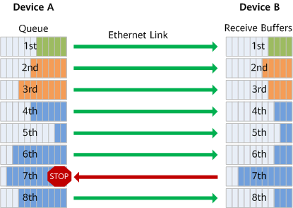
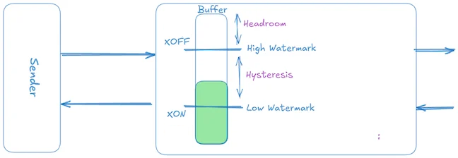
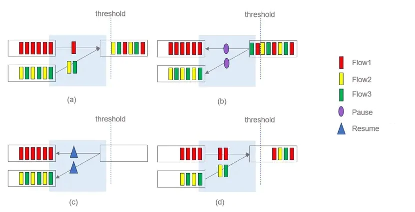
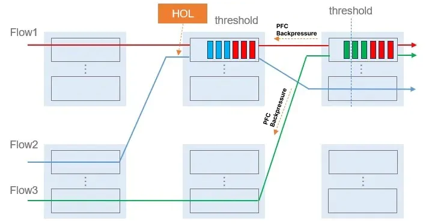
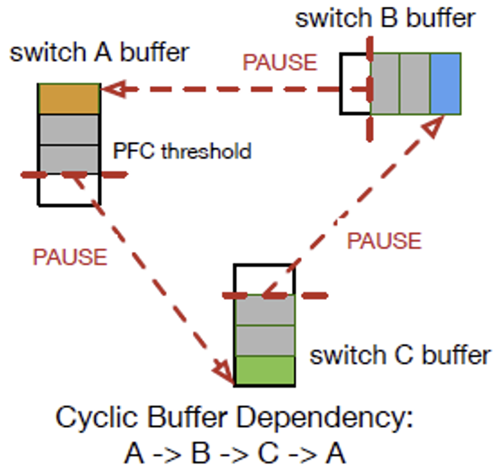

# Priority-based Flow Control (PFC)

Priority-based Flow Control (PFC), defined by IEEE 802.1Qbb, solves the limitations of legacy Ethernet flow control by enabling lossless transmission on a per-priority basis. While the older 802.3x standard paused an entire physical link during congestion (unacceptably halting latency-sensitive traffic like VoIP), PFC can selectively pause individual traffic classes. This allows a switch to momentarily halt high-volume lossless traffic while permitting other classes to continue flowing over the same physical link.

To achieve this granular control, PFC relies on **Priority Groups** (PGs) to manage the switch's ingress buffers. When a packet arrives, its internal priority is mapped to a specific PG, which dictates how much buffer memory it receives and whether it operates in a lossless or lossy mode. Only traffic mapped to a lossless PG triggers PFC PAUSE frames when the PG's buffer nears capacity. Traffic in a lossy PG ignores PFC entirely and is simply dropped if its allocated buffer overflows.

This document covers PFC hardware requirements, threshold mechanics (Xoff, headroom, Xon), and the operational risks PFC introduces along with the mitigations used in modern deployments.

## 802.3x and PFC: Mutual Exclusion

Legacy 802.3x PAUSE and PFC cannot coexist on the same port. 802.3x pauses all traffic indiscriminately, which directly conflicts with PFC's per-priority granularity. If both were active simultaneously, a single 802.3x PAUSE frame would halt all eight Priority Groups, negating the isolation that PFC provides.

In practice, enabling PFC on a port automatically disables 802.3x flow control. A well-implemented switch enforces this constraint: if an operator attempts to enable 802.3x on a PFC-enabled port, the system either rejects the command or auto-disables 802.3x with a warning.

## Layer 2, Hop-by-Hop Operation

PFC operates directly between two connected Ethernet ports (e.g., Server NIC ↔ Switch). It is strictly a Layer 2 conversation — no routers or IP addresses are involved in the PAUSE frame transaction. Understanding this is essential for reasoning about its hardware requirements and propagation behavior.

**Bidirectional**: The IEEE 802.1Qbb standard specifies PFC for both "bridges and end nodes," meaning any device on either end of a full-duplex Ethernet link can generate PAUSE frames toward its peer. Whichever side's ingress buffer fills up sends the pause.

| Direction | When It Happens | Example Scenario |
|-----------|-----------------|------------------|
| Switch → NIC | Switch's ingress buffer fills because the NIC is sending too fast | Incast: many NICs blast data into the same switch port. Switch pauses the senders. |
| NIC → Switch | NIC's receive buffer fills because the switch is delivering faster than the application consumes | Slow receiver: GPU is busy computing and not draining the NIC's RX buffer. NIC pauses the switch. |

**Hardware-Driven**: PFC PAUSE frame generation and processing happen entirely in the hardware ASIC (both in switches and NICs), completely bypassing the CPU, operating system, and software drivers. When a buffer threshold is crossed, the hardware must construct, transmit, and react to PAUSE frames within microseconds to prevent packet drops.

## Hardware Requirements: Data Center vs. Consumer NICs

Because PFC requires dedicated per-priority hardware queues, specific buffer pools, and a full DCB firmware stack (PFC, ETS, DCBX), it cannot be implemented on consumer or commodity Ethernet NICs. The dividing line is not link speed but target market: Data Center NICs are specifically engineered for lossless Ethernet fabrics.

| Consumer NICs (No PFC Support)                    | Data Center NICs (Full DCB/PFC Support) |
| ------------------------------------------------- | --------------------------------------- |
| Intel I210 / I211                                 | Mellanox/NVIDIA ConnectX-4, 5, 6, 7     |
| Intel I225 / I226 (2.5 GbE)                       | Intel E810 (Ice Lake server NIC)        |
| Realtek RTL8111 / RTL8125                         | Broadcom BCM57500 / NetXtreme-E         |
| Broadcom BCM5720 (Standard 1G server NIC)         | Marvell/Cavium FastLinQ                 |
| Aquantia AQC107 (10 GbE)                          |                                         |
| Standard consumer motherboard NICs / USB Adapters |                                         |

## PFC Thresholds: Managing the Buffer

PFC does not trigger the instant a buffer receives its first packet. Instead, it relies on a system of watermarks within the ingress buffer to balance maximum throughput against zero packet loss.

### The Xoff Threshold

This is the high-water mark. When the ingress buffer for a lossless Priority Group fills to this level, the switch generates and transmits a PFC PAUSE frame to the upstream sender. The Xoff threshold must be set high enough to avoid premature pausing (which wastes bandwidth) but low enough to leave sufficient headroom above it for in-flight packets.

### Headroom (The Stopping Distance)

When the switch hits Xoff and sends a PAUSE frame, the upstream sender does not stop instantly. The PAUSE frame takes time to travel backward across the physical cable, and the sender's NIC takes time to process the command. Meanwhile, packets continue arriving at line rate. **Headroom** is the reserved buffer space above the Xoff threshold designed to absorb these in-flight packets. If Xoff is hitting the brakes, headroom is the stopping distance.

- **Undersized Headroom**: Packets arriving during the delay overflow the buffer and are dropped, defeating the purpose of a lossless fabric.

- **Oversized Headroom**: Wastes valuable on-chip buffer memory that could be dynamically shared among other ports.

The required headroom is a function of link speed and the total delay before the upstream sender actually stops:

    headroom_bytes = line_rate × total_response_delay

Line rate (bytes per second) is the dominant scaling factor — doubling the speed doubles the bytes in flight during any fixed delay. The total response delay includes:

- **Cable propagation delay**: Time for the PAUSE frame to traverse the physical cable. At ~5 ns/m in copper, a 5 m cable adds ~25 ns. A 300 m fiber adds ~1.5 μs.

- **Switch-internal delay**: Time for the local switch to detect the threshold crossing, generate the PAUSE frame, and serialize it through its MAC/PHY pipeline. Typically 1–2 μs depending on ASIC architecture.

- **NIC response time**: Time between the upstream NIC receiving the PAUSE frame and halting transmission. Modern ConnectX-class NICs react in roughly ~1 μs.

In short-reach deployments, cable propagation is negligible compared to switch-internal and NIC processing delays, so headroom scales almost linearly with port speed:

| Port Speed | Cable Delay (5 m) | Switch + NIC Delay | Required Headroom |
| ---------- | ----------------- | ------------------ | ----------------- |
| 100G       | ~25 ns            | ~3 μs              | ~48 KB            |
| 200G       | ~25 ns            | ~3 μs              | ~96 KB            |
| 400G       | ~25 ns            | ~3 μs              | ~192 KB           |
| 800G       | ~25 ns            | ~3 μs              | ~384 KB           |

These are approximate values for short-reach (5 m) deployments. Actual headroom depends on the switch ASIC (cell size, pipeline latency, MAC/PHY delay), NIC generation, and configured safety margins. Production deployments typically reserve 1.5–2x the theoretical minimum to account for worst-case burst alignment and cell overhead. Longer cables (40 m, 300 m) require proportionally larger headroom.

### The Xon Threshold

Once the upstream sender stops, the switch continues forwarding the packets it already has, causing the buffer to drain. The switch does not resume transmission the moment the buffer drops one byte below Xoff. Instead, it waits for the buffer to drain to a lower watermark: the Xon threshold. At this level, the switch sends a resume signal (a PAUSE frame with a timer of zero), allowing the upstream sender to transmit again.

The gap between Xoff and Xon creates **hysteresis**, preventing rapid pause/resume oscillation. Without this gap, a switch hovering near the Xoff line would rapidly alternate between stop and go commands, thrashing the link.

## Operational Risks of PFC

While PFC is a mandatory safety net for lossless Ethernet fabrics, it is fundamentally a reactive emergency brake. Over-reliance introduces severe operational risks because PFC pauses traffic at the Priority Group level rather than managing individual flows — localized congestion can spiral into network-wide failures.

### Performance Degradation

Even when functioning as designed, PFC can degrade network efficiency under heavy load due to its lack of per-flow granularity.

**Unfair Bandwidth Allocation**: When a lossless PG on a receiving port gets congested, the switch sends a PFC PAUSE frame to all upstream sending ports. When congestion clears, all senders resume simultaneously. If one sending port handles multiple active flows while another handles only one, the single-flow port consistently grabs a disproportionate share of bandwidth.

The Scenario (a & b): Multiple flows from different sending ports converge on a single lossless PG on the receiving port. When that PG hits Xoff, the switch broadcasts a PAUSE, halting both upstream interfaces.

The Imbalance (c & d): When the PG drains and the switch sends a resume signal, both upstream ports transmit simultaneously. Because Flow 2 and Flow 3 share a single sending port while Flow 1 has its own, Flow 1 consistently secures a larger share of bandwidth.

**Head-of-Line (HoL) Blocking**: Because PFC pauses an entire Priority Group, it cannot distinguish between congested and healthy flows sharing that group. If Flow A heads to a congested server and Flow B heads to a completely idle server, a PFC pause triggered by Flow A traps Flow B behind it.

As illustrated, Flow 1 (red), Flow 2 (blue), and Flow 3 (green) share the same Priority Group. Flows 1 and 3 are destined for a downstream port that becomes congested. When the downstream switch sends a PFC back-pressure signal upstream, it pauses the entire PG. Flow 2, destined for an entirely different un-congested port, is also paused — blocked by the congested flows at the head of the line.

### Catastrophic Network Failures

Under exceptional congestion or hardware malfunction, PFC can trigger cascading failures that paralyze the entire fabric.

**PFC Storms (Congestion Spreading)**: If a server NIC malfunctions and stops accepting data, the local switch buffer fills and sends a PAUSE frame to its upstream neighbor. That neighbor's buffer fills, pausing its neighbor in turn. This chain reaction cascades outward, flooding the network with PAUSE frames and bringing entire sections of the fabric to a standstill.

**PFC Deadlock**: A permanent gridlock state caused by circular dependencies, typically triggered by a transient routing loop. For example: Switch B pauses Switch A, Switch A pauses Switch C, and because of the routing loop, Switch C pauses Switch B. All switches are stuck in a circular wait — traffic permanently drops to zero.

## PFC Propagation in a Leaf-Spine Topology

The risks described above are protocol-inherent. In a Leaf-Spine data center, the physical topology determines how far these effects can spread. Every server connects to a Top-of-Rack (ToR) leaf switch, and every leaf connects to a layer of spine switches via high-speed uplinks.

PFC conversations happen strictly hop-by-hop:

- Between the server NIC and the ToR.
- Between the ToR and the Spine.

Because PFC is bidirectional at each link, the NIC → Switch direction is the typical origin of PFC storms. A malfunctioning NIC or stalled application continuously pauses the ToR, the ToR's egress queue backs up, its ingress buffers from the spine fill, and the ToR pauses the spine upstream. From the spine, back-pressure cascades down into every other leaf in the fabric.

A single faulty NIC can therefore escalate into a fabric-wide outage. To prevent this, engineers must decide exactly where in the topology PFC is allowed to operate.

## Architectural Defenses: Blast-Radius Controls

To contain PAUSE frame propagation, network architects choose between two deployment models:

**Model 1: Edge-Only PFC (Lossy Core)**

PFC is enabled only on host-facing ports (server NIC to ToR leaf). It is explicitly disabled on uplinks connecting the ToR to the spine. By making the spine layer lossy, engineers create a structural firebreak: PAUSE frames can propagate at most one hop up to the local ToR but cannot cross into the spine.

*Trade-off*: Under extreme congestion, the spine drops RDMA packets rather than propagating back-pressure. Common in traditional enterprise data centers where minimizing blast radius takes priority over absolute losslessness.

**Model 2: Fabric-Wide PFC (Lossless Core)**

AI and High-Performance Computing (HPC) fabrics running RoCEv2 cannot tolerate packet drops at any tier. PFC is enabled across the entire topology (Host-to-ToR and ToR-to-Spine). Disabling PFC on uplinks would force drops at the ToR during heavy incast events, defeating the purpose of RoCEv2.

*Trade-off*: The risk of fabric-wide PFC storms is significantly higher, making the automated hardware failsafe described below mandatory.

## The PFC Watchdog

Because fabric-wide PFC carries severe risk, modern data centers never deploy it without automated safety mechanisms. The **PFC Watchdog** is a hardware agent that acts as a circuit breaker, independently monitoring the state of every lossless Priority Group. It operates in three phases:

- **Detection**: If the Watchdog observes that a PG's transmit queue has been continuously paused for an abnormally long period (e.g., 100 ms), it flags a PFC storm or deadlock condition.

- **Action**: The Watchdog intervenes based on its configured policy. The most common action is `drop` — the switch temporarily ignores upstream PFC back-pressure, intentionally drops the stuck packets to drain the PG, and breaks the circular dependency. Alternatively, it can be configured to `alert` the operator or `forward` the traffic.

- **Restoration**: After a configurable recovery window (e.g., 200 ms), the Watchdog relinquishes control and re-enables normal PFC operations. If the root cause (such as an underlying routing loop) persists, the Watchdog catches the next deadlock and breaks it again.

> While the Watchdog breaks storms after they occur, modern fabrics also rely on end-to-end congestion notification to prevent them from forming in the first place. This mechanism is covered in **[Data Center Quantized Congestion Notification](05_DCQCN.md)**.
