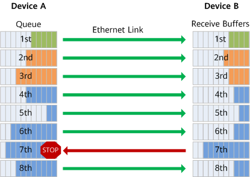
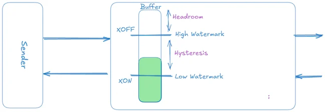
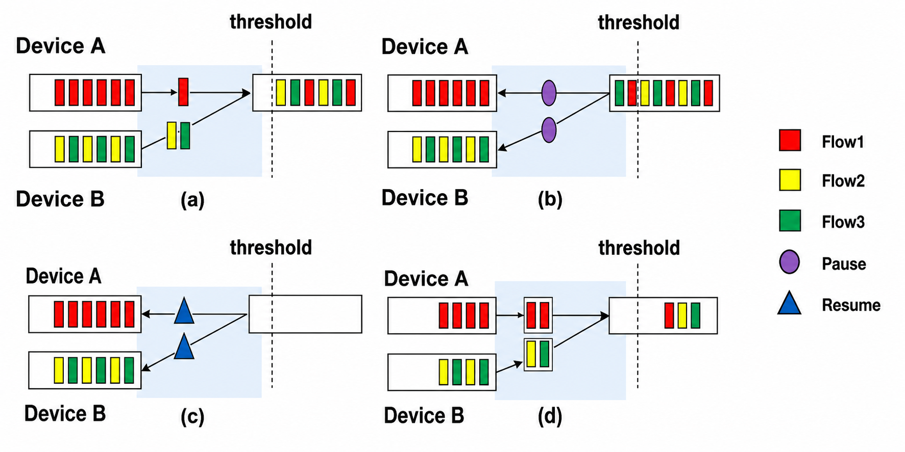
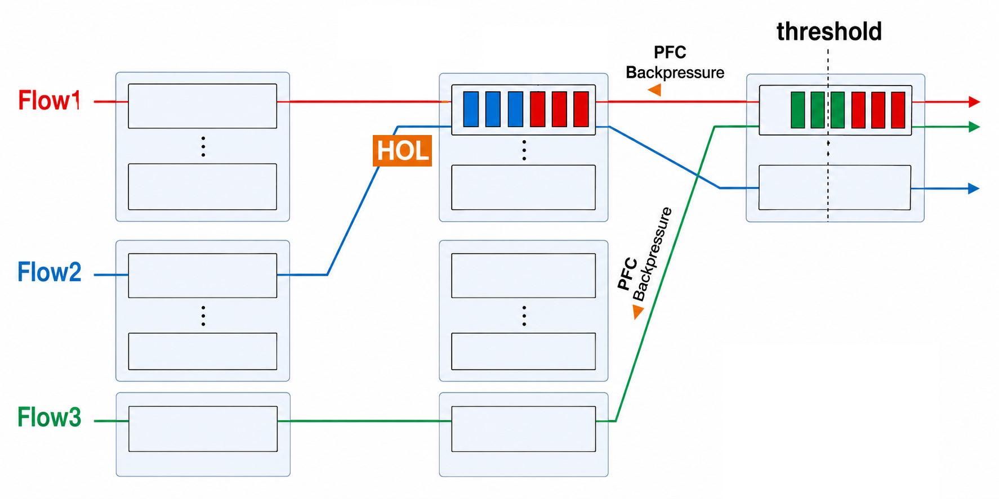
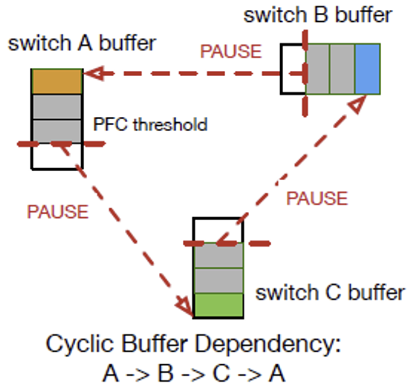
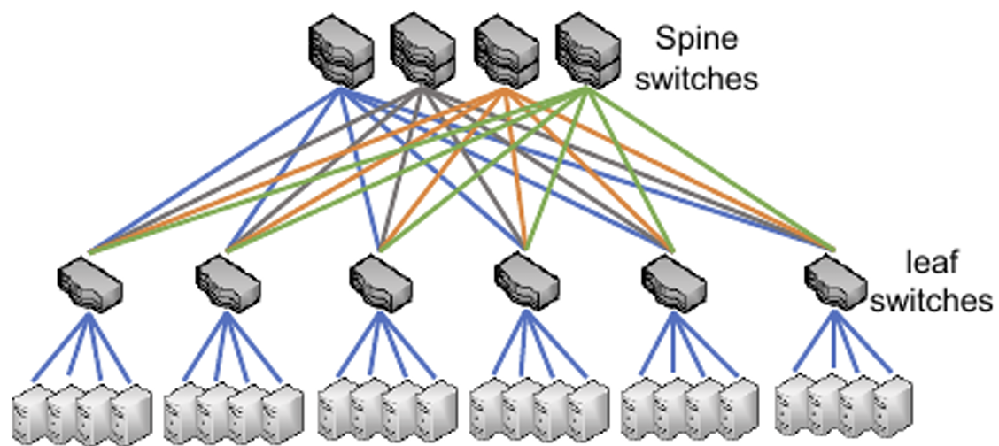
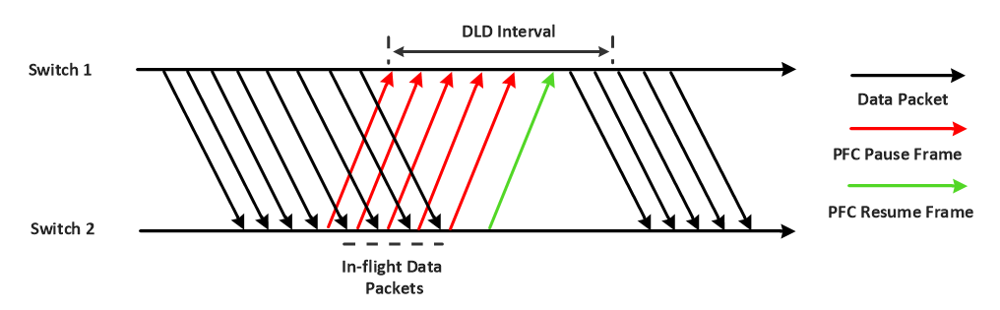
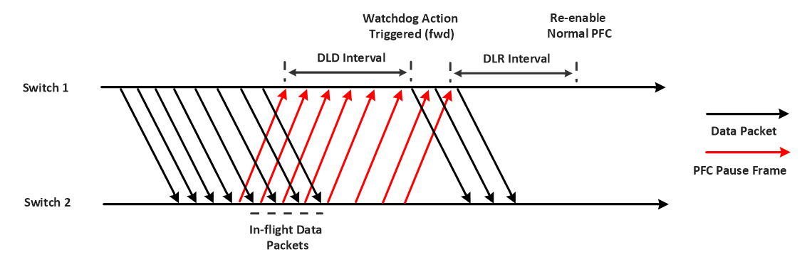

# Priority-based Flow Control (PFC)

Priority-based Flow Control (PFC), defined by IEEE 802.1Qbb, solves the limitations of legacy Ethernet flow control by enabling lossless transmission on a per-priority basis. While the older 802.3x standard paused an entire physical link during congestion (unacceptably halting latency-sensitive traffic like VoIP), PFC can selectively pause individual traffic classes. This allows a switch to momentarily halt high-volume lossless traffic while permitting other classes to continue flowing over the same physical link.

To achieve this granular control, PFC relies on **Priority Groups** (PGs) to manage the switch's ingress buffers. When a packet arrives, its Traffic Class (TC) is mapped to a specific PG, which dictates how much buffer memory it receives and whether it operates in a lossless or lossy mode. Only traffic mapped to a lossless PG triggers PFC PAUSE frames when the PG's buffer nears capacity. Traffic in a lossy PG ignores PFC entirely and is simply dropped if its allocated buffer overflows.



This document covers PFC hardware requirements, threshold mechanics (Xoff, headroom, Xon), and the operational risks PFC introduces along with the mitigations used in modern deployments.


## 802.3x and PFC: Mutual Exclusion

Legacy 802.3x PAUSE and PFC cannot coexist on the same port. 802.3x pauses all traffic indiscriminately, which directly conflicts with PFC's per-priority granularity. If both were active simultaneously, a single 802.3x PAUSE frame would halt all eight Priority Groups, negating the isolation that PFC provides.

In practice, enabling PFC on a port automatically disables 802.3x flow control. A well-implemented switch enforces this constraint: if an operator attempts to enable 802.3x on a PFC-enabled port, the system either rejects the command or auto-disables 802.3x with a warning.


## Layer 2, Hop-by-Hop Operation

PFC operates directly between two connected Ethernet ports (e.g., Server NIC ↔ Switch). It is strictly a Layer 2 conversation — no routers or IP addresses are involved in the PAUSE frame transaction. Understanding this is essential for reasoning about its hardware requirements and propagation behavior.

**Bidirectional**: The IEEE 802.1Qbb standard specifies PFC for both "bridges and end nodes," meaning any device on either end of a full-duplex Ethernet link can generate PAUSE frames toward its peer. Whichever side's ingress buffer fills up sends the pause.

| Direction | When It Happens | Example Scenario |
|-----------|-----------------|------------------|
| Switch → NIC | Switch's ingress buffer fills because the NIC is sending too fast | Incast: many NICs blast data into the same switch port. Switch pauses the senders. |
| NIC → Switch | NIC's receive buffer fills because the switch is delivering faster than the application consumes | Slow receiver: GPU is busy computing and not draining the NIC's RX buffer. NIC pauses the switch. |

**Hardware-Driven**: PFC PAUSE frame generation and processing happen entirely in the hardware ASIC (both in switches and NICs), completely bypassing the CPU, operating system, and software drivers. When a buffer threshold is crossed, the hardware must construct, transmit, and react to PAUSE frames within microseconds to prevent packet drops.


## Hardware Requirements: Data Center vs. Consumer NICs

Because PFC requires dedicated per-priority hardware queues, specific buffer pools, and a full DCB firmware stack (PFC, ETS, DCBX), it cannot be implemented on consumer or commodity Ethernet NICs. The dividing line is not link speed but target market: Data Center NICs are specifically engineered for lossless Ethernet fabrics.

| Consumer NICs (No PFC Support)                    | Data Center NICs (Full DCB/PFC Support) |
| ------------------------------------------------- | --------------------------------------- |
| Intel I210 / I211                                 | Mellanox/NVIDIA ConnectX-4, 5, 6, 7     |
| Intel I225 / I226 (2.5 GbE)                       | Intel E810 (Ice Lake server NIC)        |
| Realtek RTL8111 / RTL8125                         | Broadcom BCM57500 / NetXtreme-E         |
| Broadcom BCM5720 (Standard 1G server NIC)         | Marvell/Cavium FastLinQ                 |
| Aquantia AQC107 (10 GbE)                          |                                         |
| Standard consumer motherboard NICs / USB Adapters |                                         |


## The PFC PAUSE Frame

A PFC PAUSE frame is a standard Ethernet MAC Control frame — exactly 64 bytes on the wire, the minimum Ethernet frame size. It carries no IP header, no VLAN tag, and no upper-layer payload. Its sole purpose is to instruct the receiving port to stop transmitting specific traffic classes for a specified duration.

### Frame Structure

```
 Byte Offset   Field                          Size     Value / Purpose
───────────────────────────────────────────────────────────────────────
  0            Destination MAC                 6 B     01:80:C2:00:00:01 (reserved multicast)
  6            Source MAC                      6 B     Sender's MAC address
 12            EtherType                       2 B     0x8808 (MAC Control)
 14            Opcode                          2 B     0x0101 (PFC PAUSE)
 16            Priority Enable Vector          2 B     Bitmap: bit N = pause priority N
───────────────────────────────────────────────────────────────────────
 18            Time[0]                         2 B     Pause duration for priority 0
 20            Time[1]                         2 B     Pause duration for priority 1
 22            Time[2]                         2 B     Pause duration for priority 2
 24            Time[3]                         2 B     Pause duration for priority 3
 26            Time[4]                         2 B     Pause duration for priority 4
 28            Time[5]                         2 B     Pause duration for priority 5
 30            Time[6]                         2 B     Pause duration for priority 6
 32            Time[7]                         2 B     Pause duration for priority 7
───────────────────────────────────────────────────────────────────────
 34            Padding                        26 B     Zeros (fill to minimum frame size)
 60            FCS                             4 B     Frame Check Sequence
───────────────────────────────────────────────────────────────────────
               Total                          64 B
```

The **Priority Enable Vector** is a 2-byte field whose lower 8 bits form a bitmap indicating which of the eight IEEE 802.1p priorities the frame applies to (the upper 8 bits are reserved and set to zero). Each enabled priority has a corresponding **Time** field specifying how long to pause that priority, measured in pause quanta.

### Pause Quanta

The Time field for each priority is a 16-bit unsigned integer representing the pause duration in units of **512 bit times**. A "bit time" is the time to transmit one bit at the port's current link speed — so the real-time duration of one pause quantum depends on the link speed:

$$\text{1 pause quantum} = 512 \times \frac{1}{\text{link speed (bits/sec)}}$$

| Link Speed | 1 Bit Time | 1 Pause Quantum (512 bit times) | Max Quanta (0xFFFF) Duration |
|------------|------------|---------------------------------|------------------------------|
| 10G        | 100 ps     | 51.2 ns                         | 3.36 ms                      |
| 25G        | 40 ps      | 20.48 ns                        | 1.34 ms                      |
| 100G       | 10 ps      | 5.12 ns                         | 335 μs                       |
| 200G       | 5 ps       | 2.56 ns                         | 168 μs                       |
| 400G       | 2.5 ps     | 1.28 ns                         | 84 μs                        |
| 800G       | 1.25 ps    | 0.64 ns                         | 42 μs                        |

In production, the quanta value is always set to the maximum: **0xFFFF (65535)**. The rationale is explained under [Timer Refresh](#timer-refresh-continuous-pausing).


## PFC Thresholds: Managing the Buffer

PFC does not trigger the instant a buffer receives its first packet. Instead, it relies on a system of watermarks within the ingress buffer to balance maximum throughput against zero packet loss.



### The Xoff Threshold

This is the high-water mark. When the ingress buffer for a lossless Priority Group fills to this level, the switch generates and transmits a PFC PAUSE frame to the upstream sender. The Xoff threshold must be set high enough to avoid premature pausing (which wastes bandwidth) but low enough to leave sufficient headroom above it for in-flight packets.

### Headroom (The Stopping Distance)

When the switch hits Xoff and sends a PAUSE frame, the upstream sender does not stop instantly. The PAUSE frame takes time to travel backward across the physical cable, and the sender's NIC takes time to process the command. Meanwhile, packets continue arriving at line rate. **Headroom** is the reserved buffer space above the Xoff threshold designed to absorb these in-flight packets. If Xoff is hitting the brakes, headroom is the stopping distance.

- **Undersized Headroom**: Packets arriving during the delay overflow the buffer and are dropped, defeating the purpose of a lossless fabric.

- **Oversized Headroom**: Wastes valuable on-chip buffer memory that could be dynamically shared among other ports.

The required headroom is a function of link speed and the total delay before the upstream sender actually stops:

    headroom_bytes = line_rate × total_response_delay

Line rate (bytes per second) is the dominant scaling factor — doubling the speed doubles the bytes in flight during any fixed delay. The total response delay includes:

- **Cable propagation delay**: Time for the PAUSE frame to traverse the physical cable. At ~5 ns/m in copper, a 5 m cable adds ~25 ns. A 300 m fiber adds ~1.5 μs.

- **Switch-internal delay**: Time for the local switch to detect the threshold crossing, generate the PAUSE frame, and serialize it through its MAC/PHY pipeline. Typically 1–2 μs depending on ASIC architecture.

- **NIC response time**: Time between the upstream NIC receiving the PAUSE frame and halting transmission. Modern ConnectX-class NICs react in roughly ~1 μs.

In short-reach deployments, cable propagation is negligible compared to switch-internal and NIC processing delays, so headroom scales almost linearly with port speed:

| Port Speed | Cable Delay (5 m) | Switch + NIC Delay | Required Headroom |
| ---------- | ----------------- | ------------------ | ----------------- |
| 100G       | ~25 ns            | ~3 μs              | ~48 KB            |
| 200G       | ~25 ns            | ~3 μs              | ~96 KB            |
| 400G       | ~25 ns            | ~3 μs              | ~192 KB           |
| 800G       | ~25 ns            | ~3 μs              | ~384 KB           |

These are approximate values for short-reach (5 m) deployments. The headroom figures include the processing delay, maximum frame completion overhead, and ASIC cell-size rounding. Actual headroom depends on the switch ASIC (cell size, pipeline latency, MAC/PHY delay), NIC generation, and configured safety margins. Production deployments typically reserve 1.5–2x the theoretical minimum to account for worst-case burst alignment. Longer cables (40 m, 300 m) require proportionally larger headroom.

### The Xon Threshold

Once the upstream sender stops, the switch continues forwarding the packets it already has, causing the buffer to drain. The switch does not resume transmission the moment the buffer drops one byte below Xoff. Instead, it waits for the buffer to drain to a lower watermark: the Xon threshold. At this level, the switch sends a resume signal (a PAUSE frame with quanta = 0), allowing the upstream sender to transmit again.

The gap between Xoff and Xon creates **hysteresis**, preventing rapid pause/resume oscillation. Without this gap, a switch hovering near the Xoff line would rapidly alternate between stop and go commands, thrashing the link.


## PAUSE Timing and Recovery

With the frame format and threshold system established, this section describes how the hardware dynamically maintains the pause state and ultimately resumes transmission.

### Timer Refresh: Continuous Pausing

When the switch's ingress buffer crosses the Xoff threshold, it does not send one PAUSE frame and wait. Instead, the hardware continuously transmits PFC PAUSE frames at a regular interval (typically every few microseconds) for as long as the buffer remains above Xoff. Each frame the receiver gets **resets** its pause timer:

```
pause_expiry = now + (quanta_value × 512_bit_times)
```

The sender maintains a per-priority countdown timer. Every incoming PAUSE frame for that priority overwrites the timer with the new expiry. As long as the switch keeps sending PAUSE frames faster than the timer expires, the sender remains paused indefinitely.

Using the maximum quanta (0xFFFF) provides a safety margin: even if one or two PAUSE frames are lost or delayed in the MAC pipeline, the large timer value ensures the sender does not prematurely resume and overflow the congested buffer. On a 400G link, this gives an 84 μs window — far longer than the typical refresh interval of a few microseconds.

### Resuming Transmission

The sender resumes when either condition occurs:

1. **Timer expiry**: The switch stops sending PAUSE frames (because the buffer drained below Xon). The sender's countdown timer reaches zero and it resumes on its own.

2. **Explicit resume (quanta = 0)**: The switch sends a PFC frame with Time[priority] = 0 for the relevant priority. This immediately clears the sender's timer, signaling "resume now." This is the mechanism triggered when the buffer drops below the Xon threshold.

In practice, both mechanisms work together. Once the buffer drains below Xon, the switch sends a quanta-zero frame for immediate effect and simultaneously stops the periodic refresh. Even if the explicit resume frame is lost, the sender's timer will expire shortly after and resume anyway.


## Operational Risks of PFC

While PFC is a mandatory safety net for lossless Ethernet fabrics, it is fundamentally a reactive emergency brake. Over-reliance introduces severe operational risks because PFC pauses traffic at the Priority Group level rather than managing individual flows — localized congestion can spiral into network-wide failures.

### Performance Degradation

Even when functioning as designed, PFC can degrade network efficiency under heavy load due to its lack of per-flow granularity.

**Unfair Bandwidth Allocation**: In a lossy network, when a congestion point overflows, it drops packets from all flows. Each flow independently detects its own losses and reduces its rate (via TCP congestion control or similar). Over time, this per-flow feedback converges toward equal bandwidth per flow — regardless of how the flows are distributed across upstream links.

PFC eliminates drops, which also eliminates this per-flow feedback. Instead, PFC pauses entire links. When multiple senders feed traffic into the same downstream ingress PG and that PG becomes congested, PFC back-pressure pauses all upstream links equally. The receiver's bandwidth is divided per-link, not per-flow — and a device carrying fewer flows captures a disproportionate share.



**(a)** Device A sends one flow (Flow 1, red) and Device B sends two flows (Flow 2 yellow, Flow 3 green). All three flows traverse the network (blue) and converge on the same downstream receiver's ingress queue (right), which approaches its Xoff threshold.

**(b)** The receiver's ingress PG crosses the Xoff threshold. The receiver sends PFC PAUSE back toward the senders. Because PFC is hop-by-hop, this back-pressure propagates through the switch: the switch's own ingress PG buffers fill, and it in turn pauses Device A and Device B on their respective links.

**(c)** The receiver's buffer drains below Xon. The resume signal propagates back through the switch, releasing both Device A and Device B simultaneously.

**(d)** Both devices resume at the same instant. Each link gets an equal share of the receiver's bandwidth. Device A puts its entire share toward Flow 1. Device B splits its equal share between Flow 2 and Flow 3. Result: Flow 1 captures ~1/2 of the bandwidth, while Flow 2 and Flow 3 each get ~1/4. In a lossy network with per-flow congestion control, all three flows would converge toward ~1/3 each.

**Head-of-Line (HoL) Blocking**: When an ingress PG fills, the switch sends PFC PAUSE upstream, stopping all traffic entering that PG — regardless of each flow's destination. PFC cannot distinguish between individual flows sharing the same PG. If a congested flow and a healthy flow share the same ingress PG, the healthy flow is collateral damage.



Flow 1 (red) and Flow 3 (green) are both destined for the top-right device, whose ingress PG fills and crosses its Xoff threshold. That device sends PFC PAUSE back to the middle switch on both links carrying Flow 1 and Flow 3. The middle switch can no longer forward Flow 1 packets, so they pile up in its top ingress port's PG.

Flow 2 (blue) shares that same ingress PG with Flow 1 on the middle switch — but Flow 2 is destined for the bottom-right device, which is completely idle. When the shared PG fills and the middle switch sends PFC PAUSE upstream, both Flow 1 and Flow 2 are paused. Flow 2 is blocked by Flow 1 at the head of the line, despite having a clear, uncongested path to its destination.

### Catastrophic Network Failures

Under exceptional congestion or hardware malfunction, PFC can trigger cascading failures that paralyze the entire fabric.

**PFC Storms (Congestion Spreading)**: If a server NIC malfunctions or a stalled application stops draining the NIC's receive buffer, the NIC sends continuous PFC PAUSE frames to the local switch. The switch respects the pause and cannot deliver to that NIC, causing its own ingress buffers (fed by upstream sources) to fill. The switch then sends PFC PAUSE to its upstream neighbors, whose buffers fill in turn. This chain reaction cascades outward, flooding the network with PAUSE frames and bringing entire sections of the fabric to a standstill.

**PFC Deadlock**: A permanent gridlock state caused by circular buffer dependencies, typically triggered by a transient routing loop. For example: Switch B pauses Switch A, Switch A pauses Switch C, and because of the routing loop, Switch C pauses Switch B. All switches are stuck in a circular wait — traffic permanently drops to zero.




## PFC Propagation in a Leaf-Spine Topology

The risks described above are protocol-inherent. In a Leaf-Spine data center, the physical topology determines how far these effects can spread. Every server connects to a Top-of-Rack (ToR) leaf switch, and every leaf connects to a layer of spine switches via high-speed uplinks.



PFC conversations happen strictly hop-by-hop:

- Between the server NIC and the ToR.
- Between the ToR and the Spine.

Because PFC is bidirectional at each link, the NIC → Switch direction is the most common origin of [PFC storms](#catastrophic-network-failures). In a Leaf-Spine topology, the cascade follows a predictable path: the faulty NIC pauses the ToR, the ToR's spine-facing ingress buffers fill, the ToR pauses the spines, and back-pressure propagates down to every other leaf in the fabric.

A single faulty NIC can therefore escalate into a fabric-wide outage. To prevent this, engineers must decide exactly where in the topology PFC is allowed to operate.


## Architectural Defenses: Blast-Radius Controls

To contain PAUSE frame propagation, network architects choose between two deployment models:

**Model 1: Edge-Only PFC (Lossy Core)**

PFC is enabled only on host-facing ports (server NIC to ToR leaf). It is explicitly disabled on uplinks connecting the ToR to the spine. By making the spine layer lossy, engineers create a structural firebreak: PAUSE frames can propagate at most one hop up to the local ToR but cannot cross into the spine.

*Trade-off*: Under extreme congestion, the spine drops RDMA packets rather than propagating back-pressure. Common in traditional enterprise data centers where minimizing blast radius takes priority over absolute losslessness.

**Model 2: Fabric-Wide PFC (Lossless Core)**

AI and High-Performance Computing (HPC) fabrics running RoCEv2 cannot tolerate packet drops at any tier. PFC is enabled across the entire topology (Host-to-ToR and ToR-to-Spine). Disabling PFC on uplinks would force drops at the ToR during heavy incast events, defeating the purpose of RoCEv2.

*Trade-off*: The risk of fabric-wide PFC storms is significantly higher, making the automated hardware failsafe described below mandatory.


## The PFC Watchdog

Because fabric-wide deadlocks carry severe risk, modern data centers rely on automated circuit breakers. The PFC Watchdog monitors lossless queues for sustained pause states and intervenes to break back-pressure chains before they propagate across the fabric. In network silicon and SAI terminology, this mechanism is standardized into two phases: `DLD` (Deadlock Detection) and `DLR` (Deadlock Recovery).

### Detection (DLD)

A per-queue timer starts the moment a lossless queue enters a paused state — continuously receiving PFC PAUSE frames but unable to drain. If the queue remains paused beyond the **DLD interval** (the configured detection threshold), the Watchdog declares a PFC storm.

The default DLD interval in SONiC is **200 ms**. For perspective, a single PFC PAUSE frame at maximum quanta lasts only 335 μs at 100G or 84 μs at 400G (see [Pause Quanta](#pause-quanta)). A normal congestion event resolves within a few pause/resume cycles — well under a millisecond. A queue that has been continuously paused for 200 ms has endured thousands of consecutive PAUSE frames without ever draining, a clear indication that the congestion is not transient.

### Recovery (DLR)

Once a storm is detected, the Watchdog executes the configured **DLR action** to break the back-pressure chain:

- **`drop`** (most common): The switch disables PFC on the affected queue, drops all existing and incoming packets for that queue and its corresponding ingress Priority Group, and stops generating PAUSE frames upstream. This severs the chain and prevents the pause from propagating further.

- **`forward`**: The switch ignores incoming PAUSE frames and forces transmission. This may cause drops downstream but still breaks the deadlock.

- **`alert`**: The switch logs the storm and tracks counters but does **not** intervene — no packets are dropped or forwarded. This monitoring-only mode is useful for observing PFC storm frequency before committing to a mitigation action in a new deployment.

After taking action, the Watchdog continues monitoring the affected queue. If no PFC PAUSE frames are received for the **DLR interval** (the configured restoration period), it re-enables PFC and resumes normal lossless operation. If the root cause persists, the Watchdog catches the subsequent storm and breaks it again.

### Example: Normal Operation vs. Watchdog Intervention

The following scenario illustrates a switch transmitting data to a downstream neighbor, contrasting healthy flow control against a deadlock scenario.

**Normal PFC Operation**: Switch 1 transmits data to Switch 2. Switch 2 experiences brief congestion and begins sending continuous PFC PAUSE frames back to Switch 1. Switch 1 honors the pause and halts transmission for the affected priority. The DLD timer starts. Before the timer exceeds the DLD interval, Switch 2's buffer drains below Xon and it sends a resume frame (quanta = 0). Switch 1 resumes transmission and the DLD timer resets.



**Deadlock Condition (DLD Triggers)**: Switch 2 experiences a severe fault and sends continuous PFC PAUSE frames. Switch 1 remains paused, and the DLD timer eventually crosses the DLD interval. The Watchdog declares a storm.

**Recovery Action (DLR Executes)**: Switch 1 executes the DLR action. With `forward`, Switch 1 ignores the incoming PAUSE frames and resumes transmitting data to Switch 2 — Switch 2 may drop these packets, but the deadlock is broken. With `drop`, Switch 1 discards all traffic for the locked queue and its ingress PG, draining its buffers and releasing any upstream back-pressure. In both cases, once Switch 2 recovers and stops transmitting PAUSE frames for the DLR interval, the Watchdog re-enables normal PFC operation.



### Implementation: Software vs. Hardware

The default SONiC implementation for PFC Watchdog is **software-driven**. The `syncd` daemon periodically polls ASIC counters (queue occupancy, PFC frame counts, pause duration) via SAI, and Lua scripts in the Counter DB evaluate whether a queue is in storm state. On detection, `orchagent` programs the mitigation action into the ASIC. Detection granularity is on the order of hundreds of milliseconds.

Some ASICs support **hardware-accelerated** detection and recovery. Broadcom Tomahawk 4 and Tomahawk 5 implement PFC Deadlock Detection and Recovery (DLDR) directly in the ASIC, enabled via the SAI attribute `SAI_QUEUE_ATTR_ENABLE_PFC_DLDR`. When enabled, the ASIC itself monitors whether a queue is stuck in Xoff state using a hardware **DLD timer interval** of **1 ms** — orders of magnitude faster than software polling. On detection, the ASIC autonomously drops packets without CPU involvement. Software still configures the timers and policies, but the detection and mitigation execute entirely in hardware.

> While the Watchdog breaks storms after they occur, modern fabrics also rely on end-to-end congestion notification to prevent them from forming in the first place. This mechanism is covered in **[Data Center Quantized Congestion Notification](05_DCQCN.md)**.

### SAI Attributes

The Switch Abstraction Interface (SAI) exposes the following attributes for configuring PFC Watchdog behavior. Software (e.g., SONiC `orchagent`) programs these attributes into the ASIC via SAI to control detection thresholds, recovery actions, and hardware acceleration.

| SAI Attribute                               | Term               | Scope            | Purpose                                                                       |
|---------------------------------------------|--------------------|------------------|-------------------------------------------------------------------------------|
| `SAI_PORT_ATTR_PFC_TC_DLD_INTERVAL`         | DLD interval       | Per port, per TC | How long (ms) a queue must be continuously paused before the Watchdog declares a storm |
| `SAI_PORT_ATTR_PFC_TC_DLR_INTERVAL`         | DLR interval       | Per port, per TC | How long (ms) the queue must be storm-free before the Watchdog re-enables PFC |
| `SAI_QUEUE_ATTR_PFC_DLR_PACKET_ACTION`      | DLR action         | Per queue        | What to do with packets on the stuck queue (drop or forward). The `alert` action is SONiC-level and does not program SAI. |
| `SAI_SWITCH_ATTR_PFC_TC_DLD_TIMER_INTERVAL` | DLD timer interval | Switch-wide      | Polling/timer granularity for detection (hardware-accelerated ASICs typically use 1 ms) |
| `SAI_QUEUE_ATTR_ENABLE_PFC_DLDR`            | Enable DLDR        | Per queue        | Enables hardware-accelerated DLDR on ASICs that support it (e.g., Broadcom TH4/TH5) |


## Software-Crafted PFC Frames (Testing Only)

Although production PFC is a hardware-only operation, it is technically possible to construct a valid PFC PAUSE frame in software and inject it onto the wire using tools such as [pfctest](https://github.com/archjeb/pfctest) (Python) or Scapy's `MACControlClassBasedFlowControl` layer.

These software-crafted frames are used exclusively for **validation and debugging**: verifying that a switch or NIC correctly honors PFC PAUSE frames, testing Watchdog detection thresholds, or simulating storm conditions in a lab environment. A receiving device cannot distinguish a software-crafted PFC frame from a hardware-generated one — the frame format is identical on the wire — so the receiver will pause its transmit queues accordingly.

Software-crafted PFC is unsuitable for production congestion control for three fundamental reasons:

1. **Latency**: PFC must react within microseconds of a buffer threshold crossing. Software processing (system calls, scheduling, driver queues) adds orders of magnitude more delay, making timely intervention impossible at line rate.

2. **No buffer visibility**: The operating system has no real-time access to the NIC's or ASIC's internal buffer fill levels. The hardware threshold-crossing event that must trigger a PAUSE frame is invisible to software.

3. **No closed-loop recovery**: Production PFC requires continuous refresh while congested and an immediate Xon signal (quanta = 0) when the buffer drains. Software has no mechanism to monitor drain state and issue a precisely-timed resume, risking either permanent pausing or premature resumption.
