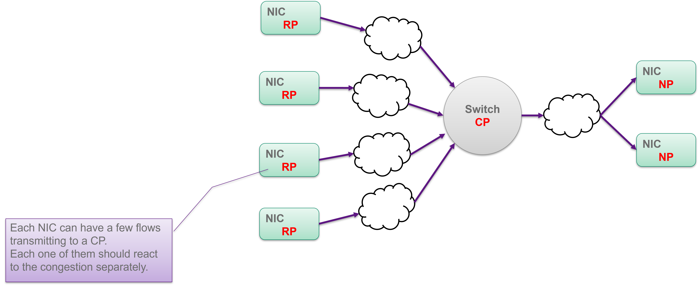
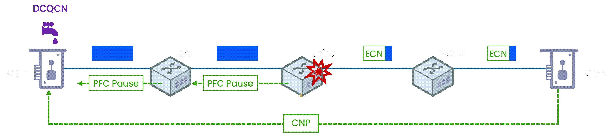
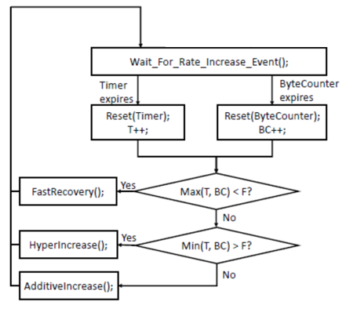
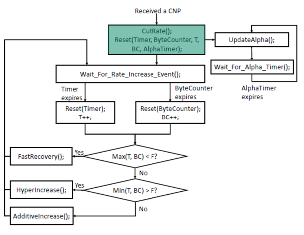
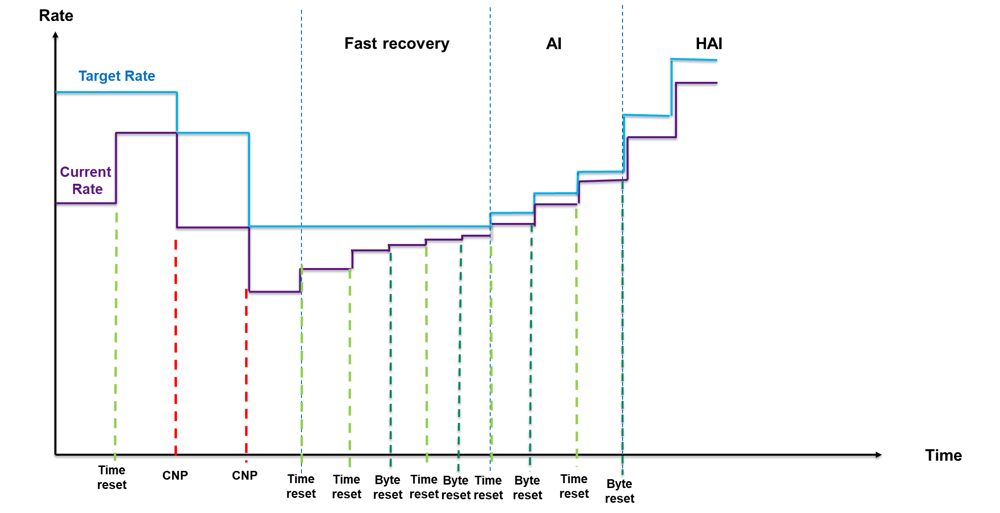
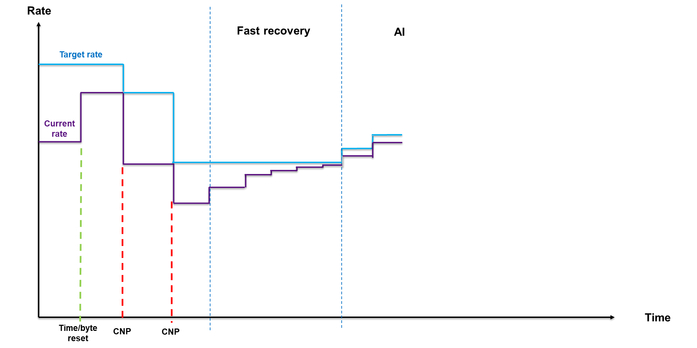
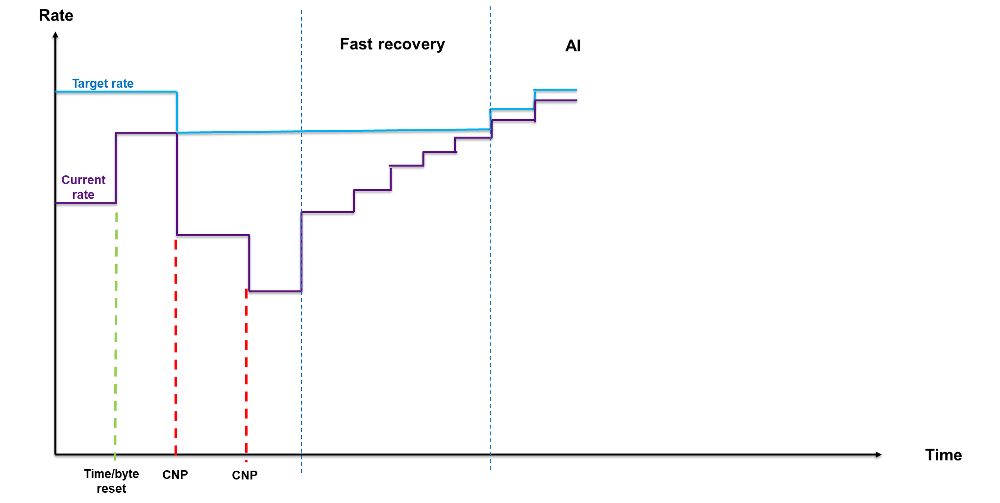

# DCQCN and ECN (The Proactive Slow-Down)

To avoid hitting the PFC emergency brake, the RoCEv2 ecosystem relies on **DCQCN** (Data Center Quantized Congestion Notification) as its congestion control algorithm. DCQCN is not an IEEE standard; it is a specialized algorithm developed primarily by Microsoft and Mellanox (NVIDIA), first described in Zhu et al. (SIGCOMM 2015), and designed specifically for RoCEv2 networks.

DCQCN is essentially a hybrid protocol that takes the best parts of two older standards. From `QCN`, it borrowed the mechanical rate-control engine (the timers, byte counters, and multi-phase speed adjustments) that dictate exactly how a NIC should physically throttle its speed. However, its creators stripped away QCN's non-routable Layer 2 delivery mechanisms. To replace them, they grafted on the congestion-scoring math and Layer 3 signaling from `DCTCP`. This allowed the algorithm to rely on simple Explicit Congestion Notification (ECN) bits embedded in standard IP packets.

| Feature           | QCN (IEEE 802.1Qau)                      | DCQCN (RoCEv2 Standard Algorithm)           |
| ----------------- | ---------------------------------------- | ------------------------------------------- |
| Network Layer     | Layer 2 (MAC Addresses)                  | Layer 3 and 4 (IP / UDP)                    |
| Routable?         | No. Confined to a single VLAN or rack.   | Yes. Fully routable across the data center. |
| Congestion Marker | Layer 2 switch generates the warning.    | Switch marks the IP header (ECN).           |
| Feedback Message  | `CNM` (Congestion Notification Message)  | `CNP` (Congestion Notification Packet)      |
| Primary Use Case  | Legacy FCoE and RoCEv1                   | Modern RoCEv2 AI and HPC clusters           |

To execute this "soft brake" across a routed network, DCQCN relies on a continuous, three-stage feedback loop between the network infrastructure and the endpoints. The DCQCN specification (and the IBTA RoCEv2 Annex) defines three distinct roles in this loop:

| Role   | Full Name          | Who                  | Responsibility                                                                       |
| ------ | ------------------ | -------------------- | ------------------------------------------------------------------------------------ |
| **CP** | Congestion Point   | The congested switch | Detects buffer buildup and marks passing packets by setting the ECN bits to CE (11). |
| **NP** | Notification Point | The receiving NIC    | Detects CE-marked packets and immediately generates a CNP back to the sender.        |
| **RP** | Reaction Point     | The sending NIC      | Receives CNPs and adjusts its transmission rate using the DCQCN state machine.       |



The rest of this document follows this three-stage loop in order: the CP's detection and marking logic, the NP's CNP generation, and the RP's rate control algorithm.


## The Congestion Point (WRED)

The Congestion Point is the switch's egress queue, where WRED (Weighted Random Early Detection) monitors buffer depth and ECN-marks passing packets as congestion builds. The full mechanics of RED, ECN, and WRED color profiles are covered in the [Active Queue Management](02_SERVICE_MODELS.md#active-queue-management) section. This section focuses on how RoCEv2 networks configure WRED differently from standard IP deployments.

In a typical DiffServ pipeline, an Ingress Policer colors packets Green, Yellow, or Red based on their bandwidth conformance, and WRED runs three independent profiles with progressively aggressive thresholds for each color. RoCEv2 fabrics simplify this significantly:

- There is no Ingress Policer measuring individual flows, so all traffic enters as Green.
- Because all traffic is Green, the three WRED color profiles collapse into a single, identical profile.
- Standard RoCEv2 strictly sets $P_{max}$ to 100%.

With $P_{max}$ at 100%, the marking probability ramps linearly from 0% at $K_{min}$ to 100% at $K_{max}$. The moment the egress queue reaches $K_{max}$, the switch marks every single packet with ECN CE. This aggressively forces all senders to slow down, preventing the buffer from overflowing into a PFC pause event. If the senders do not react fast enough and the buffer fills, the switch fires the PFC emergency brake as a last resort.


## The Notification Point (Generating the CNP)

When the receiving NIC gets a packet with the ECN bits set to 11, it does not drop it. Instead, the receiver's hardware instantly generates a specialized message called a **Congestion Notification Packet** (CNP) and shoots it back to the original sender.



Once the sending NIC receives the CNP, its hardware automatically throttles down its transmission rate using tuned mathematical parameters. This eases the load on the network, allowing the switch buffers to drain before they ever overflow. Once the CNPs stop arriving, the sender gradually ramps its speed back up. Under the conditions modeled in the original paper (Zhu et al., SIGCOMM 2015), the DCQCN loop converges on the order of 5–10 round-trip times, though actual convergence depends on parameter tuning, the number of competing flows, and congestion severity.

If a massive burst of traffic overwhelms the network and the senders do not slow down fast enough, the switch buffer will breach $K_{max}$ and hit its critical panic threshold. At this exact moment, the switch abandons the polite Layer 3 ECN system and fires the physical Layer 2 PFC Pause frame. This emergency brake physically halts the wire, ensuring that even if the soft brake fails, zero packets are dropped.

**Why a Custom CNP?**

RoCEv2 cannot use standard TCP/IP ECN-Echo (ECE) mechanisms for two critical reasons:

- **The UDP Problem** (No ACKs): Standard ECN relies on TCP. When a normal receiver gets an ECN warning, it piggybacks the "slow down" message onto its next standard TCP Acknowledgment (ACK). Because RoCEv2 uses UDP (which has no built-in acknowledgment mechanism), there are no continuous ACKs. The designers had to invent a standalone packet (the CNP) purely to carry this back-channel message.

- **Kernel Bypass** (Hardware vs. CPU): Standard TCP/IP ECN is processed by the server's CPU and operating system. RDMA's entire purpose is to bypass the CPU and OS for ultra-low latency. If RoCE waited for the OS to process a traditional TCP warning, latency would skyrocket. CNPs are generated and processed purely in the NIC silicon, completely invisible to the host CPU.

**Anatomy of a CNP**

The CNP format is defined by the IBTA (InfiniBand Trade Association) RoCEv2 specification (Annex A17 of the InfiniBand Architecture Specification). It is deliberately minimal — a bare-bones identification packet with no application payload:

```
┌──────────────────────────────────────────┐
│  Ethernet Header (14 bytes)              │  Standard L2: src/dst MAC, EtherType
├──────────────────────────────────────────┤
│  IP Header (20 bytes)                    │  Src/Dst IP swapped vs. original flow
│    DSCP = 48 (CS6)                       │  Strict priority scheduling
│    ECN  = 01 (ECT(1))                    │  ECN-capable, not congestion-marked
├──────────────────────────────────────────┤
│  UDP Header (8 bytes)                    │  Destination port = 4791 (RoCEv2)
├──────────────────────────────────────────┤
│  BTH — Base Transport Header (12 bytes)  │  InfiniBand transport header
│    Opcode = 0x81                         │  Identifies this packet as a CNP
│    Destination QP Number                 │  Identifies which flow is congested
│    PSN = 0                               │  Not meaningful for CNPs
├──────────────────────────────────────────┤
│  (No payload)                            │  CNPs carry zero application data
├──────────────────────────────────────────┤
│  ICRC (4 bytes)                          │  Invariant CRC for integrity
└──────────────────────────────────────────┘
```

The packet carries exactly two pieces of actionable information. The **Opcode 0x81** in the Base Transport Header tells the receiving NIC's hardware parser "this is a congestion notification, not data — route it to the rate-control engine." The **Destination QP (Queue Pair) Number** identifies which specific RDMA flow caused the congestion, allowing the sender to throttle only that flow's rate limiter rather than all flows indiscriminately. The source and destination IP addresses are swapped relative to the original data packet because the CNP travels in the reverse direction — from receiver back to sender.

Beyond these fields, the CNP carries nothing: no queue depth, no switch identifier, no timestamp, no utilization metric. It is a pure "you caused congestion" signal with a flow identifier attached. This intentional minimalism keeps CNPs tiny and fast to generate in hardware, but it is also the root limitation addressed by [Extended CNP](05_DCQCN_.md#lighter-signals-ecnp-and-csig) and [IFA telemetry](05_DCQCN_.md#per-hop-telemetry-int-and-ifa) in the next document.

**Protecting the Notification Signal**

Because CNPs are the vital feedback loop that makes this entire system work, they must never be delayed by the network. To guarantee instant delivery, CNPs receive special treatment in the switch's Quality of Service (QoS) pipeline:

- **Strict Priority**: The generating NIC stamps CNPs with `DSCP 48`, mapping them to the dedicated traffic class TC6. This class is scheduled with strict priority. Even under severe network congestion, if a CNP is waiting in TC6, it transmits before any data or management packets.

- **Intentionally Lossy**: Critically, the CNP Priority Group (PG6) is not protected by PFC. Because CNPs are tiny, infrequent packets, they never build up significant buffer occupancy. Applying PFC to them would create an unnecessary risk of a pause storm for a traffic class that doesn't need lossless guarantees.


## The Reaction Point (Sender Transmission Rate)

The sending side of DCQCN (the algorithm described in Zhu et al., SIGCOMM 2015, and implemented in commodity RDMA NICs) is a small state machine running entirely in NIC hardware. Unlike software-based TCP congestion control, every decision (when to cut the rate, how fast to recover, and which acceleration phase to enter) is made by silicon, with zero host CPU involvement. This hardware state machine is governed by a collection of tunable parameters that work together to control how the NIC accelerates, brakes, and recovers. The table below provides a quick reference; each parameter is explained in detail throughout the subsections that follow.

| Parameter                    | Description                                                                                                                                                                       |
| ---------------------------- | --------------------------------------------------------------------------------------------------------------------------------------------------------------------------------- |
| `CurrentRate`                | The actual transmit rate the NIC's shaper enforces right now. Adjusted by all three phases and by the multiplicative cut on CNP.                                                  |
| `TargetRate`                 | The saved reference speed the NIC tries to recover toward. Set to CurrentRate on each CNP, then used as the ceiling during Fast Recovery.                                         |
| `TIME_RESET`                 | Timer-based trigger interval (in µs). Forces rate evaluation for slow flows that don't send enough bytes to trip the byte counter.                                                |
| `BYTE_RESET`                 | Byte-volume trigger threshold. Forces rate evaluation for fast flows that hit the byte limit before the timer expires.                                                            |
| `RPG_THRESHOLD`              | Number of consecutive trigger events that must fire without a CNP before the algorithm exits Fast Recovery. Determines when Phase B or C is entered.                              |
| `AI`                         | Additive Increase step size. A small, fixed amount added to TargetRate each tick during Phase B (Cautious Probing).                                                               |
| `HAI`                        | Hyper Additive Increase step size. A much larger fixed amount added to TargetRate each tick during Phase C (Open Throttle).                                                       |
| `DCE_TCP_RTT`                | Fixed hardware timer interval (not a live RTT measurement) that controls how often the $\alpha$ congestion score is updated. Legacy name inherited from DCTCP.                    |
| $\alpha$                     | Congestion severity score (0–1). Rises when CNPs arrive, decays when the path is quiet. Scales the multiplicative rate cut.                                                       |
| `G`                          | Gain / EWMA weight for the $\alpha$ update. Higher G = more reactive to individual CNPs; lower G = smoother, more sluggish response.                                              |
| `RPG_GD`                     | Rate cut sensitivity exponent. Sits in the denominator of the cut formula ($2^{RPG\\_GD}$). Lower = harder braking; higher = gentler braking.                                     |
| `RATE_REDUCE_MONITOR_PERIOD` | The observation window over which the algorithm watches for incoming CNPs before triggering a rate reduction.                                                                     |
| `Clamp` (0 or 1)             | Controls whether TargetRate is re-pinned on every consecutive CNP (0 = conservative, slow recovery) or only on the first (1 = optimized, fast recovery).                          |


### The Engine: Triggers

To understand why this "engine" is necessary, it helps to compare it to traditional networking. In a standard TCP connection, the receiver constantly sends back Acknowledgments (ACKs) for the data it receives. TCP uses this continuous stream of ACKs as a natural metronome to pace outgoing traffic and immediately detect network traffic jams.

However, DCQCN operates over RoCEv2, which relies on the UDP protocol. UDP is essentially a "fire-and-forget" protocol; it lacks a built-in ACK mechanism. Without those constant ACKs returning to the sender, the NIC has no natural rhythm to tell it how fast it should be transmitting.

Because the sender isn't getting constant "all clear" messages, it operates on the assumption that the network is fine unless told otherwise. If a network switch experiences a bottleneck, it will generate a CNP and send it back to the source. If the sender's NIC is actively transmitting and does not receive any of these CNPs, it assumes the path is clear and that it can safely bump up its sending speed to maximize efficiency.

But without ACKs, when exactly should the NIC check to see if it hasn't received any warnings and is clear to speed up? To solve this, the hardware uses a **dual-trigger** system to initiate a Rate Increase Event. These two "clocks" run simultaneously, and whichever one hits its limit first forces the NIC to evaluate the flow:

- **The Timer** (`TIME_RESET`): This is a strict time-based countdown measured in microseconds. Its primary job is to support slow flows. If an application is sending small amounts of data sporadically, it might take a long time to send a large volume of bytes. The timer ensures that these slow flows are still periodically evaluated and allowed to increase their speeds if the network is clear.

- **The Byte Counter** (`BYTE_RESET`): This acts like an odometer, tracking the volume of data sent. Its primary job is to support fast flows. If an application is blasting massive amounts of data at lightning speed, it will hit this byte limit long before the timer runs out. This allows heavy data streams to aggressively ramp up their speeds to fill available bandwidth without being bottlenecked by an arbitrary time limit.

By running both triggers simultaneously, the DCQCN algorithm ensures that the network dynamically and rapidly optimizes the speeds for both tiny background tasks and massive data transfers.


### The Clear Path: Increasing the Rate (No CNPs Received)

When the NIC is transmitting data and its internal clocks (the timer or the byte counter) fire without any interruptions, it treats that silence as a green light. It assumes the path is clear and systematically accelerates through three phases to maximize its speed.

**Phase A: The Rapid Climb (Fast Recovery)**

When the NIC is running below its target speed and the network is quiet, its first priority is to quickly get back up to a baseline safe speed, known as the `TargetRate`. Every time a clock triggers, the NIC calculates the gap between its current speed and that target speed, and jumps halfway there. Because it is cutting the distance in half at every step, the acceleration starts out very fast and smoothly tapers off as it approaches the goal.

$$CurrentRate = \frac{CurrentRate + TargetRate}{2}$$

**Phase B: Cautious Probing (Additive Increase)**

Once the faster of the two counters reaches the `RPG_THRESHOLD` while the slower counter has not yet crossed it, the NIC knows the path is clear enough to probe but not pristine enough for maximum aggression. It shifts from a rapid climb into a steady, cautious probe. It slightly raises its goal by adding a fixed, conservative amount (`AI`) to the `TargetRate`, and then steps its current speed up to match. This results in a slow, steady, linear increase as the NIC carefully tests the waters to see how fast it can go.

$$TargetRate = TargetRate + AI$$

$$CurrentRate = \frac{CurrentRate + TargetRate}{2}$$

**Phase C: Open Throttle (Hyper Increase)**

If the path is absolutely pristine (meaning both the timer and the byte counter have continuously fired and passed the `RPG_THRESHOLD` with zero interruptions), the NIC realizes it has access to a massive, empty pipe. It drops the cautious probing strategy and switches to maximum aggression. Instead of taking small steps, it adds a massive chunk of speed (`HAI`) to the `TargetRate` at every trigger. The goal here is to rapidly reclaim all available physical bandwidth and max out the connection speed (e.g., hitting the full 100 Gbps or 400 Gbps limit).

$$TargetRate = TargetRate + HAI$$

$$CurrentRate = \frac{CurrentRate + TargetRate}{2}$$


### Visualizing Clear Path

The following diagram illustrates the acceleration engine we just discussed:



To understand how the NIC navigates this flowchart, it helps to look at its internal scoring system, which is driven by two running tallies: `T` (the Timer Counter) and `BC` (the Byte Counter). Every time the hardware's internal timer expires without receiving a congestion warning (CNP), it adds a point to the timer score (`T++`). Simultaneously, every time a specific volume of data is successfully transmitted without a warning, it adds a point to the byte score (`BC++`). As long as the network remains completely quiet, these two scores will continuously climb.

The critical decision point for these counters is `F`, which represents the `RPG_THRESHOLD`. Think of `F` as the definitive finish line for Phase A (Fast Recovery). While both `T` and `BC` are below this threshold, the NIC knows it is still safely in its rapid-climb phase and continues to take large steps to regain speed. However, the exact moment either of these counters hits `F`, the algorithm registers that it has aggressively recovered enough baseline bandwidth.

Because we already know at least one clock passed the threshold, the algorithm now looks at the lowest score between the two (the "Min"). If `Yes` (the lowest score is also greater than the `F` threshold): This means both the Timer and the Byte Counter have fired continuously without any warnings. The path is absolutely pristine. The NIC shifts into Hyper Increase (Phase C), taking massive steps to aggressively max out the connection speed. If `No` (one clock passed the threshold, but the other did not): The network is clear enough to speed up, but not necessarily empty enough for maximum aggression. The NIC defaults to the safe, steady probing of Additive Increase (Phase B), taking small, cautious steps to find the new speed limit.


### Measuring Congestion Severity: The Alpha ($\alpha$) Parameter

Eventually, the aggressive rate increases will cause a bottleneck, and the network switches will begin generating CNPs. Before we can calculate the sender's reaction, we must understand how it measures the severity of the congestion. This severity is represented by $\alpha$ (Alpha), a value between `0` and `1`. It is updated periodically every `DCE_TCP_RTT` interval (a fixed hardware timer, not a live RTT measurement) based on a configured aggressiveness factor, `G` (Gain).

**When Path is Clear (Decrement)**: If no CNP was received during the period, $\alpha$ naturally decays, making the system less sensitive.

$$\alpha = \alpha \cdot (1 - G)$$

**When Congested (Increment)**: If a CNP was received, $\alpha$ is increased to force a stronger reaction.

$$\alpha = \alpha \cdot (1 - G) + G$$

`G` acts as the sensitivity dial for the congestion control system, determining how twitchy or sluggish the NIC's reactions are. As a fixed fractional value (between 0 and 1), `G` dictates how much weight the system gives to the immediate network state versus its historical memory. If `G` is set high, the system is highly reactive: a single warning packet (CNP) will cause the severity score ($\alpha$) to spike dramatically, and a brief moment of silence will cause it to plummet just as fast. Conversely, a low `G` gives the system a long memory and high inertia, smoothing out sudden hiccups and requiring a sustained stream of warnings (or a long period of silence) to significantly alter the severity score.

**The "TCP" Naming Quirk in a UDP System**

Because RoCEv2 relies on the UDP protocol, it lacks the continuous stream of acknowledgments required to dynamically measure a true Round Trip Time. The appearance of "TCP" in the variable name `DCE_TCP_RTT` is a legacy artifact; DCQCN borrowed its congestion-scoring math directly from an older protocol DCTCP (Data Center TCP), and hardware configuration manuals retained the original terminology. In practice, this "RTT" is not a live measurement at all. Instead, it is a fixed, configured hardware stopwatch (often set around 50 microseconds). Every time this static timer ticks, the NIC updates its $\alpha$ score, operating on the assumption that enough time has passed for a full back-and-forth conversation across the network.


### Reacting to Congestion: Decrementing the Rate (CNP Received)

When a switch flags a passing data packet, the receiver fires a CNP back to the sender. The algorithm monitors for these over a defined `RATE_REDUCE_MONITOR_PERIOD`. As soon as a CNP arrives, the sender must instantly slash its current speed to relieve network pressure. The following sequence occurs:

**Save the Reference**: The NIC remembers its current, pre-congestion speed. This becomes the goal for the Fast Recovery phase later.

$$TargetRate = CurrentRate$$

**Cut the Rate**: The current rate is reduced multiplicatively, scaled by the severity of the congestion ($\alpha$).

$$CurrentRate = CurrentRate \cdot \left(1 - \frac{\alpha}{2^{RPG\\_GD}}\right)$$

If the $\alpha$ score represents the severity of the traffic jam, `RPG_GD` (Rate Phase Growth / Gain Decrease) acts as the configurable sensitivity of the brake pedal itself. Notice that `RPG_GD` sits in the denominator as an exponent. Because of how the math works, this parameter gives network administrators fine-grained control over the aggressiveness of the speed reduction:

- Lower `RPG_GD` (Hard Braking): If this value is low (for example, 1), the denominator remains small. This means a larger percentage is subtracted from the current rate, resulting in a drastic, immediate drop in transmission speed. This is incredibly safe for preventing packet loss but can unnecessarily throttle performance.

- Higher `RPG_GD` (Feathering the Brakes): If the value is set higher, the denominator exponentially grows. This shrinks the overall fraction, meaning the NIC only shaves a tiny percentage off its current speed. This allows the application to keep pushing data at high speeds, but risks exacerbating the congestion if the warning was masking a severe bottleneck.

Ultimately, `RPG_GD` allows engineers to tune their network for specific workloads. For highly sensitive AI or HPC clusters where dropped packets are catastrophic, they might configure a more aggressive braking response. For resilient storage networks prioritizing massive throughput, they might tune `RPG_GD` higher to keep speeds up even when minor congestion occurs.

**Reset Clocks**: All increment counters (Timer and Byte counters) are reset to zero. The flow is pushed back to the beginning of its recovery cycle.

The following flowchart illustrates the DCQCN algorithm's response to a CNP. It highlights the immediate reduction of the transmission rate and the resetting of all acceleration counters, alongside an independent loop that periodically updates the congestion severity score ($\alpha$).




### Example: Visualizing the Full DCQCN Cycle

The graph below brings all the rules of the DCQCN algorithm together into a single timeline, assuming an `RPG_THRESHOLD` = 4.



**The Braking Phase (CNPs Received)**

Starting on the left, the network experiences a sudden bottleneck, and two consecutive CNPs arrive. When the first CNP hits, the NIC instantly abandons its current speed: the light blue `TargetRate` drops to match the purple `CurrentRate`, and the `CurrentRate` is aggressively slashed based on the severity of the congestion ($\alpha$). Before the NIC can begin to recover, a second CNP arrives, repeating the penalty. The `TargetRate` is pinned to the new, lower `CurrentRate`, the `CurrentRate` drops even further, and both internal clocks (`T` and `BC`) are reset to zero.

**Fast Recovery (The Rapid Climb)**

Following the second CNP, the network goes completely quiet. As the internal clocks begin to tick without interruption, the NIC enters Phase A. You can see a mix of Time reset and Byte reset events firing. With every single tick, the purple `CurrentRate` line steps upward, rapidly closing the gap to the `TargetRate` by cutting the distance in half. Because the `RPG_THRESHOLD` is set to 4, the algorithm will remain in this rapid climb phase until either the Timer (`T`) or the Byte Counter (`BC`) hits 4 consecutive ticks.

**AI (Cautious Probing)**

Eventually, the most active clock crosses the threshold of 4, while the slower clock is still lagging behind. The algorithm determines the path is clear enough to probe and shifts into Additive Increase. Notice that the light blue `TargetRate` line steps up for the first time. The NIC is now cautiously adding a small, fixed amount to its target speed, while the `CurrentRate` continues to step up halfway to meet it.

**HAI (Open Throttle)**

As the quiet period continues, the slower of the two clocks finally catches up and also crosses the threshold of 4. Now, both clocks have proven the network is pristine. The algorithm drops its caution and enters Hyper Increase. The graph illustrates this transition with massive, aggressive upward leaps in the `TargetRate`. The `CurrentRate` follows closely behind, taking massive chunks of available bandwidth to rapidly maximize the connection speed.


### Refining the Target: The Clamp Feature

In severe congestion, a flow might receive multiple back-to-back CNPs. How the hardware handles the `TargetRate` during these consecutive hits drastically alters the recovery behavior. This is controlled by the **Clamp** setting:

- **Clamp Target Rate = 1** (Optimized Recovery): The `TargetRate` is captured only on the first decrement. Even if more CNPs arrive and drive the `CurrentRate` further down, the `TargetRate` remains anchored at the original pre-congestion speed. This allows for a much faster recovery once the network clears.



- **Clamp Target Rate = 0** (Conservative): The `TargetRate` is pulled down to match the `CurrentRate` on every single CNP received. This artificially lowers the recovery goal, causing the flow to take a much longer time to regain its speed.




### DCQCN on the ConnectX-4

**CNP Parameters**

```bash
sudo mlxconfig -d /dev/mst/mt4115_pciconf0 q | grep -iE "cnp"

        ROCE_CC_CNP_MODERATION_P1                   DEVICE_DEFAULT(0)
        RATE_TO_SET_ON_FIRST_CNP_P1                 0
        MIN_TIME_BETWEEN_CNPS_P1                    0
        CNP_802P_PRIO_P1                            6
        CNP_DSCP_MODE_P1                            DEVICE_DEFAULT(0)
        CNP_DSCP_P1                                 48
```

- **`CNP_802P_PRIO_P1 = 6`**: The 802.1p priority stamped on outgoing CNP frames. Value 6 maps to TC6, which is scheduled with strict priority. This ensures CNPs are always dequeued before data or management traffic.

- **`CNP_DSCP_P1 = 48`**: The DSCP value stamped in the IP header of outgoing CNPs. DSCP 48 maps to TC6 through the standard DSCP-to-TC classification pipeline, reinforcing the strict-priority treatment at every hop.

- **`CNP_DSCP_MODE_P1 = DEVICE_DEFAULT`**: The NIC uses its default logic for writing the DSCP field on CNPs. In device-default mode, it stamps the value configured in `CNP_DSCP_P1` (48).

- **`MIN_TIME_BETWEEN_CNPS_P1 = 0`**: No minimum interval is enforced between consecutive CNPs. The receiver generates a CNP for every CE-marked packet it receives, maximizing the responsiveness of the DCQCN feedback loop. Setting a non-zero value would throttle CNP generation to reduce control-plane overhead at the cost of slower congestion signaling.

- **`ROCE_CC_CNP_MODERATION_P1 = DEVICE_DEFAULT`**: CNP generation moderation uses the device default policy. This controls whether the NIC coalesces multiple CE-marked packets into a single CNP or generates one per marked packet.

- **`RATE_TO_SET_ON_FIRST_CNP_P1 = 0`**: No override rate is applied when the first CNP arrives. Value 0 means the sender uses the normal α-based multiplicative cut formula. A non-zero value would force the sender to immediately drop to a specific rate (in Mbps) on the very first CNP, bypassing the gradual α-scaled reduction.

**DCQCN Rate Control Parameters**

```bash
sudo mlxconfig -d /dev/mst/mt4115_pciconf0 q | grep -iE "rpg_|clamp|dce_tcp|rate_reduce|initial_alpha|roce_cc_prio"

        CLAMP_TGT_RATE_AFTER_TIME_INC_P1            True(1)
        CLAMP_TGT_RATE_P1                           False(0)
        RPG_TIME_RESET_P1                           300
        RPG_BYTE_RESET_P1                           32767
        RPG_THRESHOLD_P1                            1
        RPG_MAX_RATE_P1                             0
        RPG_AI_RATE_P1                              5
        RPG_HAI_RATE_P1                             50
        RPG_GD_P1                                   11
        RPG_MIN_DEC_FAC_P1                          50
        RPG_MIN_RATE_P1                             1
        RATE_REDUCE_MONITOR_PERIOD_P1               4
        DCE_TCP_G_P1                                1019
        DCE_TCP_RTT_P1                              1
        INITIAL_ALPHA_VALUE_P1                      1023
        ROCE_CC_PRIO_MASK_P1                        255
```

| Firmware Parameter                 | Value | Algorithm Parameter | Notes |
| ---------------------------------- | --- | --- | --- |
| `RPG_TIME_RESET_P1`                | 300 | `TIME_RESET` | Timer trigger interval: 300 μs |
| `RPG_BYTE_RESET_P1`                | 32767 | `BYTE_RESET` | Byte counter trigger: ~32 KB |
| `RPG_THRESHOLD_P1`                 | 1 | `RPG_THRESHOLD` | 1 trigger without CNP exits Fast Recovery. With this default, Phase A is effectively a single step before entering Phase B or C. |
| `RPG_AI_RATE_P1`                   | 5 | `AI` | Additive Increase: 5 Mbps per tick (Phase B) |
| `RPG_HAI_RATE_P1`                  | 50 | `HAI` | Hyper Additive Increase: 50 Mbps per tick (Phase C) |
| `RPG_GD_P1`                        | 11 | `RPG_GD` | Rate cut exponent: α / 2^11 (gentle braking) |
| `RPG_MIN_DEC_FAC_P1`               | 50 | — | Rate never drops below 50% in a single cut |
| `RPG_MIN_RATE_P1`                  | 1 | — | Minimum rate floor: 1 Mbps |
| `RPG_MAX_RATE_P1`                  | 0 | — | No cap; rate recovers to full line rate |
| `CLAMP_TGT_RATE_P1`                | False(0) | `Clamp` | Conservative: TargetRate pulled down on every CNP |
| `CLAMP_TGT_RATE_AFTER_TIME_INC_P1` | True(1) | — | Clamp TargetRate to CurrentRate after timer increase |
| `DCE_TCP_G_P1`                     | 1019 | `G` | EWMA gain: 1019/1024 ≈ 0.995 (highly reactive — α jumps to near 1.0 on a single CNP and decays to near 0 in a single quiet interval) |
| `DCE_TCP_RTT_P1`                   | 1 | `DCE_TCP_RTT` | α update interval: firmware register value 1 (the actual time base depends on the NIC's internal clock granularity; consult the ConnectX-4 PRM for the exact unit) |
| `RATE_REDUCE_MONITOR_PERIOD_P1`    | 4 | `RATE_REDUCE_MONITOR_PERIOD` | CNP observation window: firmware register value 4 (the actual time base depends on the NIC's internal clock granularity; consult the ConnectX-4 PRM for the exact unit) |
| `INITIAL_ALPHA_VALUE_P1`           | 1023 | α initial | 1023/1024 ≈ 1.0 (first CNP triggers full-strength cut) |
| `ROCE_CC_PRIO_MASK_P1`             | 255 | — | Bitmask 0xFF: DCQCN enabled on all 8 priorities |


## DCQCN vs DCTCP

DCQCN is essentially the hardware silicon equivalent of Datacenter TCP (DCTCP). Both rely on ECN to catch traffic jams before packets start dropping, and both use the same philosophical approach of "Additive Increase, Multiplicative Decrease" (AIMD). The massive difference is the execution layer: TCP congestion control happens in the host operating system's software, which is too slow for modern supercomputing and AI clusters. DCQCN is baked directly into the NIC hardware, allowing it to react in microseconds without bothering the server's CPU.

In a properly designed datacenter, DCQCN (UDP) and standard TCP traffic are completely isolated from one another. Network engineers use QoS and PFC on the physical switches to assign RoCEv2/DCQCN traffic to a dedicated, lossless Priority Group (e.g., PG3), while standard TCP is mapped to a separate, lossy Priority Group (e.g., PG0). If you were to dump both types of traffic into the same Priority Group without QoS separation, they would interfere with each other. The hardware-driven DCQCN and the software-driven TCP algorithms would interpret the network's congestion signals differently and end up fighting over the same bandwidth, leading to poor performance for both.
