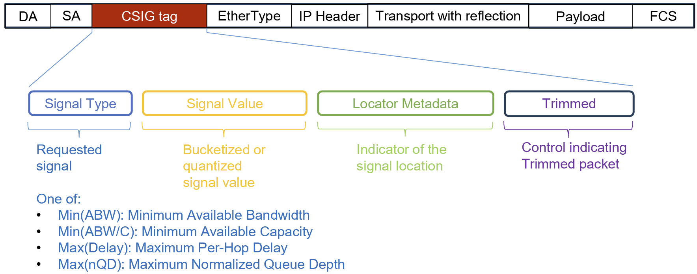
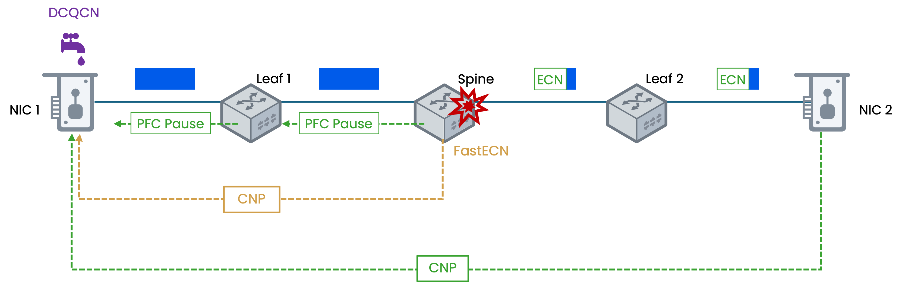

# Beyond Standard DCQCN

The [DCQCN feedback loop](05_DCQCN.md) is effective, but it has a fundamental limitation: the signal is binary. The standard CNP tells the sender exactly one thing — "you caused congestion" — with no information about how severe the congestion is, which switch is the bottleneck, or how deep the queue has grown. The sender reacts to every CNP with the same formula, regardless of whether the switch buffer is 10% full or 90% full. This can lead to over-correction (slashing the rate when a gentle tap would suffice) or under-correction (applying the same mild cut to both minor and severe congestion).

The evolution beyond standard DCQCN follows three threads:

- Richer congestion signals that give the sender real data about network conditions
- Faster feedback paths that cut the control loop latency by having switches signal the sender directly
- A programmable engine that lets the sender act on any of these signals with custom logic

## Per-Hop In-band Telemetry Applied to Congestion Control

[In-band network telemetry](07_PerHop_Inband_Telemetry.md) such as INT or IFA enables switches to stamp real-time metadata — queue depth, link utilization, timestamps — directly into data packets as they traverse the fabric. By the time a packet reaches its destination, it carries a complete record of conditions at every hop.

It is important to note that in-band network telemetry is **not** a congestion control algorithm. It is general-purpose telemetry infrastructure with applications ranging from network monitoring to fault isolation. However, it provides the richest possible input signal for a congestion control algorithm — replacing DCQCN's binary "congested or not" with actual per-hop measurements that a sender can act on directly.

The overhead trade-off is straightforward: each switch appends a fixed-size metadata block, so total overhead grows linearly with hop count. This is negligible for large data transfers but significant for small RDMA messages.

### HPCC — Direct Rate Control from Telemetry

**HPCC (High Precision Congestion Control)**, introduced by Alibaba (Li et al., SIGCOMM 2019), is the most prominent algorithm built on per-hop telemetry. It was the first to prove that a sender with real network measurements can dramatically outperform DCQCN's indirect estimation.

Standard DCQCN's rate adjustment is inherently indirect. The sender never learns the actual state of the network. It receives a binary CNP, updates an estimated severity score ($\alpha$), and applies a multiplicative formula. The resulting rate is a guess — an educated one, but a guess nonetheless. If the congestion is mild, the sender may over-correct and waste bandwidth. If the congestion is severe, the sender may under-correct and trigger PFC.

HPCC eliminates this guesswork. It requires every switch on the path to stamp per-hop telemetry into data packets (the original paper used INT in inband mode). By the time the packet reaches the receiver, it carries the actual link utilization and queue depth recorded at every hop. The receiver reflects this telemetry back to the sender, and the sender computes its new rate directly from the measurements.

The algorithm is straightforward: the sender scans the per-hop telemetry, finds the hop with the highest utilization, and sets its transmission rate to drive that bottleneck link toward a target utilization (typically 95%). There is no alpha, no phased recovery, no additive or hyper-additive increase. The rate is calculated from a single formula applied to real data:

$$Rate_{new} = \frac{Rate_{current} \times U_{target}}{U_{bottleneck}}$$

Where $U_{target}$ is the desired link utilization (e.g., 95%) and $U_{bottleneck}$ is the measured utilization at the most loaded hop. If the bottleneck link is running at 100% utilization and the target is 95%, the sender cuts its rate by exactly 5%. If the bottleneck is at 60%, the sender increases its rate. The adjustment is always proportional to the actual gap, never a blind multiplicative slash.

### HPCC++ — Solving the Overhead Problem

HPCC's precision comes at a cost. Each switch along the path appends its own metadata block to the packet. In a multi-tier leaf-spine fabric where a packet traverses five hops, the cumulative telemetry header can grow to tens of bytes per packet. For large data transfers, this overhead is negligible. For small RoCEv2 messages (common in collective operations like all-reduce), it becomes significant.

**HPCC++** (also called HPCC-PINT) addresses this by replacing full per-hop headers with **Probabilistic In-band Network Telemetry (PINT)**. Instead of every switch appending a complete metadata block, the telemetry is encoded probabilistically into a single, fixed-size field regardless of hop count. Each switch overwrites the same field with its own data at a configured probability. Over multiple packets, the sender reconstructs a statistically accurate picture of per-hop congestion from many small samples rather than one large header. This compresses the overhead to a constant size (typically 1–2 bytes) while preserving HPCC's core advantage: rate decisions driven by real measurements.

| Algorithm     | Signal                         | Rate Calculation                                    | Overhead             |
|---------------|--------------------------------|-----------------------------------------------------|----------------------|
| **DCQCN**     | Binary ECN / CNP               | Indirect (alpha estimation + multiplicative cut)    | None (ECN is 2 bits) |
| **HPCC**      | Full per-hop INT/IFA telemetry | Direct (proportional to bottleneck utilization)     | Grows with hop count |
| **HPCC++**    | Probabilistic (PINT)           | Direct (same formula, sampled data)                 | Fixed (1–2 bytes)    |

## Congestion Signaling (CSIG)

Full per-hop telemetry provides maximum visibility but is not always necessary or practical. Some deployments need a congestion signal that is richer than binary ECN but avoids the growing overhead of a per-hop metadata stack.

CSIG addresses this with a fundamentally different architectural approach from IFA/INT. Rather than stacking per-hop metadata that grows with each switch, CSIG uses a fixed-size **L2 tag** (4 bytes compact, 8 bytes expanded) positioned between the MAC and IP headers — structurally similar to a VLAN tag. As a packet traverses the fabric, each switch performs a **compare-and-replace** on the same tag: if the switch's local congestion metric is worse than the value already in the tag, it overwrites it; otherwise, it leaves the tag untouched. By the time the packet arrives at its destination, the tag carries the **bottleneck summary** for the entire path — not a per-hop breakdown, but the single worst value.

CSIG was developed by Google and submitted to the IETF as an Internet-Draft ([draft-ravi-ippm-csig](https://datatracker.ietf.org/doc/draft-ravi-ippm-csig/)), with co-authorship from Broadcom. It is also being standardized by the Ultra Ethernet Consortium (UEC) as part of the UE 1.1 specification. NVIDIA supports CSIG in Spectrum-4 switches and ConnectX-8 NICs, but the protocol is an open, multi-vendor standard — not proprietary.

The draft defines four concrete signals, each computed locally by every transit switch:

| Signal Type     | What It Captures                                       | Aggregation                        |
|-----------------|--------------------------------------------------------|------------------------------------|
| **min(ABW)**    | Minimum available bandwidth across all hops            | min() — bottleneck bandwidth       |
| **min(ABW/C)**  | Minimum ratio of available bandwidth to link capacity  | min() — bottleneck utilization     |
| **max(PD)**     | Maximum per-hop delay across all hops                  | max() — worst queuing delay        |
| **max(nQD)**    | Maximum normalized queue depth across all hops         | max() — worst queue occupancy      |

Because the tag is fixed-size and tiny, CSIG can be enabled on **every data packet** at line rate — no sampling required. The receiver extracts the tag and reflects the values back to the sender via an L4+ reflection header (e.g., a TCP option or UDP payload field). The sender's congestion control engine then has direct, per-packet access to the bottleneck bandwidth, utilization, or delay along the forward path, all within one round-trip time.

> [This video](https://youtu.be/wDXTqw_bFFY) explains how CSIG provides actionable insights for AI workloads.

> CSIG explicitly builds on lessons from INT and IFA. The draft states: "CSIG builds upon the successful aspects of prior work such as switch in-band network telemetry (INT) that incorporates multibit signals in live data packets. At the same time, CSIG's end-to-end mechanism for carrying the signals via fixed size header is simple, practical and deployable akin to Explicit Congestion Notification (ECN)."

CSIG trades per-hop granularity for simplicity and deployability. An operator chooses along a spectrum based on workload requirements:

| Signal           | Layer     | Overhead             | Visibility                                       | Best For                                                 |
|------------------|-----------|----------------------|--------------------------------------------------|----------------------------------------------------------|
| **Standard ECN** | L3 (IP)   | None (2 bits)        | Binary — congested or not                        | Baseline DCQCN deployments                               |
| **CSIG**         | L2 tag    | Fixed (4 or 8 bytes) | Bottleneck summary (ABW, utilization, or delay)  | Every-packet telemetry at line rate, tunnel-friendly     |
| **IFA / INT**    | L3+       | Grows with hop count | Full per-hop path telemetry                      | Maximum visibility for complex multi-tier fabrics        |

## Swift — Delay-Based Congestion Control

All the congestion control algorithms discussed so far — DCQCN, HPCC, HPCC++ — share a common design: the **network** generates the congestion signal, whether that signal is a binary ECN mark, a per-hop telemetry stack, or a CSIG bottleneck summary. The sender reacts to what the switches tell it. **Swift** takes a fundamentally different approach: the sender measures congestion **itself**, using round-trip time (RTT).

The premise is straightforward. When queues build up at switches, packets take longer to traverse the network. A sender with access to precise timestamps can detect this delay increase and use it directly as a congestion signal — no switch cooperation required beyond basic forwarding. Deeper queues produce longer RTT; empty queues produce minimal RTT. The signal is inherently proportional: unlike binary ECN, which says only "congested or not," RTT tells the sender *how much* congestion exists.

Swift was developed by Google and published at SIGCOMM 2020 (*"Swift: Delay is Simple and Effective for Congestion Control in the Datacenter,"* Kumar et al.). It evolved from an earlier Google protocol called **TIMELY** (SIGCOMM 2015), which was the first to demonstrate that NIC hardware timestamps could drive delay-based congestion control in data centers. Swift simplified TIMELY's design and proved it at production scale.

### How Swift Works

Swift uses an **AIMD (Additive Increase, Multiplicative Decrease)** control loop centered on a configurable **target delay**:

- If the measured RTT is **below** the target delay, the network is uncongested — Swift additively increases the congestion window.
- If the measured RTT is **above** the target delay, queues are building — Swift multiplicatively decreases the window in proportion to how far the delay exceeds the target.

The decrease is not a fixed cut. It scales with the severity of the congestion:

$$md = \beta \times \frac{RTT - target\_delay}{RTT}$$

$$cwnd_{new} = (1 - md) \times cwnd_{current}$$

If the RTT is barely above the target, $md$ is small and the window shrinks gently. If the RTT is far above the target, $md$ is large and the window shrinks aggressively. This proportional response eliminates the over-correction and under-correction problems inherent in DCQCN's fixed multiplicative slash.

### Fabric vs. Host Delay Decomposition

A subtle but important feature of Swift is its ability to separate **fabric delay** (queueing in the network switches) from **host delay** (processing time at the receiving server). End-to-end RTT includes both, but only fabric delay indicates network congestion — a slow receiver does not mean the fabric is overloaded. Swift uses NIC hardware timestamps at both endpoints to decompose the total RTT into its fabric and host components, and reacts only to the fabric portion. This prevents false congestion signals caused by slow hosts or software overhead.

### Where Swift Fits

|                         | DCQCN                                 | HPCC                                    | Swift |
|-------------------------|---------------------------------------|-----------------------------------------|---|
| **Signal source**       | Switch (ECN mark)                     | Switch (per-hop telemetry)              | End-host (RTT measurement) |
| **Switch requirements** | ECN marking thresholds                | IFA/INT telemetry support               | None — basic forwarding only |
| **Reaction**            | Indirect (alpha + multiplicative cut) | Direct (bottleneck utilization formula) | Direct (proportional to delay overshoot) |
| **Overhead**            | None (2 bits)                         | Grows with hop count                    | None |

### Swift and CSIG

Swift is particularly attractive for deployments where switch telemetry support (IFA/INT/CSIG) is unavailable or incomplete, because the sender derives its signal entirely from end-host timestamps. In deployments that *do* have CSIG, Swift's delay-based logic can be augmented with CSIG's `max(PD)` signal for even higher precision. The CSIG draft itself uses Swift as its baseline congestion control algorithm and demonstrates how CSIG signals improve Swift's ramp-up and reaction accuracy.

## Switch-Direct Backward Feedback

Every congestion control mechanism discussed so far shares a common architectural assumption: the feedback signal travels **forward** through the network before being **reflected** back to the sender. In standard DCQCN, the switch marks a packet with ECN, the packet continues forward to the receiver, the receiver generates a CNP, and the CNP travels back. Even with richer signals (IFA, CSIG), this forward-then-reflect model is unchanged — the receiver is always the relay point. Swift removes the switch from the signaling path entirely, but the sender still waits for a full round-trip before it has any measurement to act on.

This means the sender is blind for at least one full RTT after congestion begins. At 400 Gbps over a 4 μs fabric RTT, a single sender injects approximately 200 KB of additional data before it even *learns* there is a problem. At scale — hundreds of flows hitting the same bottleneck — this blind window is the primary reason switch buffers overflow into PFC pauses.

**Switch-direct backward feedback** eliminates the receiver from the control loop. The congested switch itself generates a message directly back to the sender at the moment congestion is detected. The sender learns about the problem in roughly half the time — the signal travels directly from the congestion point to the sender, skipping the entire receiver-side leg of the loop — and the blind injection window shrinks proportionally.

The idea of switch-generated backward signals is not new. [QCN](./03_CLASSIFICATION.md#the-legacy-standard-layer-2-congestion-control-ieee-8021qau--qcn) implemented it in 2010 for Layer 2 domains. When a bridge's queue exceeds a threshold, its ASIC generates a Congestion Notification Message (CNM) directly back to the source MAC address, carrying quantized feedback that enables proportional rate adjustment. QCN proved the concept in hardware but was limited to a single VLAN — it cannot cross routed boundaries. The mechanisms below extend switch-direct backward feedback to routable Layer 3 RoCEv2 fabrics.

### Fast CNP

**Fast CNP** ([draft-xiao-rtgwg-rocev2-fast-cnp](https://datatracker.ietf.org/doc/draft-xiao-rtgwg-rocev2-fast-cnp/)) applies switch-direct backward feedback to RoCEv2. The draft is scoped to IPv6 only.

**How it works:**

1. A switch detects congestion (queue depth exceeds threshold) on an egress port.

2. Instead of marking the data packet with ECN and relying on the receiver to generate a CNP, the switch constructs a Fast CNP itself and sends it directly back to the sender.

3. The sender receives the Fast CNP, identifies the affected flow, and reduces its transmission rate — all without waiting for the data packet to reach the receiver and a standard CNP to return.

**The flow identification problem:**

For the sender to throttle the correct flow, it needs to know which of its Source QPs caused the congestion. In a standard CNP, this is straightforward: the receiver knows the full QP mapping from the connection setup. A switch in the middle of the path does not have this knowledge. It can only see the Destination QP (the receiver's queue pair) in the packet's Base Transport Header.

The Destination QP alone is ambiguous. A sender may communicate with multiple receivers, and different receivers may use the same Destination QP number mapped to different Source QPs at the sender. The switch cannot tell them apart.

**The solution:**

Fast CNP prepends an IPv6 Destination Options extension header to the CNP. This header contains the **original destination IPv6 address** (the receiver's IP) copied from the congested data packet. The sender receives the Fast CNP and uses two pieces of information together to perform a unique lookup:

- **Destination QP** (from the BTH) — identifies the receiver's queue pair
- **Destination Address** (from the IPv6 extension header) — identifies which receiver

This combination uniquely resolves to the correct Source QP at the sender.

Additionally, the switch sets the Fast CNP's **source IP address** to its own loopback address. This tells the sender exactly which switch along the path detected congestion, enabling optional ECMP rerouting around the bottleneck.

**Two option formats:**

The draft defines two variants of the IPv6 destination option:

| Format        | Contents                                              | Use Case |
|---------------|-------------------------------------------------------|----------|
| **Basic**     | Original destination IPv6 address (16 bytes)          | Standard rate reduction — sender identifies the flow and applies its normal CC algorithm |
| **With IOAM** | Original destination address + In situ OAM Trace Data | Telemetry-aware rate reduction — sender uses per-hop congestion data (e.g., for HPCC++) |

**Backward compatibility:**

If the switch does not know whether the sender supports Fast CNP, it MAY simultaneously mark the data packet with ECN CE. This triggers the standard receiver-originated CNP as a fallback — the sender will react to whichever signal arrives first. If the switch knows the sender supports Fast CNP, it MUST NOT mark the ECN bits, avoiding a duplicate signal.

**Deployment and status:**

Fast CNP must be deployed within a controlled administrative domain with rate-limiting on generation, source-address filtering, and border filtering to prevent Fast CNPs from entering or leaving the domain. The feature must be disabled by default.

> As of version 05 (May 2026), Fast CNP remains an individual Internet-Draft — it has not been adopted by an IETF working group and should be considered a proposal, not a ratified standard.

### Bolt

**Bolt** (Stanford/Google, NSDI 2023) extends the concept from simple notification to **sub-RTT congestion control** by leveraging programmable switch ASICs (P4/Tofino). Rather than generating a minimal backward notification, Bolt's switch data plane computes precise congestion signals — actual queue depths, available bandwidth, and per-flow state — and feeds them directly to the sender at the point of congestion. The sender reacts before the packet even reaches the receiver, shrinking the control loop below one RTT.

Bolt is built on three hardware-level mechanisms:

- **Sub-RTT Control (SRC)**: The switch pipeline detects congestion and generates backward feedback within a single packet processing cycle — no store-and-forward delay, no software involvement.

- **Proactive Ramp-up (PRU)**: The switch tracks flow completions in its pipeline and signals neighboring senders to claim released bandwidth immediately, rather than waiting for the slow additive-increase ramp.

- **Supply Matching (SM)**: The switch ASIC explicitly computes available bandwidth and distributes it to competing flows, replacing the sender's indirect estimation with a direct allocation.

Bolt reports 80% reduction in 99th-percentile tail latency and up to 3× improvement in flow completion time compared to Swift and HPCC at 400 Gbps. It requires P4-programmable switches (e.g., Intel Tofino) and is not yet available on fixed-function merchant silicon (Broadcom Tomahawk, NVIDIA Spectrum).

## Summary Reference

### Hardware Congestion Control Algorithms

All congestion control in the RoCEv2 ecosystem runs in NIC hardware or firmware — kernel bypass demands it. The table below lists every NIC-side rate control algorithm discussed in this document and its [predecessor](05_DCQCN.md), ordered chronologically.

| Year | Algorithm | Execution Layer | Signal Used | Rate Adjustment |
|------|-----------|-----------------|-------------|-----------------|
| 2015 | DCQCN     | NIC hardware (ConnectX) | Binary ECN / CNP | α-scaled multiplicative cut + phased recovery |
| 2015 | TIMELY    | NIC firmware | End-host RTT (NIC timestamps) | RTT gradient-based AIMD |
| 2019 | HPCC      | NIC hardware | Full per-hop INT/IFA telemetry | Direct: rate ∝ target utilization / bottleneck utilization |
| 2020 | HPCC++    | NIC hardware | Probabilistic telemetry (PINT) | Same as HPCC, sampled data |
| 2020 | Swift     | NIC hardware/firmware | End-host RTT (NIC timestamps) | Proportional delay-based AIMD |

### Forward-Path Signaling Mechanisms

These are the in-band signals that travel with data packets toward the receiver, then get reflected back to the sender.

| Mechanism     | Layer   | Generated By | Information Carried | Overhead |
|---------------|---------|--------------|---------------------|----------|
| ECN / CNP     | L3 (IP) | Switch marks CE; receiver generates CNP | Binary — "congestion occurred" | None (2 bits in IP header) |
| CSIG          | L2 tag  | Each switch updates tag via compare-and-replace | Bottleneck summary: min(ABW), max(delay), or max(queue depth) | Fixed (4 or 8 bytes) |
| IFA / INT     | L3+     | Each switch appends metadata block | Full per-hop: switch ID, queue depth, timestamps, ports | Grows linearly with hop count |
| PINT          | L3+     | Each switch overwrites shared field probabilistically | Same data as IFA, reconstructed statistically over many packets | Fixed (1–2 bytes) |

### Switch-Direct Backward Feedback Mechanisms

These are signals generated by the switch and sent directly back to the sender, bypassing the receiver.

| Mechanism | Year | Switch Hardware               | What It Signals                           | Flow ID Method            | Scope |
|-----------|------|-------------------------------|-------------------------------------------|---------------------------|-------|
| QCN (CNM) | 2010 | Bridge ASIC (fixed-function)  | Quantized congestion severity             | Source MAC                | L2 only (single VLAN) |
| Bolt      | 2023 | Programmable ASIC (P4/Tofino) | Precise congestion + bandwidth allocation | Programmable match-action | L3 routable |
| Fast CNP  | 2024 | Switch ASIC (fixed-function)  | "Slow down" + optional IOAM telemetry     | IPv6 ext header + Dest QP | L3 RoCEv2 |

## Programmable Congestion Control (PCC)

Richer signals — whether full per-hop telemetry, CSIG bottleneck summaries, or precise delay measurements — are only useful if the sender can act on them intelligently. Standard DCQCN's Reaction Point cannot. The entire state machine (the alpha update, the three recovery phases, the clamp behavior) is burned into the NIC firmware. Network engineers can tune the parameters (`RPG_GD`, `AI`, `HAI`, `G`, etc.), but the algorithm itself cannot be changed. It has no concept of "queue depth" or "per-hop telemetry." It understands one input (CNP received: yes or no) and runs one fixed algorithm.

**Programmable Congestion Control (PCC)** solves this by replacing the fixed Reaction Point with a programmable engine running on the NIC itself. PCC is a framework provided by NVIDIA's DOCA SDK that allows engineers to write custom congestion control algorithms in C, compile them, and deploy them onto the embedded processing cores of ConnectX NICs. These cores sit on the NIC's data path — they execute at line rate without involving the host CPU, preserving the zero-kernel-bypass property that makes RDMA fast.

With PCC, the Reaction Point is no longer a black box with tunable knobs. It becomes a blank slate. The NIC exposes congestion events (standard CNPs, CSIG signals, IFA telemetry, RTT measurements) to the custom algorithm as structured inputs. The algorithm processes these inputs however it sees fit and produces a single output: the new transmission rate. The NIC's hardware rate limiter then enforces that rate, exactly as it would enforce a rate computed by the standard DCQCN state machine.

This means engineers can implement fundamentally different strategies depending on the workload:

- A large-scale all-reduce training job might use IFA telemetry to identify the single most congested switch in a multi-hop path and surgically reduce the rate just enough to relieve that specific bottleneck, rather than applying a blanket multiplicative cut.

- A latency-sensitive inference workload might react to CSIG's max per-hop delay with a proportional controller (higher delay = harder brake), replacing the indirect alpha-based estimation with a direct measurement.

- A mixed workload might combine multiple signals — using IFA for full path-level diagnostics and CSIG for per-packet bottleneck bandwidth and utilization — and weight them differently depending on the traffic class.

PCC does not change the three-role model (CP, NP, RP) that DCQCN established — it changes the *implementation* of the Reaction Point: from a fixed state machine with tunable parameters to a fully programmable algorithm with structured inputs. The Congestion Point is still the switch detecting congestion. The Notification Point is still the entity generating feedback (the receiver in forward-path mode, or the switch itself in backward-feedback mode). The Reaction Point is still the sender adjusting its rate.

| Component         | Standard DCQCN                                       | Next-Generation (PCC + Telemetry)                             |
|-------------------|------------------------------------------------------|---------------------------------------------------------------|
| **CP (Switch)**   | Marks ECN CE bit                                     | Stamps IFA/CSIG metadata, and/or generates Fast CNP directly  |
| **NP**            | Receiver generates minimal CNP                       | Receiver reflects telemetry, or switch sends Fast CNP (backward) |
| **RP (Sender)**   | Fixed alpha / phase A-B-C state machine in firmware  | Custom algorithm on NIC embedded cores (DOCA PCC)             |
| **Signal**        | Binary (CNP received or not)                         | Quantitative (queue depth, per-hop path data, timestamps)     |
| **Tunability**    | Parameter knobs (`AI`, `HAI`, `G`, `RPG_GD`, etc.)   | Entire algorithm is replaceable                               |
