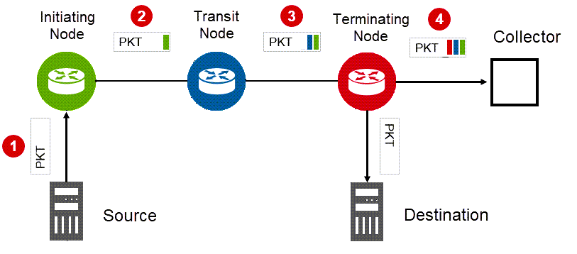
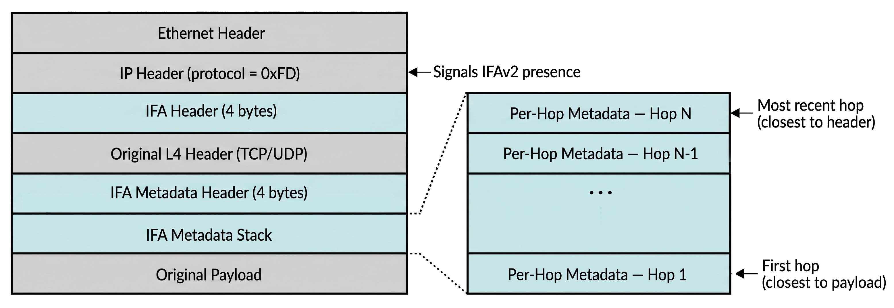

# Per-Hop In-Band Telemetry

**Network telemetry** is the collection of real-time measurements from network devices — queue depths, link utilization, packet counts, latency — so that operators and automated systems can observe network behavior and react accordingly.

Traditional telemetry is **out-of-band**: switches export counters and statistics through a separate control-plane channel (SNMP polling, streaming gRPC, sFlow samples) that is decoupled from the data packets themselves. The monitoring system sees aggregate, periodically sampled snapshots — not what any individual packet experienced.

**In-band telemetry** takes a fundamentally different approach. Instead of exporting statistics on a side channel, it embeds monitoring metadata directly into data packets as they traverse the network. The telemetry travels the same path, through the same queues, at the same time as the traffic it measures — capturing the exact conditions each packet encounters rather than a periodic approximation.

The form of in-band telemetry covered here is **per-hop**: each switch along the path appends its own metadata block to the packet. The metadata stack grows with every hop, so by the time the packet reaches its destination it carries a complete, ordered record of every switch it touched and the conditions at each one.

Per-hop in-band telemetry provides raw, per-switch measurements that many systems can consume:

| Application                  | How Telemetry Is Used                                                                |
|------------------------------|--------------------------------------------------------------------------------------|
| **Network monitoring**       | Export per-hop latency and queue depth to collectors for dashboards and alerting     |
| **Path tracing / debugging** | Identify exactly which switch introduced delay or dropped packets                    |
| **SLA verification**         | Measure actual per-hop and end-to-end latency against contractual targets            |
| **Congestion control**       | Feed queue depth and utilization measurements to the sender's rate-control algorithm |
| **Load balancing**           | Detect asymmetric congestion across ECMP paths and reroute flows                     |

Three protocol specifications define per-hop in-band telemetry:

- **[INT](https://p4.org/wp-content/uploads/sites/53/p4-spec/docs/INT_v2_1.pdf) (In-band Network Telemetry)** — a P4 Language Consortium specification developed by Barefoot Networks (now Intel) around 2015–2016 as part of the P4 programmable switch ecosystem. INT was specified by the P4.org Applications Working Group and targets programmable Tofino ASICs.

- **[IOAM](https://datatracker.ietf.org/doc/html/rfc9197) (In-situ OAM)** — originated as IETF drafts in 2016–2017 and standardized as RFC 9197 in 2022. IOAM defines a data-plane–native framework for embedding OAM information into data packets, with pluggable data fields and support for IPv6, NSH, GRE, Geneve, and other encapsulations. It shares the same per-hop stamping model but is designed for broader protocol integration.

- **[IFA](https://datatracker.ietf.org/doc/draft-kumar-ippm-ifa/08/) (Inband Flow Analyzer)** — introduced by Broadcom around 2019, designed for their fixed-function ASICs (Trident and Tomahawk families). IFA was submitted to the IETF for industry-wide standardization and is documented as an Internet-Draft in the IP Performance Measurement (IPPM) working group, now at version 2 (IFAv2).

All three share the same per-hop stamping model but are not wire-compatible. Their metadata field sets overlap substantially, though each defines additional fields and encoding formats specific to its ecosystem. They target different switch silicon and use different header layouts, but the core measurements they provide are functionally equivalent from the perspective of a downstream consumer.

The remainder of this document focuses on **IFAv2**, which is the telemetry mechanism available on Broadcom-based switching platforms common in datacenter fabrics. IFA is a general-purpose telemetry standard — not specific to RDMA or RoCEv2 — and can stamp telemetry into any IP packet that matches a configured policy.


## Operational Modes

The IFA standard ([draft-kumar-ippm-ifa-08](https://datatracker.ietf.org/doc/draft-kumar-ippm-ifa/)) defines three roles within an **IFA zone** — the monitored domain:

- **Initiating node** — at the ingress edge, marks or clones selected traffic for telemetry collection.
- **Transit nodes** — inside the zone, append their metadata to every IFA-marked packet they forward.
- **Terminating node** — at the egress edge, collects the accumulated telemetry.

The standard defines two operational modes, controlled by the **I (Inband)** flag in the IFA header:

- **Inband mode (I = 1)** — Telemetry is inserted directly into live data packets. Every matched packet receives metadata at every transit hop. The Terminating node strips the IFA headers and forwards the original packet to its destination. The draft describes this as inserting metadata "on a per packet basis in live traffic."

- **Clone mode (I = 0)** — Rather than modifying live traffic, the Initiating node creates synthetic copies of selected packets, inserts the IFA header into the clone, and forwards both. Only the clones carry telemetry and accumulate metadata at each transit hop; the original data packets traverse the network untouched. The Terminating node drops the clones after extracting the telemetry and reporting it to a collector.

The choice between modes is made at the Initiating node through configuration. Transit switches do not distinguish between the two — they see an IFA-marked packet and stamp it unconditionally.

> **Sampling in clone mode:** Cloning every packet would double the traffic on the fabric, so the draft requires that cloned traffic "be at a sampled ratio to keep the network overhead to a minimum." The Initiating node selects only a subset of matched packets — for example, one per burst — and clones only those. The sampling ratio is an implementation choice.


## Protocol Detection

An IFAv2 packet is identified by setting the IP header's protocol field to **253 (0xFD)**, a value from the IANA-reserved experimental range (253–254) designated for experimentation and testing by RFC 3692. The Initiating node overwrites the original protocol value (e.g., 17 for UDP) with `0xFD` and saves the original in a dedicated field within the IFA Header so the Terminating node can restore the packet after stripping telemetry.

This L3-based detection allows IFAv2 to work across existing IP fabrics without requiring tunnel encapsulation, VXLAN awareness, or IP options support. Non-IFA-aware routers forward the packet normally — the protocol number is opaque to standard L3 forwarding decisions.


## Packet Lifecycle

The following diagram illustrates how per-hop telemetry accumulates in **inband mode** as a packet traverses the network fabric.



The source server transmits a standard data packet (Step 1). The Initiating node intercepts the packet, rewrites the IP protocol field to `0xFD`, inserts the IFA headers, appends its own metadata entry, and forwards the packet into the fabric (Step 2). Each subsequent transit switch detects the IFA-marked packet (IP protocol == `0xFD`), appends its own metadata block, and forwards the packet onward (Step 3). By the final hop, the packet carries a chronological, stacked record of conditions at every node it traversed.

The Terminating node (Step 4) extracts the complete telemetry stack, strips the IFA headers, restores the original protocol field, and delivers the packet to the destination server. The collected metadata is exported to an external **Collector** — a telemetry analytics application (e.g., BroadView Analytics) that aggregates per-flow, per-hop measurements for monitoring, SLA verification, and path tracing (see the applications table above). The destination host receives the original packet unmodified and is unaware that telemetry was collected in-flight.

In **clone mode**, the lifecycle is identical except the telemetry rides in a separate probe packet rather than in the data packet itself. Because the clone preserves the original L3/L4 headers and QoS markings, it is intended to follow the same ECMP path and queue assignment as the data flow it represents. However, path fidelity depends on whether the switch's ECMP hash includes the IP protocol field — since the clone's protocol is rewritten to `0xFD`, an ECMP hash that incorporates this field may select a different path than the original traffic.


## Packet Format

An IFAv2 packet contains two distinct headers inserted by the Initiating node:

- **IFA Header (4 bytes)** — inserted between the IP header and the original L4 header. It signals IFAv2 presence and preserves the original L4 protocol number.
- **IFA Metadata Header (4 bytes)** — inserted after the original L4 header. It controls the metadata stack: which fields are requested, hop limit, and current stack length.

Each transit switch appends one per-hop metadata entry to the growing stack after the Metadata Header. The default placement is called **payload stamping** — metadata sits between the L4 header and the original payload. The standard also defines **tail stamping** (TS flag), where metadata is appended after the payload before the FCS, preserving upper-layer protocol visibility for legacy devices.



The IFA Header and IFA Metadata Header are separate structures with the original L4 header sitting between them. The metadata stack grows after the Metadata Header — the most recent hop's entry is closest to the header; older entries are pushed toward the payload.


### IFA Header

The IFA Header is a 4-byte (32-bit) structure treated as an L3 extension header:

```
 0 1 2 3 4 5 6 7 8 9 0 1 2 3 4 5 6 7 8 9 0 1 2 3 4 5 6 7 8 9 0 1
+-+-+-+-+-+-+-+-+-+-+-+-+-+-+-+-+-+-+-+-+-+-+-+-+-+-+-+-+-+-+-+-+
| Ver=2 |  GNS  |   NextHdr     |R|R|R|M|T|I|T|C|  Max Length   |
|       |       |               | | | |F|S| |A| |               |
+-+-+-+-+-+-+-+-+-+-+-+-+-+-+-+-+-+-+-+-+-+-+-+-+-+-+-+-+-+-+-+-+
```

| Field          | Bits | Description |
|----------------|------|-------------|
| **Version**    | 4    | IFA version (2 for IFAv2). |
| **GNS**        | 4    | Global Name Space — selects the metadata profile for the IFA zone. A value of 0xF indicates per-hop Local Name Space (LNS) mode. |
| **NextHdr**    | 8    | Original IP protocol type, copied from the IP header at the Initiating node (e.g., 17 for UDP, 6 for TCP). Used by the Terminating node to restore the packet. |
| **Flags**      | 8    | MF (metadata fragmentation), TS (tail stamp), I (inband — live traffic), TA (turn-around for bidirectional probes), C (optional checksum header present). |
| **Max Length** | 8    | Maximum allowed metadata stack length in multiples of 4 octets. Initialized by the Initiating node. Transit nodes must stop inserting metadata when Current Length reaches this value. |


### IFA Metadata Header

The IFA Metadata Header is a separate 4-byte (32-bit) structure that sits after the L4 header and controls the metadata stack:

```
 0 1 2 3 4 5 6 7 8 9 0 1 2 3 4 5 6 7 8 9 0 1 2 3 4 5 6 7 8 9 0 1
+-+-+-+-+-+-+-+-+-+-+-+-+-+-+-+-+-+-+-+-+-+-+-+-+-+-+-+-+-+-+-+-+
| Request Vector|Action Vector  |  Hop Limit    |Current Length |
|               |L|C|R|R|R|R|R|R|               |               |
+-+-+-+-+-+-+-+-+-+-+-+-+-+-+-+-+-+-+-+-+-+-+-+-+-+-+-+-+-+-+-+-+
```

| Field              | Bits | Description |
|--------------------|------|-------------|
| **Request Vector** | 8    | Bitmask specifying which metadata fields each hop should insert, as defined by the GNS profile. |
| **Action Vector**  | 8    | Node-local or end-to-end action flags. Includes L (loss measurement) and C (color marking); remaining bits are reserved. |
| **Hop Limit**      | 8    | Maximum remaining hops. Decremented by each transit node. When it reaches zero, subsequent nodes must not insert metadata. A value of 0xFF disables the hop limit check. |
| **Current Length** | 8    | Current metadata stack length in multiples of 4 octets. Incremented by each transit node as it appends its metadata entry. |

Together, **Max Length** (in the IFA Header) and **Hop Limit** (in the Metadata Header) act as independent safety bounds that prevent unbounded header growth. The minimum per-packet overhead is 8 bytes (IFA Header + Metadata Header) before any per-hop metadata is added.


### Node Operations

The three IFA roles perform specific header-level operations:

**Initiating node:**

1. Inserts the 4-byte IFA Header between the IP and L4 headers.
2. Inserts the 4-byte Metadata Header after the L4 header.
3. Copies the original IP protocol value into the IFA Header's NextHdr field.
4. Rewrites IP.protocol to `0xFD`.
5. Initializes Hop Limit and Current Length.
6. Appends its own per-hop metadata entry.
7. Updates IP total length and checksum.

**Transit node:**

1. Detects IFAv2 by matching IP.protocol == `0xFD`.
2. Parses the IFA Header to locate the Metadata Header.
3. Appends its per-hop metadata entry to the stack.
4. Decrements Hop Limit and increments Current Length.
5. Updates IP total length and checksum.

A transit node does not need to parse or understand the original L4 protocol.

**Terminating node:**

1. Removes the IFA Header, Metadata Header, and all per-hop metadata entries.
2. Restores IP.protocol to the original value from the NextHdr field.
3. Recalculates IP total length and checksum.
4. Delivers the restored packet to the end host.

The collected metadata stack is optionally exported to a telemetry collector.


## Per-Hop Metadata

The content of each per-hop metadata entry is not fixed by the standard — it is determined by the namespace system. A zone-wide **Global Name Space (GNS)** dictates which fields every switch in the zone must insert (uniform mode), while a per-hop **Local Name Space (LNS)** allows each switch to include its own most relevant data (non-uniform mode). The only field fixed by the standard itself is a 4-bit LNS identifier and a 28-bit **Device ID**; everything else is profile-dependent.

A representative telemetry profile includes:

| Field                 | Description                                                                |
|-----------------------|----------------------------------------------------------------------------|
| **Device ID**         | Unique identifier of the switch that inserted this metadata block.         |
| **Ingress Port**      | The physical port where the packet entered this switch.                    |
| **Egress Port**       | The physical port where the packet left this switch.                       |
| **Queue Depth**       | The instantaneous occupancy of the egress queue at the moment of transit.  |
| **Ingress Timestamp** | Nanosecond-precision time when the packet arrived at this switch.          |
| **Egress Timestamp**  | Nanosecond-precision time when the packet departed this switch.            |
| **Queue ID**          | The specific queue (Traffic Class) the packet was placed into.             |

The size of each per-hop entry depends on the implementation. The standard defines a trace vector that controls which fields to include, allowing variable-size entries. Because each switch appends an entry, total overhead grows linearly with hop count. In a three-hop leaf-spine fabric, the packet accumulates three metadata entries; in a five-hop fat-tree, it accumulates five.


## Overhead and Scalability

The linear growth of per-hop metadata is the primary engineering trade-off of INT/IFA. For bulk data transfers carrying large payloads, the added bytes are negligible. For small messages (e.g., 64-byte RDMA writes common in collective operations), the telemetry overhead can become a significant fraction of the packet size.

Several approaches address this:

- **Sampling** — stamp only a subset of packets (clone mode with a low sampling ratio).

- **Probabilistic encoding (PINT)** — each switch overwrites a single fixed-size field (1–2 bytes) with its data at a configured probability, rather than appending a full metadata block. Over many packets, the receiver reconstructs per-hop conditions statistically, compressing overhead to a constant regardless of hop count. HPCC++, the primary congestion control algorithm built on PINT, is discussed in [Beyond Standard DCQCN](06_DCQCN_.md).

- **Bottleneck-summary tags (CSIG)** — replace per-hop detail with a single worst-value summary using a fixed-size L2 tag and compare-and-replace semantics.

| Approach      | Overhead             | Visibility                                  |
|---------------|----------------------|---------------------------------------------|
| **IFA / INT** | Grows with hop count | Full per-hop: every switch, every field     |
| **PINT**      | Fixed (1–2 bytes)    | Same data, reconstructed statistically      |
| **CSIG**      | Fixed (4 or 8 bytes) | Bottleneck summary only (worst hop)         |

> CSIG and its congestion-signaling semantics are covered in detail in [Beyond Standard DCQCN](06_DCQCN_.md).
